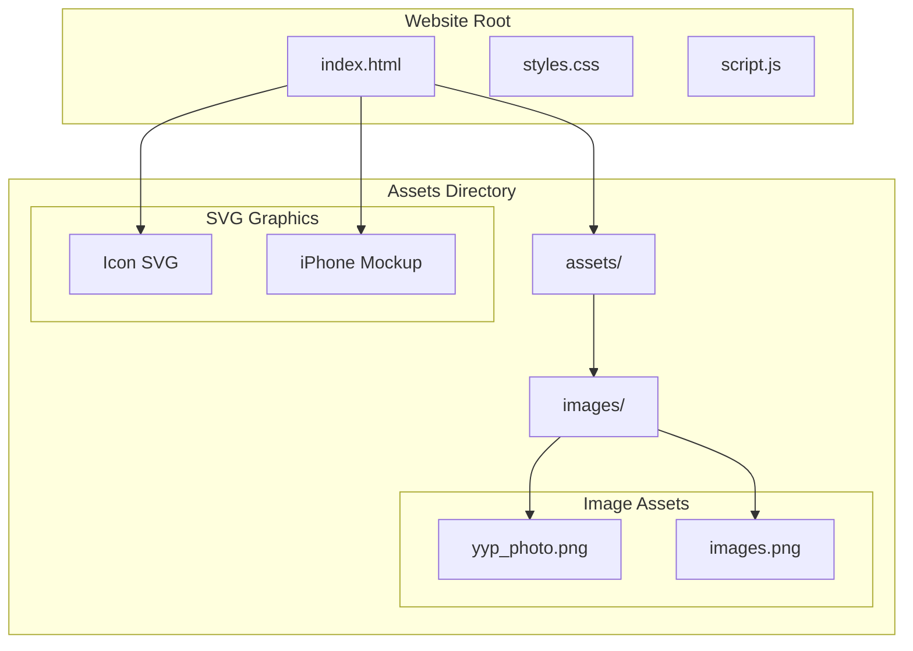
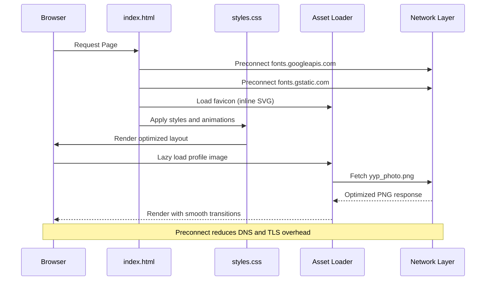
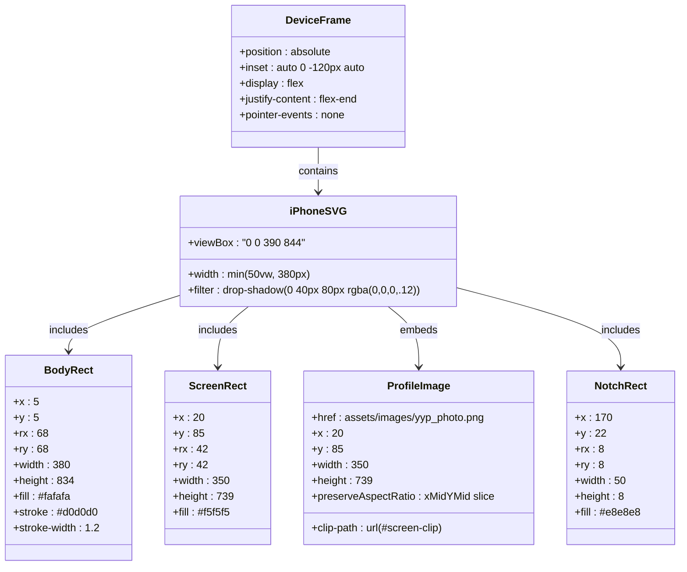
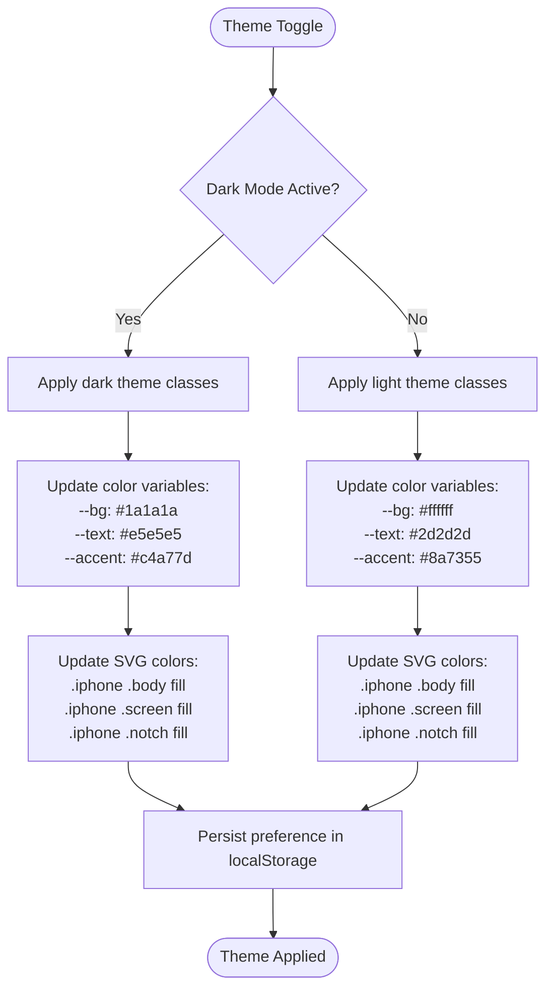
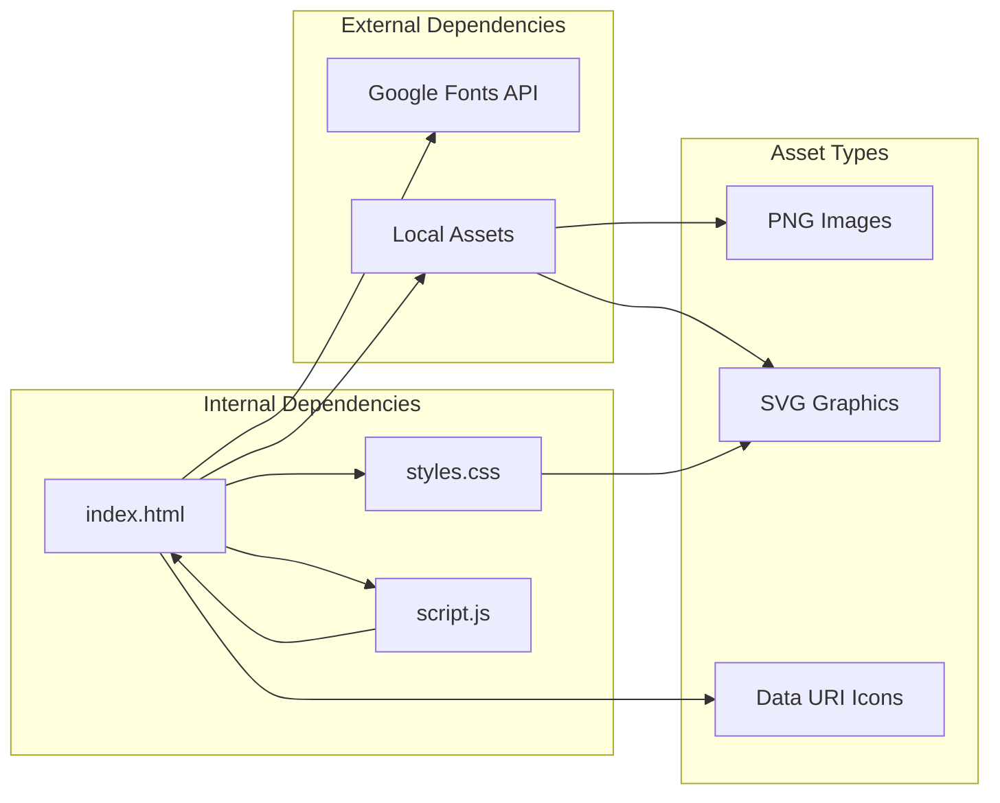
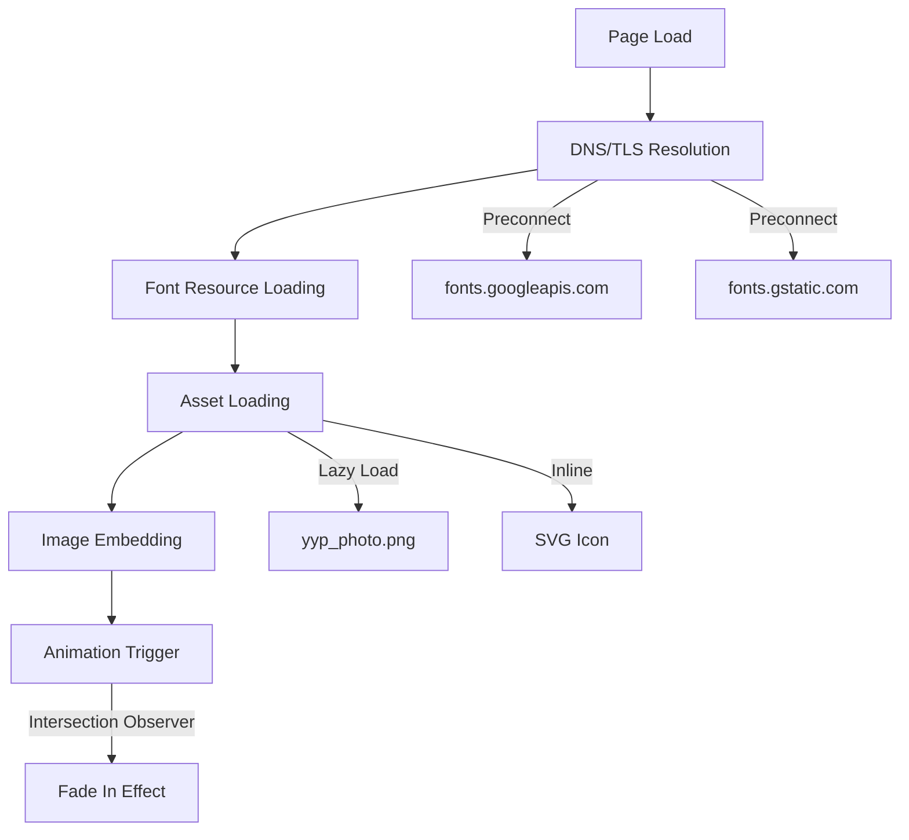

# Assets and Visual Resources

<cite>
**Referenced Files in This Document**
- [index.html](file://index.html)
- [styles.css](file://styles.css)
- [script.js](file://script.js)
</cite>

## Table of Contents
1. [Introduction](#introduction)
2. [Project Structure](#project-structure)
3. [Core Components](#core-components)
4. [Architecture Overview](#architecture-overview)
5. [Detailed Component Analysis](#detailed-component-analysis)
6. [Dependency Analysis](#dependency-analysis)
7. [Performance Considerations](#performance-considerations)
8. [Troubleshooting Guide](#troubleshooting-guide)
9. [Best Practices](#best-practices)
10. [Conclusion](#conclusion)

## Introduction

This document provides comprehensive guidance for managing assets and visual resources in Yeoh Yee Peng's portfolio website. The implementation focuses on strategic image optimization, SVG graphics integration, and performance-conscious asset loading. The portfolio demonstrates modern web practices including preconnect strategies for external resources, responsive image handling, and theme-aware visual elements.

The visual system centers around a sophisticated iPhone device mockup that showcases the profile photo, creating a cohesive mobile-first presentation while maintaining desktop responsiveness. The implementation balances aesthetic appeal with performance optimization through careful asset selection and delivery strategies.

## Project Structure

The assets and visual resources are organized within a dedicated structure that supports both static images and dynamic SVG graphics:

**Diagram sources**
- [index.html:14](file://index.html#L14)
- [index.html:62](file://index.html#L62)

The structure follows a clean separation between static assets and dynamic graphics, enabling efficient asset management and optimization workflows.

**Section sources**
- [index.html:14](file://index.html#L14)
- [index.html:62](file://index.html#L62)

## Core Components

### Image Asset Management

The portfolio utilizes a dual-image strategy focusing on PNG format optimization for critical visual elements:

**Profile Photo Implementation**
- Located at `assets/images/yyp_photo.png`
- Embedded within the iPhone device mockup using SVG `<image>` element
- Optimized for 350x739 pixel dimensions to match the device screen specification
- Uses `preserveAspectRatio="xMidYMid slice"` for optimal scaling across different viewport sizes

**Support Image Asset**
- Stored as `assets/images/images.png`
- Serves as a placeholder or secondary visual element
- Maintains consistent PNG format for cross-browser compatibility

### SVG Graphics System

The implementation features sophisticated SVG graphics that integrate seamlessly with the design system:

**iPhone Device Mockup**
- Complete device silhouette with precise 390x844 viewBox dimensions
- Layered rectangles for body, screen, and notch elements
- Gradient effects using linear gradients for realistic depth
- Responsive sizing with `min(50vw, 380px)` constraint

**Icon System**
- Favicon implemented as inline SVG data URI
- Eliminates additional HTTP requests for essential branding elements
- Scalable vector graphics ensure crisp rendering across all devices

**Section sources**
- [index.html:51-66](file://index.html#L51-L66)
- [index.html:14](file://index.html#L14)

## Architecture Overview

The visual resource architecture combines multiple optimization strategies to deliver exceptional performance:

**Diagram sources**
- [index.html:10-12](file://index.html#L10-L12)
- [index.html:14](file://index.html#L14)

The architecture prioritizes performance through strategic preloading and lazy loading approaches, ensuring optimal user experience across various network conditions.

**Section sources**
- [index.html:10-16](file://index.html#L10-L16)
- [styles.css:153-160](file://styles.css#L153-L160)

## Detailed Component Analysis

### iPhone Device Mockup Implementation

The device mockup represents a sophisticated blend of SVG vector graphics and raster image embedding:

**Diagram sources**
- [index.html:51-66](file://index.html#L51-L66)
- [styles.css:153-160](file://styles.css#L153-L160)

The mockup implementation demonstrates advanced SVG capabilities including gradient fills, precise clipping, and responsive sizing that adapts to different viewport constraints.

**Section sources**
- [index.html:51-66](file://index.html#L51-L66)
- [styles.css:153-160](file://styles.css#L153-L160)

### Asset Loading Performance Strategy

The implementation employs several performance optimization techniques:

**Preconnect Strategy**
- Fonts.googleapis.com: Establishes early connection for typography resources
- fonts.gstatic.com: Enables secure font loading without blocking render
- Reduces Time to First Paint by eliminating DNS lookup and TLS handshake delays

**Inline SVG Implementation**
- Favicon delivered as data URI eliminates additional HTTP requests
- Ensures immediate icon availability regardless of network conditions
- Maintains consistent branding experience across all devices

**Lazy Loading Approach**
- Profile image loaded via SVG `<image>` element with automatic optimization
- CSS transitions provide smooth loading experience
- Intersection Observer API manages reveal animations

**Section sources**
- [index.html:10-16](file://index.html#L10-L16)
- [script.js:4-10](file://script.js#L4-L10)

### Theme-Aware Visual Elements

The design system incorporates dark/light mode support through CSS custom properties and conditional styling:

**Diagram sources**
- [script.js:20-27](file://script.js#L20-L27)
- [styles.css:324-346](file://styles.css#L324-L346)

**Section sources**
- [script.js:20-27](file://script.js#L20-L27)
- [styles.css:324-346](file://styles.css#L324-L346)

## Dependency Analysis

The visual resource system maintains minimal dependencies while maximizing functionality:

**Diagram sources**
- [index.html:10-16](file://index.html#L10-L16)
- [index.html:14](file://index.html#L14)

The dependency graph reveals a clean separation between external resources (Google Fonts) and internal assets, with SVG graphics serving as the primary visual foundation.

**Section sources**
- [index.html:10-16](file://index.html#L10-L16)
- [index.html:14](file://index.html#L14)

## Performance Considerations

### Image Optimization Strategies

**PNG Format Benefits**
- Lossless compression ensures crisp text and sharp graphics
- Ideal for profile photos requiring precise detail reproduction
- Supports transparency for layered visual effects
- Optimized for web delivery with minimal quality loss

**Responsive Image Delivery**
- SVG device mockup scales infinitely without quality degradation
- PNG assets sized appropriately for target display densities
- CSS media queries ensure optimal asset loading across device categories

**Loading Performance**
- Preconnect headers reduce latency for external font resources
- Inline SVG favicon eliminates render-blocking requests
- Intersection Observer enables efficient lazy loading of visual elements

### Asset Loading Pipeline

**Diagram sources**
- [index.html:10-16](file://index.html#L10-L16)
- [script.js:4-10](file://script.js#L4-L10)

**Section sources**
- [index.html:10-16](file://index.html#L10-L16)
- [script.js:4-10](file://script.js#L4-L10)

## Troubleshooting Guide

### Common Asset Issues

**Missing Image Assets**
- Verify `assets/images/yyp_photo.png` exists in the correct directory
- Check file permissions and MIME type configuration
- Ensure relative path matches the HTML reference structure

**SVG Rendering Problems**
- Confirm viewBox dimensions match the intended aspect ratio
- Validate CSS class selectors for proper styling application
- Check browser compatibility for advanced SVG features

**Performance Issues**
- Monitor asset loading times using browser developer tools
- Verify preconnect headers are functioning correctly
- Test responsive behavior across different viewport sizes

### Debugging Steps

1. **Asset Verification**: Check file existence and accessibility
2. **Console Inspection**: Monitor for 404 errors or CORS issues
3. **Network Analysis**: Verify preconnect effectiveness
4. **Performance Audit**: Use Lighthouse for optimization suggestions

**Section sources**
- [index.html:62](file://index.html#L62)
- [styles.css:153-160](file://styles.css#L153-L160)

## Best Practices

### Adding New Images

**File Organization**
- Place new images in `assets/images/` directory
- Use descriptive filenames with lowercase letters and hyphens
- Maintain consistent PNG format for visual consistency

**Optimization Guidelines**
- Resize images to target display dimensions
- Remove unnecessary metadata and EXIF data
- Consider WebP format for improved compression where supported

**Integration Process**
- Reference images using relative paths from HTML
- Apply appropriate CSS classes for responsive behavior
- Test across multiple devices and screen sizes

### Asset Size Management

**Compression Strategies**
- Implement progressive JPEG for photographic content
- Use SVG for scalable graphics and icons
- Leverage browser caching for repeated asset access

**Delivery Optimization**
- Enable HTTP/2 server push for critical assets
- Implement lazy loading for non-critical images
- Use Content Delivery Networks for global distribution

### Visual Consistency

**Design System Integration**
- Maintain consistent color schemes across light and dark modes
- Ensure typography scales appropriately across breakpoints
- Preserve visual hierarchy through consistent spacing and alignment

**Responsive Design**
- Test asset rendering on various screen sizes and densities
- Verify performance metrics across different network conditions
- Validate accessibility compliance with visual elements

## Conclusion

The Yeoh Yee Peng portfolio demonstrates a mature approach to visual resource management that balances aesthetic excellence with performance optimization. The implementation successfully integrates PNG image assets with sophisticated SVG graphics, employs strategic preconnect strategies, and maintains theme-aware visual consistency.

Key achievements include the seamless integration of the iPhone device mockup showcasing the profile photo, the elimination of render-blocking asset requests through inline SVG implementation, and the establishment of a robust foundation for future visual enhancements. The modular asset architecture supports easy maintenance and extension while preserving the site's performance characteristics.

This implementation serves as an excellent model for portfolio websites seeking to optimize visual presentation without compromising loading performance or user experience across diverse devices and network conditions.