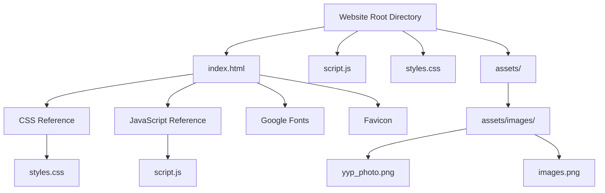
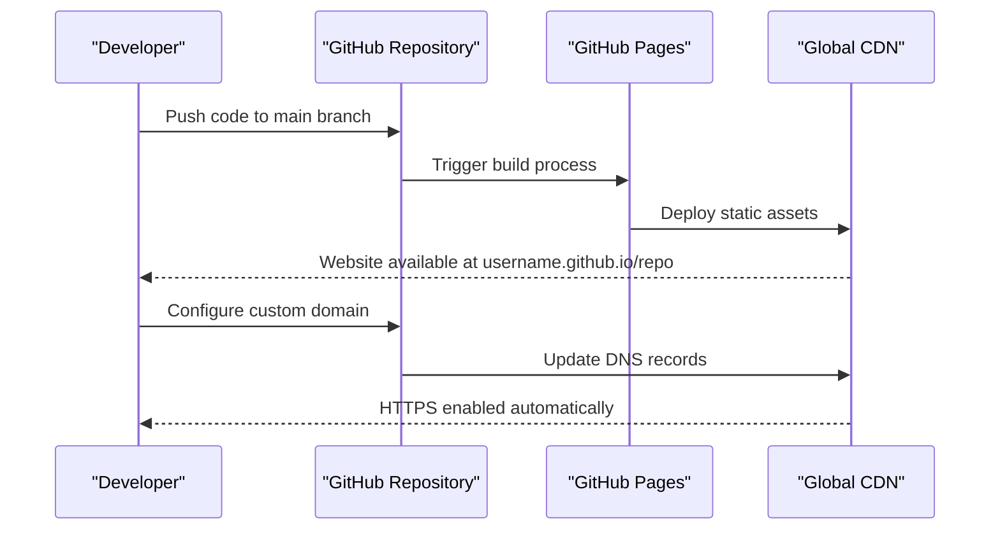
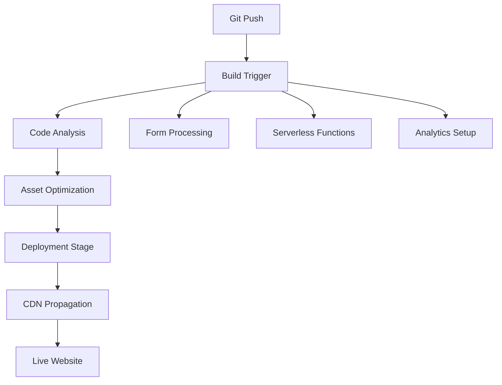
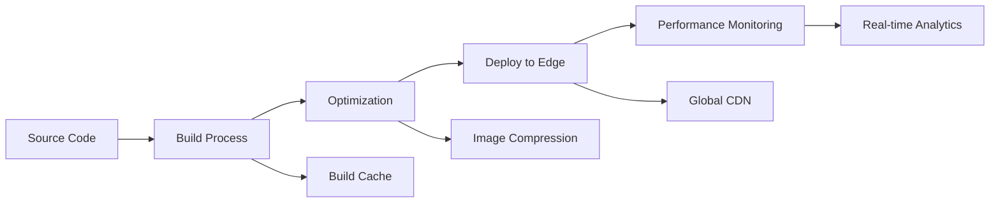

# Deployment and Hosting

<cite>
**Referenced Files in This Document**
- [index.html](file://index.html)
- [script.js](file://script.js)
- [styles.css](file://styles.css)
- [images.png](file://assets/images/images.png)
- [yyp_photo.png](file://assets/images/yyp_photo.png)
</cite>

## Table of Contents
1. [Introduction](#introduction)
2. [Project Structure](#project-structure)
3. [Static Hosting Options](#static-hosting-options)
4. [Performance Optimization Strategies](#performance-optimization-strategies)
5. [Browser Compatibility Considerations](#browser-compatibility-considerations)
6. [File Structure Requirements](#file-structure-requirements)
7. [Asset Loading and Caching Strategies](#asset-loading-and-caching-strategies)
8. [SEO Optimization](#seo-optimization)
9. [Deployment Workflows](#deployment-workflows)
10. [Domain Configuration and HTTPS](#domain-configuration-and-https)
11. [Common Deployment Issues](#common-deployment-issues)
12. [Performance Monitoring](#performance-monitoring)
13. [Maintenance Considerations](#maintenance-considerations)
14. [Minimal Server Requirements](#minimal-server-requirements)
15. [CDN Impact and Global Accessibility](#cdn-impact-and-global-accessibility)
16. [Automated Deployment Pipelines](#automated-deployment-pipelines)
17. [Conclusion](#conclusion)

## Introduction

This document provides comprehensive guidance for deploying and hosting Yeoh Yee Peng's portfolio website in production environments. The portfolio is a modern, static single-page application built with HTML, CSS, and JavaScript, featuring responsive design, dark mode support, and interactive animations. The site demonstrates contemporary web development practices suitable for various hosting platforms and deployment strategies.

The website showcases a professional digital marketing portfolio with sections covering personal information, education, experience, skills, awards, and contact details. It utilizes modern CSS features including custom properties, CSS Grid, Flexbox, and advanced selectors, along with JavaScript for smooth animations and user interactions.

## Project Structure

The portfolio website follows a clean, minimal file structure optimized for static hosting deployment:



**Diagram sources**
- [index.html:13](file://index.html#L13)
- [index.html:15](file://index.html#L15)
- [index.html:12](file://index.html#L12)
- [index.html:268](file://index.html#L268)

The project consists of four essential files:
- Single HTML entry point containing all page structure and content
- Centralized CSS stylesheet with modern CSS features
- JavaScript file handling animations, parallax effects, and theme switching
- Optimized image assets for profile photography and favicon

**Section sources**
- [index.html:1-271](file://index.html#L1-L271)
- [script.js:1-27](file://script.js#L1-L27)
- [styles.css:1-357](file://styles.css#L1-L357)

## Static Hosting Options

### GitHub Pages
GitHub Pages offers seamless integration for static portfolios with automatic build processes:

**Advantages:**
- Free tier with unlimited bandwidth for public repositories
- Automatic Jekyll builds and custom domain support
- Integrated CI/CD pipeline with GitHub Actions
- SSL certificates automatically provisioned

**Deployment Steps:**
1. Push repository to GitHub with proper branch structure
2. Enable GitHub Pages in repository settings
3. Configure custom domain if needed
4. Set up automatic redirects for HTTPS

### Netlify
Netlify provides enterprise-grade static hosting with advanced features:

**Key Features:**
- One-click SSL certificates with automatic renewal
- Automatic image optimization and compression
- Form handling and serverless functions
- Drag-and-drop deployments via Git integration
- Advanced caching and CDN distribution

**Benefits for Portfolio:**
- Automatic HTTPS enforcement
- Image optimization for PNG assets
- Fast global CDN delivery
- Built-in analytics and monitoring

### Vercel
Vercel delivers optimal performance for modern static sites:

**Features:**
- Edge network for global low-latency delivery
- Automatic image optimization and WebP conversion
- Serverless functions for dynamic features
- Zero-config deployments with Git integration
- Advanced caching strategies

**Optimization Benefits:**
- Intelligent caching for static assets
- Automatic compression (Brotli, gzip)
- Edge computing for improved performance
- Real-time analytics and monitoring

### Traditional Web Hosting
For conventional shared hosting environments:

**Requirements:**
- PHP 7.0+ or static file serving capabilities
- Apache 2.4+ or Nginx 1.10+
- OpenSSL 1.0.1+ for HTTPS
- Proper MIME type configuration

**Considerations:**
- Manual deployment process
- Need for proper server configuration
- Limited CDN integration compared to specialized platforms

## Performance Optimization Strategies

### Asset Compression and Optimization

**Image Optimization:**
- PNG compression for profile photos and favicons
- Modern formats (WebP) for improved loading performance
- Lazy loading for non-critical images
- Proper sizing to avoid unnecessary bandwidth usage

**CSS Optimization:**
- CSS custom properties for reduced redundancy
- Efficient selector patterns minimizing specificity
- Critical CSS extraction for above-the-fold content
- Minification for production builds

**JavaScript Optimization:**
- Single-file JavaScript bundle for reduced requests
- Event delegation for efficient DOM manipulation
- Debounced scroll handlers for parallax effects
- Local storage for persistent user preferences

### Caching Strategies

**Cache Headers Implementation:**
- Static assets: 1 year cache with immutable flag
- HTML documents: short cache with revalidation
- CSS and JavaScript: cache with version-based invalidation
- Images: optimized cache with progressive enhancement

**Service Worker Integration:**
- Offline-first caching strategies
- Network-first fallback for dynamic content
- Cache expiration and cleanup mechanisms
- Precaching for critical assets

### Resource Loading Optimization

**Critical Rendering Path:**
- Inline critical CSS for above-the-fold content
- Defer non-critical JavaScript until after render
- Preload key resources (fonts, critical images)
- Optimize font loading with font-display swap

**Lazy Loading Implementation:**
- Intersection Observer for image lazy loading
- Async script loading for non-blocking execution
- Priority-based resource loading order
- Viewport-aware asset preloading

**Section sources**
- [styles.css:320-347](file://styles.css#L320-L347)
- [script.js:4-10](file://script.js#L4-L10)
- [index.html:10-12](file://index.html#L10-L12)

## Browser Compatibility Considerations

### Modern Feature Support

**CSS Features:**
- CSS custom properties for theming support
- CSS Grid and Flexbox for responsive layouts
- CSS animations and transitions for interactive elements
- Custom selectors for enhanced styling capabilities

**JavaScript Features:**
- Arrow functions for concise syntax
- Template literals for dynamic content
- Destructuring assignment for clean code
- Event listeners with passive options for performance

**Progressive Enhancement:**
- Graceful degradation for older browsers
- Polyfills for missing functionality
- Feature detection over browser detection
- Mobile-first responsive design approach

### Cross-Browser Testing Strategy

**Targeted Browsers:**
- Chrome 60+ (primary desktop browser)
- Firefox 55+ (Mozilla ecosystem)
- Safari 12+ (Apple devices)
- Edge 79+ (Microsoft Edge)
- Mobile browsers with modern standards support

**Compatibility Features:**
- Vendor prefixes for experimental CSS properties
- Transitions for animation fallbacks
- Feature queries for conditional styling
- Polyfill libraries for missing APIs

**Section sources**
- [styles.css:3-14](file://styles.css#L3-L14)
- [script.js:1-27](file://script.js#L1-L27)
- [index.html:2-6](file://index.html#L2-L6)

## File Structure Requirements

### Platform-Specific Requirements

**GitHub Pages:**
- Root-level HTML file (index.html)
- Static assets in root or assets/ directory
- No server-side processing required
- Custom domain configuration via DNS records

**Netlify/Vercel:**
- Build output directory structure
- Public folder for static assets
- Config files for build customization
- Environment variable management

**Traditional Hosting:**
- Proper MIME type configuration
- Case-sensitive file naming
- Directory indexing permissions
- Security headers for HTTPS enforcement

### Asset Organization

**Directory Structure:**
```
├── index.html
├── script.js
├── styles.css
└── assets/
    └── images/
        ├── yyp_photo.png
        └── images.png
```

**File Naming Conventions:**
- Lowercase filenames with hyphens or underscores
- Consistent naming for related assets
- Versioned filenames for cache busting
- Descriptive names for accessibility

**Section sources**
- [index.html:1-271](file://index.html#L1-L271)
- [styles.css:1-357](file://styles.css#L1-L357)
- [script.js:1-27](file://script.js#L1-L27)

## Asset Loading and Caching Strategies

### Image Loading Optimization

**Profile Photography:**
- High-resolution PNG for crisp display
- Optimized compression for web delivery
- Aspect ratio preservation for responsive design
- Lazy loading for non-critical images

**Favicon Implementation:**
- SVG data URI for immediate loading
- Multiple sizes for different contexts
- Optimized SVG format for small file size
- Automatic fallback for older browsers

### CSS Delivery Optimization

**Critical CSS Extraction:**
- Above-the-fold styles inline for immediate rendering
- Deferred loading for below-the-fold content
- CSS custom properties for reduced duplication
- Media query optimization for print styles

**External Resource Loading:**
- Google Fonts with preconnect hints
- Asynchronous font loading
- Font-display swap for improved UX
- Local fallback fonts for reliability

### JavaScript Loading Strategies

**Event-Driven Loading:**
- Non-blocking script execution
- Intersection Observer for progressive enhancement
- Scroll event throttling for performance
- Local storage for persistent state

**Memory Management:**
- Efficient DOM manipulation
- Event listener cleanup
- Animation frame optimization
- Storage quota management

**Section sources**
- [index.html:14-15](file://index.html#L14-L15)
- [index.html:62-63](file://index.html#L62-L63)
- [script.js:1-27](file://script.js#L1-L27)

## SEO Optimization

### Meta Tags and Structured Content

**Essential Meta Tags:**
- Character encoding specification (UTF-8)
- Viewport configuration for mobile optimization
- Description meta tag for search results
- Open Graph protocol for social sharing
- Twitter Card configuration for Twitter

**Structured Data Implementation:**
- JSON-LD for professional information
- Schema.org markup for person profiles
- Organization and job posting schemas
- Educational qualification structured data

**Content Optimization:**
- Semantic HTML structure with proper headings
- Descriptive alt text for images
- Internal linking strategy for navigation
- Content hierarchy for readability

### Search Engine Best Practices

**Technical SEO:**
- Mobile-first indexing compliance
- HTTPS enforcement for security
- Fast loading performance metrics
- Secure content delivery

**Content Strategy:**
- Keyword optimization for digital marketing
- Professional experience highlighting
- Skill and competency showcase
- Contact information accessibility

**Section sources**
- [index.html:5-9](file://index.html#L5-L9)
- [index.html:10-12](file://index.html#L10-L12)

## Deployment Workflows

### GitHub Pages Deployment

**Workflow Process:**


**Diagram sources**
- [index.html:1-271](file://index.html#L1-L271)

**Steps:**
1. Initialize Git repository and push code
2. Enable GitHub Pages in repository settings
3. Configure custom domain if desired
4. Set up automatic HTTPS redirection
5. Monitor deployment status and logs

### Netlify Deployment

**Automated Workflow:**


**Diagram sources**
- [script.js:20-27](file://script.js#L20-L27)

**Configuration Steps:**
1. Connect GitHub repository to Netlify
2. Configure build settings and environment variables
3. Set up custom domain and SSL certificate
4. Configure redirect rules and headers
5. Enable analytics and monitoring

### Vercel Deployment

**Production Pipeline:**


**Diagram sources**
- [styles.css:349-357](file://styles.css#L349-L357)

**Setup Process:**
1. Import GitHub repository to Vercel
2. Configure environment variables and secrets
3. Set up preview deployments for pull requests
4. Configure production domains and redirects
5. Enable performance monitoring and analytics

**Section sources**
- [index.html:1-271](file://index.html#L1-L271)
- [script.js:1-27](file://script.js#L1-L27)
- [styles.css:1-357](file://styles.css#L1-L357)

## Domain Configuration and HTTPS

### Domain Setup Process

**DNS Configuration:**
- A records for IPv4 addresses
- AAAA records for IPv6 support
- CNAME records for subdomains
- TXT records for domain verification

**Certificate Management:**
- Automated certificate provisioning
- Automatic renewal processes
- Mixed content blocking prevention
- HSTS header implementation

### HTTPS Enforcement

**Security Headers:**
- Strict-Transport-Security for protocol enforcement
- Content-Security-Policy for resource control
- X-Frame-Options for clickjacking protection
- Referrer-Policy for privacy protection

**Redirect Configuration:**
- HTTP to HTTPS automatic redirects
- WWW subdomain normalization
- Trailing slash consistency
- Canonical URL establishment

**Section sources**
- [index.html:14-15](file://index.html#L14-L15)
- [index.html:10-12](file://index.html#L10-L12)

## Common Deployment Issues

### Build Failures

**Common Problems:**
- Missing dependency installations
- Incorrect file paths in references
- Build configuration errors
- Asset optimization failures

**Resolution Strategies:**
- Verify all file references are correct
- Check build tool configuration
- Validate asset file formats and sizes
- Test locally before deployment

### Performance Issues

**Loading Problems:**
- Slow asset delivery times
- Large file sizes causing delays
- Missing cache headers
- Poor CDN distribution

**Diagnostic Approaches:**
- Use browser developer tools for performance analysis
- Check network tab for resource loading patterns
- Monitor Core Web Vitals metrics
- Analyze server response times

### Compatibility Problems

**Browser Issues:**
- CSS property support variations
- JavaScript feature availability differences
- Font loading inconsistencies
- Mobile device rendering problems

**Testing Methods:**
- Cross-browser testing across target browsers
- Mobile device testing on various screen sizes
- Performance testing under different network conditions
- Accessibility testing with assistive technologies

**Section sources**
- [script.js:4-10](file://script.js#L4-L10)
- [styles.css:349-357](file://styles.css#L349-L357)

## Performance Monitoring

### Key Metrics to Track

**Core Web Vitals:**
- Largest Contentful Paint (LCP) for loading performance
- First Input Delay (FID) for interactivity
- Cumulative Layout Shift (CLS) for visual stability
- Experience Rating for overall performance health

**Infrastructure Metrics:**
- Page load time and render time
- Time to First Byte (TTFB) for server responsiveness
- Bandwidth usage and transfer sizes
- Server uptime and availability

### Monitoring Tools

**Built-in Browser Tools:**
- Chrome DevTools for performance profiling
- Lighthouse for automated audits
- WebPageTest for real-world performance testing
- GTmetrix for comprehensive analysis

**Third-party Monitoring:**
- Google Analytics for traffic insights
- Hotjar for user behavior analysis
- Sentry for error tracking and monitoring
- Pingdom for uptime and performance monitoring

### Performance Optimization Techniques

**Continuous Improvement:**
- Regular performance audits and optimization cycles
- A/B testing for layout and content changes
- User experience monitoring and feedback collection
- Infrastructure scaling based on traffic patterns

**Section sources**
- [script.js:12-18](file://script.js#L12-L18)
- [styles.css:320-347](file://styles.css#L320-L347)

## Maintenance Considerations

### Content Updates

**Update Procedures:**
- Version control for all content changes
- Preview environments for review processes
- Scheduled maintenance windows for updates
- Backup procedures before major changes

**Content Management:**
- Markdown-based content for easy editing
- Asset versioning for cache management
- Automated backup and restore procedures
- Content validation and quality checks

### Security Maintenance

**Security Practices:**
- Regular security audits and vulnerability assessments
- SSL certificate renewal and monitoring
- Content security policy updates
- Access control and permission management

**Monitoring and Alerts:**
- Security incident response procedures
- Automated security scanning and alerts
- Compliance monitoring and reporting
- Incident documentation and post-mortem analysis

### Performance Maintenance

**Ongoing Optimization:**
- Regular performance reviews and improvements
- Asset optimization and compression updates
- CDN configuration and routing optimization
- Server configuration and infrastructure updates

**Capacity Planning:**
- Traffic pattern analysis and forecasting
- Infrastructure scaling based on growth
- Cost optimization through efficient resource usage
- Disaster recovery and business continuity planning

## Minimal Server Requirements

### Hardware Specifications

**Basic Requirements:**
- CPU: Dual-core processor or equivalent
- RAM: 512MB minimum, 1GB recommended
- Storage: 1GB SSD for static files
- Bandwidth: 100GB monthly allowance
- Network: 100Mbps download, 10Mbps upload

**Scalability Considerations:**
- CDN offloads most bandwidth requirements
- Static content requires minimal server resources
- Image optimization reduces storage needs
- Caching strategies minimize server load

### Software Requirements

**Server Software:**
- Web server: Apache 2.4+ or Nginx 1.10+
- PHP: 7.0+ for dynamic features (if needed)
- SSL/TLS: OpenSSL 1.0.1+ for HTTPS
- Compression: Brotli and gzip support
- Security: Latest security patches applied

**Configuration Requirements:**
- Proper MIME type configuration
- Directory indexing disabled for security
- Symbolic links for asset organization
- Logging configuration for monitoring

**Section sources**
- [index.html:1-271](file://index.html#L1-L271)
- [styles.css:1-357](file://styles.css#L1-L357)
- [script.js:1-27](file://script.js#L1-L27)

## CDN Impact and Global Accessibility

### CDN Benefits

**Performance Improvements:**
- Reduced latency through global edge servers
- Improved bandwidth utilization and caching
- Load balancing across multiple geographic locations
- Automatic failover and redundancy

**Cost Efficiency:**
- Reduced origin server bandwidth costs
- Improved user experience through faster delivery
- Scalable infrastructure without capacity planning
- Geographic expansion without additional hardware

### Global Distribution Strategy

**Edge Locations:**
- Strategic placement of edge servers worldwide
- Regional optimization for local content delivery
- Load balancing across multiple CDN nodes
- Automatic routing to nearest optimal server

**Content Optimization:**
- Intelligent caching based on user geography
- Dynamic content optimization for regional preferences
- Asset delivery optimization for local networks
- Protocol optimization for different network conditions

### Accessibility Considerations

**Network Diversity:**
- Support for various network conditions and speeds
- Progressive enhancement for low-bandwidth connections
- Adaptive content delivery based on connection quality
- Quality of service prioritization for critical content

**Regional Compliance:**
- Data residency requirements for different regions
- Privacy regulations compliance (GDPR, CCPA)
- Localized content and language support
- Regional accessibility standards adherence

## Automated Deployment Pipelines

### CI/CD Integration

**Pipeline Components:**
- Source code repository with version control
- Automated build and testing processes
- Quality gates and approval workflows
- Production deployment automation

**Integration Points:**
- Git hooks for triggering builds
- Automated testing and validation
- Artifact storage and versioning
- Rollback and recovery procedures

### Deployment Automation

**Automated Processes:**
- Build artifact generation and optimization
- Multi-environment deployment orchestration
- Health checks and validation procedures
- Post-deployment monitoring and alerting

**Quality Assurance:**
- Automated performance testing and validation
- Security scanning and vulnerability assessment
- Accessibility compliance checking
- Cross-browser compatibility validation

### Monitoring and Alerting

**Proactive Monitoring:**
- Real-time performance metric tracking
- Automated incident detection and response
- Capacity planning and resource optimization
- Business continuity and disaster recovery

**Feedback Loops:**
- User experience monitoring and analysis
- Performance regression detection
- Business metric tracking and reporting
- Continuous improvement through data analysis

**Section sources**
- [index.html:1-271](file://index.html#L1-L271)
- [script.js:1-27](file://script.js#L1-L27)
- [styles.css:1-357](file://styles.css#L1-L357)

## Conclusion

The Yeoh Yee Peng portfolio website represents a modern, well-architected static site that demonstrates excellent practices for deployment and hosting. Its clean file structure, optimized assets, and thoughtful implementation make it ideal for various hosting platforms while maintaining excellent performance characteristics.

The website's design emphasizes user experience through responsive layouts, smooth animations, and accessible navigation. The implementation of dark mode, lazy loading, and performance optimization techniques ensures optimal delivery across different devices and network conditions.

For production deployment, the choice of hosting platform should align with specific requirements for performance, scalability, and maintenance. GitHub Pages, Netlify, and Vercel offer excellent managed solutions with minimal operational overhead, while traditional hosting provides more control for specific infrastructure requirements.

The portfolio serves as an excellent example of modern web development practices, demonstrating how static site architecture can deliver professional, high-performance websites suitable for showcasing creative work and professional achievements. The implementation provides a solid foundation for future enhancements and maintenance while maintaining excellent user experience across diverse deployment scenarios.