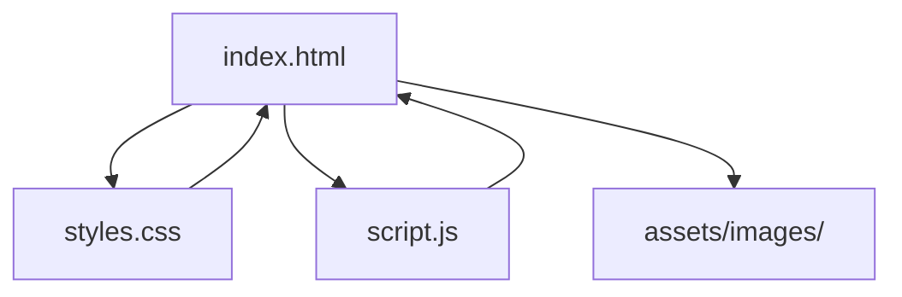
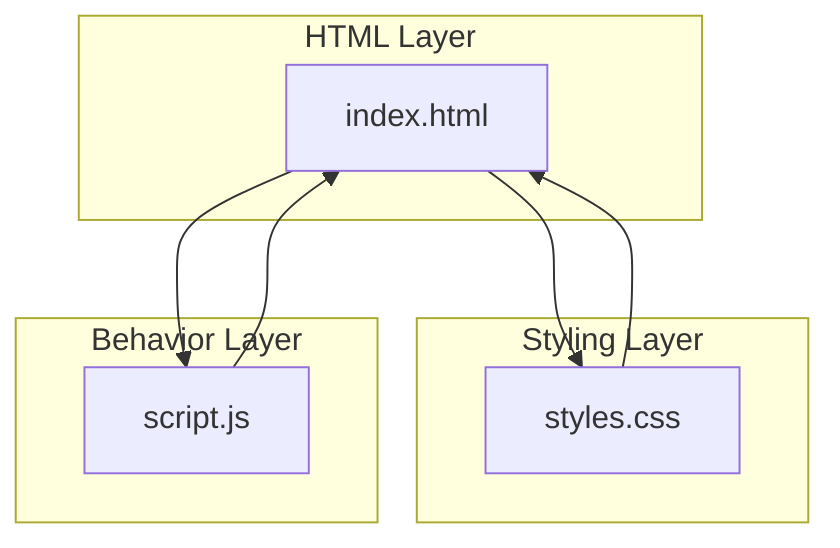
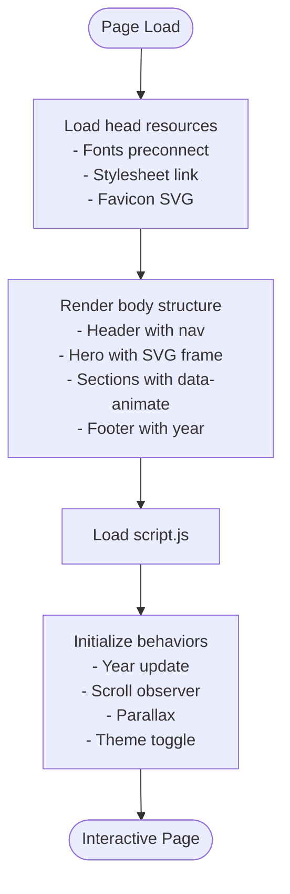
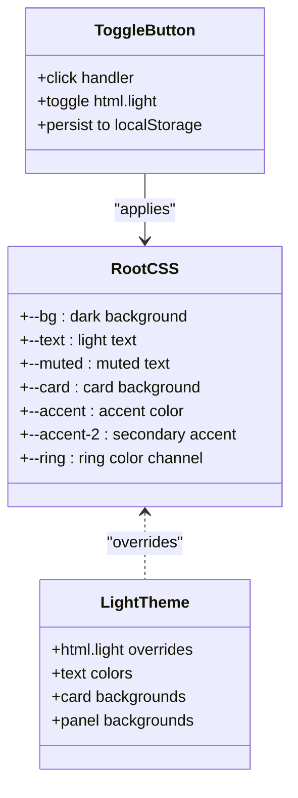
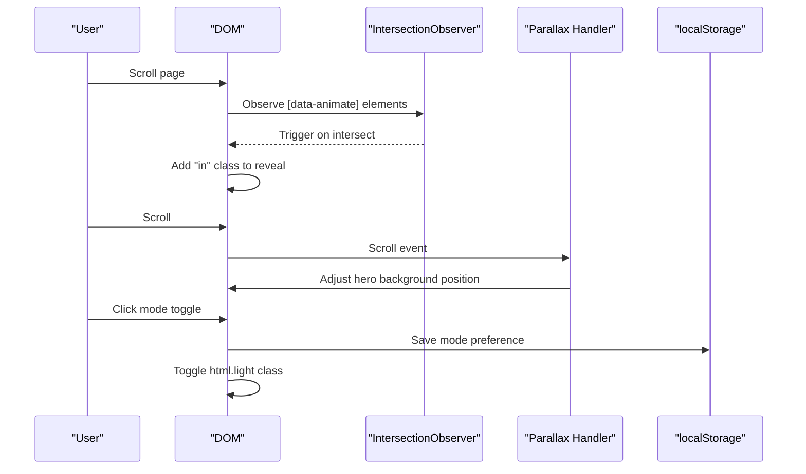
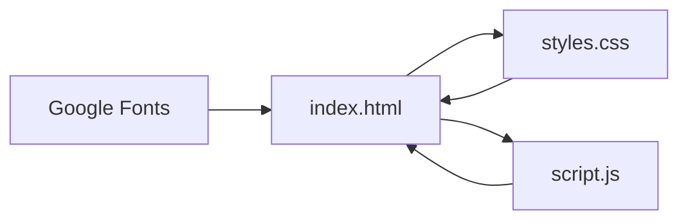

# File Structure and Architecture

<cite>
**Referenced Files in This Document**
- [index.html](file://index.html)
- [styles.css](file://styles.css)
- [script.js](file://script.js)
- [README.md](file://README.md)
</cite>

## Table of Contents
1. [Introduction](#introduction)
2. [Project Structure](#project-structure)
3. [Core Components](#core-components)
4. [Architecture Overview](#architecture-overview)
5. [Detailed Component Analysis](#detailed-component-analysis)
6. [Dependency Analysis](#dependency-analysis)
7. [Performance Considerations](#performance-considerations)
8. [Troubleshooting Guide](#troubleshooting-guide)
9. [Conclusion](#conclusion)

## Introduction
This document explains the file architecture and component relationships for Yeoh Yee Peng's portfolio website. It focuses on how the HTML structure, CSS styling, and JavaScript functionality are organized and how they interact to deliver a cohesive, responsive, and theme-aware experience. The site follows a minimal dependency approach, relying on vanilla JavaScript and CSS custom properties for interactivity and theming, while avoiding external frameworks or libraries.

## Project Structure
The project is intentionally minimalistic, consisting of four primary files:
- index.html: The main HTML document that defines the page structure, navigation, content sections, and interactive elements.
- styles.css: A single stylesheet that manages base styles, typography, layout, component styling, animations, and theme switching via CSS custom properties.
- script.js: A compact JavaScript module that handles dynamic behaviors such as scroll-triggered animations, parallax effects, and persistent theme toggling.
- assets/images/: A dedicated folder for static image assets used within the page (e.g., profile photo and placeholder images).

**Diagram sources**
- [index.html:1-271](file://index.html#L1-L271)
- [styles.css:1-157](file://styles.css#L1-L157)
- [script.js:1-27](file://script.js#L1-L27)

**Section sources**
- [index.html:1-271](file://index.html#L1-L271)
- [styles.css:1-157](file://styles.css#L1-L157)
- [script.js:1-27](file://script.js#L1-L27)

## Core Components
This section outlines the responsibilities and roles of each major component and how they collaborate.

- index.html
  - Defines the page metadata, fonts, and stylesheet inclusion.
  - Provides the semantic structure for the site, including header navigation, hero section, content panels, and footer.
  - Embeds an inline SVG favicon and uses SVG graphics for decorative device frames.
  - Implements accessibility attributes such as aria-label and aria-hidden to improve screen reader support.
  - Loads the JavaScript bundle at the bottom of the body to ensure DOM readiness before initialization.

- styles.css
  - Establishes a dark theme as the default using CSS custom properties stored in :root.
  - Defines a light theme variant by overriding custom properties under html.light.
  - Implements a modular CSS organization by grouping styles by component areas (navigation, hero, panels, skills, awards, contact, footer).
  - Uses modern CSS features like clamp(), CSS Grid, and Flexbox for responsive layouts.
  - Provides smooth transitions and animations for scroll-triggered reveals and hover states.

- script.js
  - Dynamically sets the current year in the footer.
  - Initializes an IntersectionObserver to reveal elements when they enter the viewport.
  - Applies a parallax effect to the hero background based on scroll position.
  - Manages theme persistence using localStorage and toggles the html.light class to switch themes.

**Section sources**
- [index.html:1-271](file://index.html#L1-L271)
- [styles.css:1-157](file://styles.css#L1-L157)
- [script.js:1-27](file://script.js#L1-L27)

## Architecture Overview
The site employs a progressive enhancement approach:
- Semantic HTML provides a robust baseline structure.
- CSS custom properties enable theme switching without duplicating styles.
- Vanilla JavaScript adds interactivity and dynamic behaviors without heavy frameworks.
- SVG graphics and inline assets reduce network overhead and improve perceived performance.

**Diagram sources**
- [index.html:1-271](file://index.html#L1-L271)
- [styles.css:1-157](file://styles.css#L1-L157)
- [script.js:1-27](file://script.js#L1-L27)

## Detailed Component Analysis

### HTML Structure and Content Organization
- Document head
  - Sets character encoding and viewport meta tag for responsiveness.
  - Loads Google Fonts via preconnect and stylesheet links for optimal performance.
  - Includes a data URI SVG favicon for instant rendering.
  - Links to the stylesheet before any content is rendered.

- Navigation and branding
  - Sticky header with brand identity and navigation links.
  - Dark/light mode toggle button with sun/moon icons controlled by CSS.

- Sections and panels
  - Each content area is wrapped in a section with a unique ID for navigation and animation hooks.
  - Panels use a consistent container and grid utilities for layout.
  - Specific components include timelines, cards, badges, and contact cards.

- Footer
  - Displays the copyright year dynamically updated by JavaScript.

**Diagram sources**
- [index.html:1-271](file://index.html#L1-L271)
- [script.js:1-27](file://script.js#L1-L27)

**Section sources**
- [index.html:1-271](file://index.html#L1-L271)

### CSS Theming and Custom Properties
- Default dark theme
  - Defined in :root with variables for background, text, muted text, card backgrounds, and accent colors.
  - Background gradients and subtle textures create depth without heavy assets.

- Light theme variant
  - Overridden variables under html.light adjust colors for readability and contrast.
  - Component-specific overrides ensure consistent appearance across panels, cards, and badges.

- Theme toggle mechanics
  - The mode toggle button switches the html.light class on the root element.
  - Persistent storage via localStorage ensures the theme preference survives navigation.

**Diagram sources**
- [styles.css:1-157](file://styles.css#L1-L157)
- [script.js:20-27](file://script.js#L20-L27)

**Section sources**
- [styles.css:1-157](file://styles.css#L1-L157)
- [script.js:20-27](file://script.js#L20-L27)

### JavaScript Interactions and Behaviors
- Scroll-triggered animations
  - An IntersectionObserver watches elements with [data-animate].
  - On intersection, the in class is added to reveal content smoothly.

- Parallax effect
  - A scroll event listener adjusts the hero background position based on scroll distance.
  - Uses passive event listeners for performance.

- Theme persistence
  - Reads the saved mode from localStorage on load.
  - Toggles the html.light class and updates localStorage accordingly.

**Diagram sources**
- [script.js:4-18](file://script.js#L4-L18)
- [script.js:20-27](file://script.js#L20-L27)

**Section sources**
- [script.js:1-27](file://script.js#L1-L27)

### Asset Management Strategy
- Inline SVG favicon
  - Embedded as a data URI in the head to eliminate an extra HTTP request and ensure immediate rendering.

- SVG graphics usage
  - The hero device frame uses inline SVG for a stylized phone silhouette, reducing external dependencies and enabling easy theming.

- Image assets
  - Profile and placeholder images are served from assets/images/.
  - The hero section uses an SVG <image> element to display the profile photo with clipping and scaling for a device-like presentation.

- Loading order and performance
  - Stylesheet is linked early to prevent FOIT/FOFT.
  - Script is loaded at the bottom of the body to avoid blocking render.
  - Preconnect hints for Google Fonts improve font loading performance.

**Section sources**
- [index.html:10-16](file://index.html#L10-L16)
- [index.html:51-66](file://index.html#L51-L66)
- [index.html:62-63](file://index.html#L62-L63)

### Modular CSS Organization
- Component-based grouping
  - Styles are grouped by functional areas: base, navigation, hero, panels, skills, awards, contact, footer, animations, and light theme overrides.
  - This improves maintainability and makes it easier to locate and modify specific sections.

- Responsive design patterns
  - clamp() is used extensively for fluid typography and spacing.
  - CSS Grid and Flexbox handle responsive layouts for cards, grids, and contact items.
  - Container-based max widths and padding ensure consistent spacing across devices.

**Section sources**
- [styles.css:27-157](file://styles.css#L27-L157)

### Separation of Concerns
- HTML: Structure and semantics only. No inline styles or scripts.
- CSS: Presentational logic and theming via custom properties. No inline behaviors.
- JavaScript: Dynamic behaviors and interactions. No inline styles or markup.

This separation enables:
- Predictable maintenance and updates.
- Clear debugging paths.
- Scalable extension without cross-contamination.

**Section sources**
- [index.html:1-271](file://index.html#L1-L271)
- [styles.css:1-157](file://styles.css#L1-L157)
- [script.js:1-27](file://script.js#L1-L27)

## Dependency Analysis
The site maintains a minimal dependency footprint:
- External resources
  - Google Fonts via preconnect and stylesheet links.
  - Inline SVG favicon and hero device frame.
- Internal dependencies
  - index.html depends on styles.css and script.js.
  - script.js depends on DOM elements defined in index.html.
  - styles.css depends on CSS custom properties and does not rely on external libraries.

**Diagram sources**
- [index.html:10-16](file://index.html#L10-L16)
- [index.html:13](file://index.html#L13)
- [index.html:268](file://index.html#L268)

**Section sources**
- [index.html:10-16](file://index.html#L10-L16)
- [index.html:13](file://index.html#L13)
- [index.html:268](file://index.html#L268)

## Performance Considerations
- Early resource loading
  - Preconnect to Google Fonts reduces DNS and handshake latency.
  - Stylesheet link in the head prevents flash of invisible text.

- Efficient scripting
  - Passive scroll listener minimizes layout thrashing.
  - IntersectionObserver avoids polling and reduces CPU usage.

- Lightweight assets
  - Inline SVG favicon eliminates network requests.
  - SVG device frame is lightweight and scalable.

- Theme persistence
  - localStorage reduces server round-trips and ensures instant theme restoration.

[No sources needed since this section provides general guidance]

## Troubleshooting Guide
- Theme not persisting
  - Verify localStorage availability and that the html.light class is toggled on click.
  - Confirm the saved mode value is either "light" or "dark".

- Animations not triggering
  - Ensure elements have the [data-animate] attribute and are within the viewport.
  - Check that the IntersectionObserver is initialized and observing target elements.

- Parallax not working
  - Confirm the hero section has the [data-parallax] attribute.
  - Verify the scroll event listener is attached and the background property is set.

- Images not displaying
  - Validate the asset paths in the hero section and ensure files exist in assets/images/.

**Section sources**
- [script.js:20-27](file://script.js#L20-L27)
- [script.js:4-18](file://script.js#L4-L18)
- [index.html:39](file://index.html#L39)
- [index.html:62-63](file://index.html#L62-L63)

## Conclusion
The portfolio website demonstrates a clean, minimal, and efficient architecture. By separating structure, presentation, and behavior, and leveraging CSS custom properties and vanilla JavaScript, the site achieves a responsive, theme-aware experience with excellent performance characteristics. The modular CSS organization and thoughtful asset management contribute to a maintainable and scalable foundation for future enhancements.