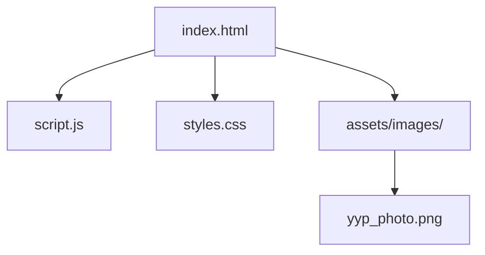
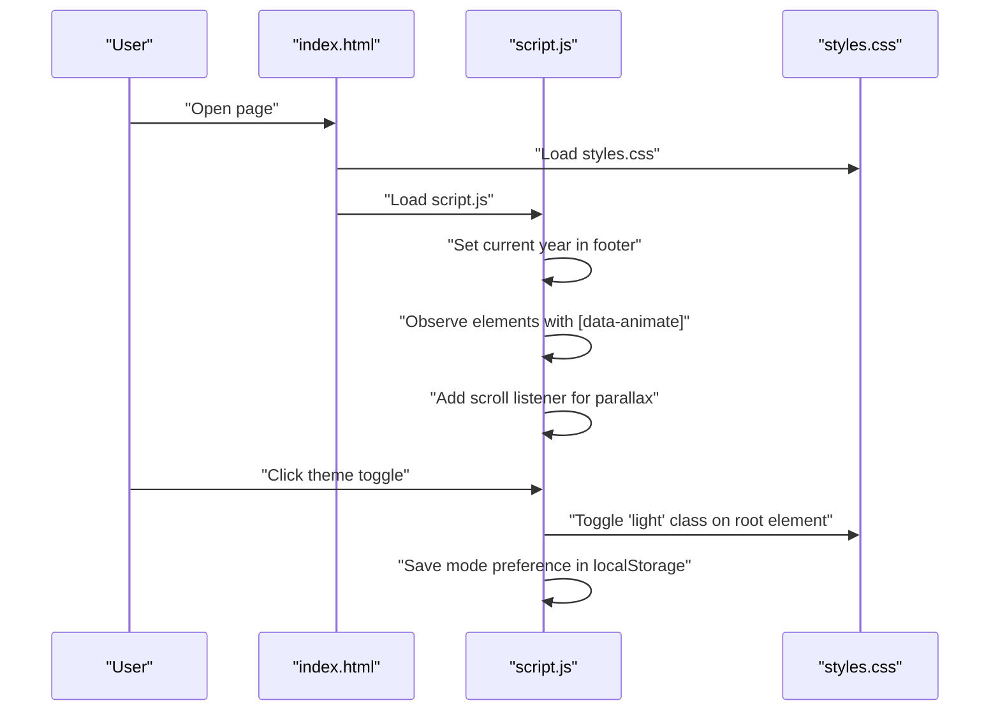

# Getting Started

<cite>
**Referenced Files in This Document**
- [index.html](file://index.html)
- [script.js](file://script.js)
- [styles.css](file://styles.css)
- [README.md](file://README.md)
</cite>

## Table of Contents
1. [Introduction](#introduction)
2. [Project Structure](#project-structure)
3. [Prerequisites](#prerequisites)
4. [Installation and Local Setup](#installation-and-local-setup)
5. [Viewing the Portfolio](#viewing-the-portfolio)
6. [Understanding the Design and Interactions](#understanding-the-design-and-interactions)
7. [Customization Guide](#customization-guide)
8. [Troubleshooting](#troubleshooting)
9. [Why Vanilla JavaScript Without Build Tools](#why-vanilla-javascript-without-build-tools)
10. [Conclusion](#conclusion)

## Introduction
This guide helps you set up and run Yeoh Yee Peng’s portfolio website locally. The site is a modern, single-page static website built with HTML, CSS, and vanilla JavaScript. It focuses on showcasing professional content with smooth animations, responsive design, and a dark/light theme toggle. There are no build tools or external frameworks required—just a browser and a local server to serve the files.

## Project Structure
The project consists of a small set of core files:
- index.html: The main page markup and content sections
- script.js: Lightweight JavaScript for year insertion, scroll animations, parallax effect, and theme toggle
- styles.css: CSS for layout, typography, dark/light themes, and responsive grids
- assets/images: Contains placeholder images referenced by the HTML (e.g., profile photo)

**Diagram sources**
- [index.html:1-271](file://index.html#L1-L271)
- [script.js:1-27](file://script.js#L1-L27)
- [styles.css:1-157](file://styles.css#L1-L157)

**Section sources**
- [index.html:1-271](file://index.html#L1-L271)
- [script.js:1-27](file://script.js#L1-L27)
- [styles.css:1-157](file://styles.css#L1-L157)

## Prerequisites
- Basic web development knowledge:
  - Understanding of HTML structure, CSS selectors, and JavaScript DOM manipulation
  - Familiarity with browser developer tools for inspection and debugging
- Browser compatibility:
  - Modern desktop and mobile browsers (Chrome, Firefox, Safari, Edge)
  - The site relies on CSS Grid, Flexbox, CSS custom properties, IntersectionObserver, and localStorage—these are widely supported in current browsers
- Local server setup:
  - Static hosting is required because some features rely on loading resources via file paths and local storage persistence

## Installation and Local Setup
Follow these steps to run the site locally:

1. Download or clone the repository to your computer.
2. Open a terminal or command prompt in the project root folder.
3. Start a local static server:
   - Python 3.x: python -m http.server 8000
   - Node.js (if installed): npx http-server
   - VS Code Live Server extension
   - Any other static file server
4. Open your browser and navigate to http://localhost:8000 (or the port your server uses).
5. Confirm the site loads without errors and all assets appear.

Notes:
- The site references a profile image at assets/images/yyp_photo.png. Ensure this file exists in the assets/images/ directory. If missing, the hero screen will still render, but the image area will be empty.
- Fonts are loaded from Google Fonts via CDN links in the HTML head. An internet connection is required for fonts to load.

**Section sources**
- [index.html:10-15](file://index.html#L10-L15)
- [index.html:62-63](file://index.html#L62-L63)

## Viewing the Portfolio
- Desktop browsers: Use Chrome, Firefox, Safari, or Edge. Scroll to explore panels and click navigation links to jump between sections.
- Mobile browsers: The design is responsive. Swipe vertically to scroll and tap navigation items to jump to sections.
- Dark/light theme: Toggle the sun/moon button in the top-right navigation to switch modes. The preference persists in your browser’s local storage.

Verification steps:
- Confirm the hero section displays with the device frame and gradient background.
- Verify the “See my work” and “Get in touch” buttons are clickable.
- Test the navigation links in the header to jump to About, Education, Experience, Skills, Awards, and Contact sections.
- Try the theme toggle and refresh the page to confirm the saved mode.

**Section sources**
- [index.html:18-35](file://index.html#L18-L35)
- [script.js:20-27](file://script.js#L20-L27)

## Understanding the Design and Interactions
Key behaviors and features:
- Smooth scrolling: The page uses smooth scroll behavior for anchor navigation.
- Scroll-triggered animations: Panels fade in when scrolled into view using IntersectionObserver.
- Parallax background: The hero background subtly moves with scroll speed.
- Responsive layout: CSS Grid and Flexbox adapt content to different screen sizes.
- Dark/light theme: CSS custom properties switch color schemes; the toggle persists via localStorage.

**Diagram sources**
- [index.html:1-271](file://index.html#L1-L271)
- [script.js:1-27](file://script.js#L1-L27)
- [styles.css:1-157](file://styles.css#L1-L157)

**Section sources**
- [script.js:1-27](file://script.js#L1-L27)
- [styles.css:132-157](file://styles.css#L132-L157)

## Customization Guide
You can tailor the site to reflect your own information and preferences. Below are practical, step-by-step approaches:

- Modify personal information and content
  - Edit the hero headline, kicker, and subheading in the hero section.
  - Update the About section content, badges, and cards.
  - Adjust the Education timeline entries and CGPA details.
  - Replace Experience entries with your roles, dates, and bullet points.
  - Update Skills and Languages lists to match your toolbox and proficiency.
  - Add or remove Awards entries as needed.
  - Change Contact details (phone, email, address) to your information.

- Update the profile image
  - Place your own image in assets/images/yyp_photo.png and keep the filename identical.
  - Ensure the image is accessible at the expected path.

- Customize visual appearance
  - Adjust color tokens in CSS custom properties to change the palette.
  - Modify gradients, shadows, and borders in relevant sections.
  - Tweak typography scales and spacing using clamp() and rem units.
  - Switch the theme toggle behavior by editing the light/dark class logic.

- Extend functionality
  - Add new sections by duplicating existing panel structures and linking them in the navigation.
  - Introduce additional animations by adding [data-animate] attributes and adjusting CSS transitions.
  - Enhance interactivity with more event listeners in script.js (e.g., form handling, tooltips).

Important tips:
- Preserve the data-animate and data-parallax attributes for existing animations and effects.
- Keep the navigation anchors (#about, #education, #experience, #skills, #awards, #contact) consistent with section IDs.
- Maintain the structure of the hero device frame if you want to keep the iPhone silhouette.

**Section sources**
- [index.html:39-68](file://index.html#L39-L68)
- [index.html:70-105](file://index.html#L70-L105)
- [index.html:107-140](file://index.html#L107-L140)
- [index.html:142-183](file://index.html#L142-L183)
- [index.html:185-220](file://index.html#L185-L220)
- [index.html:222-238](file://index.html#L222-L238)
- [index.html:240-259](file://index.html#L240-L259)
- [styles.css:3-11](file://styles.css#L3-L11)
- [script.js:1-27](file://script.js#L1-L27)

## Troubleshooting
Common beginner issues and fixes:

- Page appears blank or assets fail to load
  - Ensure the local server is running and serving files from the project root.
  - Verify that assets/images/yyp_photo.png exists and is named correctly.
  - Check the browser console for 404 errors related to missing images or styles.

- Fonts not loading
  - Confirm an active internet connection; fonts are fetched from Google Fonts.
  - If offline, replace the external font links with local font files or adjust fallbacks.

- Animations not triggering
  - Make sure the page is long enough to scroll; shorter pages may not trigger IntersectionObserver.
  - Ensure the [data-animate] attributes are present on elements you want to animate.

- Theme toggle not persisting
  - Clear browser cache or disable cache temporarily to test.
  - Confirm the browser allows localStorage for localhost.

- Navigation links not jumping to sections
  - Verify that section IDs match the href targets in the navigation.
  - Ensure the smooth scroll behavior does not conflict with any custom scripts.

**Section sources**
- [index.html:10-15](file://index.html#L10-L15)
- [index.html:62-63](file://index.html#L62-L63)
- [script.js:4-10](file://script.js#L4-L10)
- [script.js:20-27](file://script.js#L20-L27)

## Why Vanilla JavaScript Without Build Tools
This project uses vanilla JavaScript and static HTML/CSS for simplicity and accessibility:
- Zero dependencies: No bundlers, transpilers, or package managers are needed.
- Fast iteration: Changes are immediately visible after saving files.
- Beginner-friendly: Learners can study and modify the entire stack without build configuration.
- Lightweight: Minimal overhead enables quick local hosting and optimal performance for static content.

The site’s JavaScript is intentionally small:
- Sets the current year in the footer
- Observes elements to reveal them on scroll
- Applies a parallax effect on scroll
- Toggles a theme class and persists the choice

**Section sources**
- [script.js:1-27](file://script.js#L1-L27)

## Conclusion
You now have everything needed to run Yeoh Yee Peng’s portfolio website locally, understand its design and interactions, and customize it for your own use. Start with a local server, verify assets and fonts, and then tweak content and styling to reflect your personal brand. For advanced customization, extend the HTML structure and CSS variables while preserving the existing JavaScript behaviors.