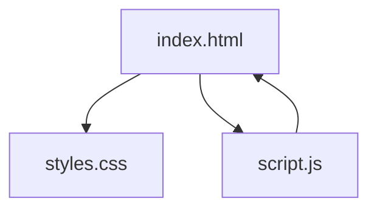
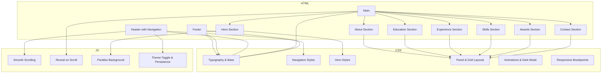
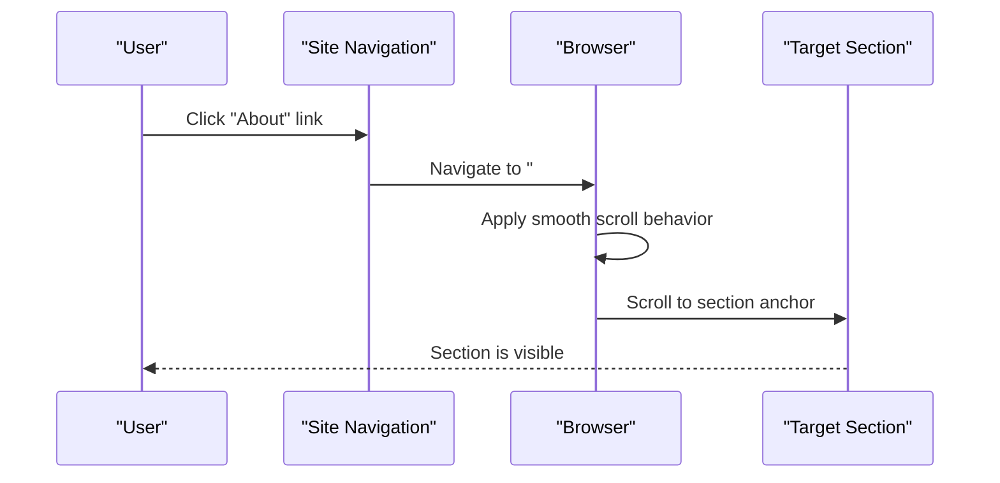
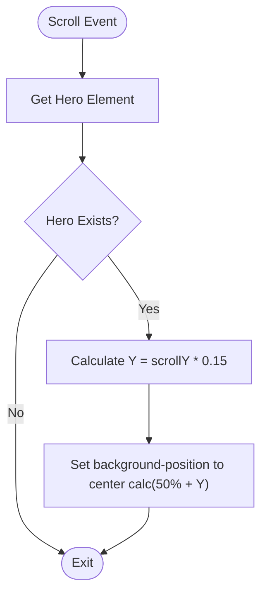
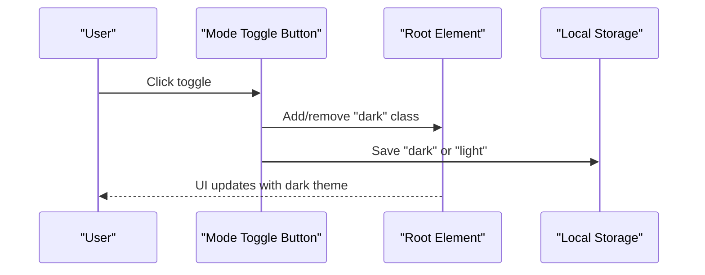
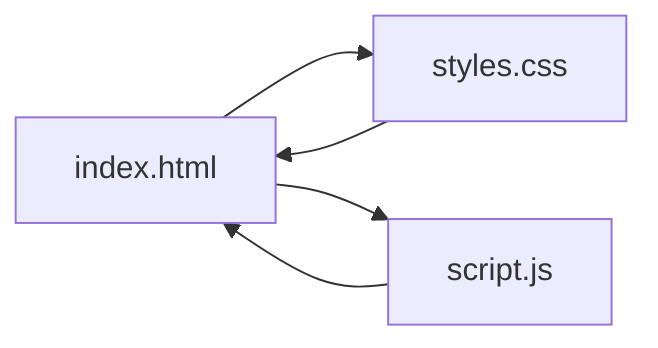

# HTML Structure and Content

<cite>
**Referenced Files in This Document**
- [index.html](file://index.html)
- [script.js](file://script.js)
- [styles.css](file://styles.css)
</cite>

## Table of Contents
1. [Introduction](#introduction)
2. [Project Structure](#project-structure)
3. [Core Components](#core-components)
4. [Architecture Overview](#architecture-overview)
5. [Detailed Component Analysis](#detailed-component-analysis)
6. [Dependency Analysis](#dependency-analysis)
7. [Performance Considerations](#performance-considerations)
8. [Troubleshooting Guide](#troubleshooting-guide)
9. [Conclusion](#conclusion)
10. [Appendices](#appendices)

## Introduction
This document explains the semantic HTML5 structure and content hierarchy of Yeoh Yee Peng’s portfolio website. It focuses on how the page is organized using semantic elements, section-based layout with panel classes, and content organization patterns. It documents the navigation system with smooth scrolling, the hero section with device mockup graphics, and the multi-section layout covering About, Education, Experience, Skills, Awards, and Contact. It also covers responsive grid systems, SVG graphics implementation, accessibility features (ARIA labels and screen reader support), and the relationships with CSS classes and JavaScript functionality. Guidance is included for adding new content sections while maintaining semantic correctness.

## Project Structure
The site consists of a single-page HTML document with inline CSS and a small JavaScript module. The structure is designed around a semantic, sectioned layout with a sticky navigation bar, a hero section, and six content sections wrapped inside a main element. The JavaScript handles smooth scrolling, reveal-on-scroll animations, parallax background movement, and theme toggling with persistence.

**Diagram sources**
- [index.html:18-271](file://index.html#L18-L271)
- [script.js:1-27](file://script.js#L1-L27)
- [styles.css:1-357](file://styles.css#L1-L357)

**Section sources**
- [index.html:18-271](file://index.html#L18-L271)
- [script.js:1-27](file://script.js#L1-L27)
- [styles.css:17-27](file://styles.css#L17-L27)

## Core Components
- Semantic HTML5 structure: Uses header, main, section, article, nav, and footer elements appropriately. The main element wraps the entire page content, and each major content area is a section with a unique ID for navigation anchors.
- Navigation system: A sticky navigation bar with links to each section anchor. Smooth scrolling is enabled globally via CSS.
- Hero section: A visually prominent hero with a kicker, headline, subheading, call-to-action buttons, and an SVG device mockup for visual appeal.
- Multi-section layout: Six distinct sections (About, Education, Experience, Skills, Awards, Contact) each with semantic headings and content blocks.
- Responsive grid systems: CSS Grid is used extensively for layouts, with responsive breakpoints to adapt to smaller screens.
- SVG graphics: An iPhone-shaped device frame is rendered with SVG and positioned absolutely behind the hero content.
- Accessibility: ARIA attributes and screen-reader-friendly markup are used for interactive controls and decorative images.

**Section sources**
- [index.html:18-271](file://index.html#L18-L271)
- [styles.css:348-357](file://styles.css#L348-L357)
- [script.js:13-18](file://script.js#L13-L18)

## Architecture Overview
The architecture is a client-side single-page application composed of:
- HTML: Defines the semantic structure and content anchors.
- CSS: Provides typography, layout, responsive grids, animations, and dark mode theming.
- JavaScript: Implements smooth scrolling, reveal-on-scroll animations, parallax effect, and theme persistence.

**Diagram sources**
- [index.html:18-271](file://index.html#L18-L271)
- [styles.css:1-357](file://styles.css#L1-L357)
- [script.js:1-27](file://script.js#L1-L27)

## Detailed Component Analysis

### Semantic HTML5 Structure and Content Hierarchy
- Root and metadata: The document declares HTML5 and sets language, viewport, title, and meta description for SEO and accessibility.
- Body structure: Contains a header with a brand link and navigation, a main element wrapping all content, and a footer.
- Sections: Each major content area is a section with a unique ID, enabling anchor-based navigation and smooth scrolling.
- Articles: Experience entries are structured as articles with headers containing titles and dates, and lists for responsibilities.
- Lists and badges: Education timeline items and skill/language lists use semantic lists with appropriate classes for styling.

Implementation references:
- Document head and metadata: [index.html:4-16](file://index.html#L4-L16)
- Header and navigation: [index.html:18-35](file://index.html#L18-L35)
- Main wrapper and sections: [index.html:37-260](file://index.html#L37-L260)
- Experience articles: [index.html:142-183](file://index.html#L142-L183)

Accessibility and semantics:
- Navigation anchors target section IDs for smooth scrolling.
- Decorative SVG device frame is marked as hidden from assistive technologies.
- ARIA label is provided for the theme toggle button.

**Section sources**
- [index.html:4-16](file://index.html#L4-L16)
- [index.html:18-35](file://index.html#L18-L35)
- [index.html:37-260](file://index.html#L37-L260)
- [index.html:142-183](file://index.html#L142-L183)

### Navigation System with Smooth Scrolling
- Sticky navigation bar with brand link and menu items linking to each section anchor.
- Smooth scrolling is enabled globally via CSS for anchor navigation.
- JavaScript ensures smooth scrolling behavior and adds focus-visible enhancements indirectly through global scroll behavior.

Implementation references:
- Navigation anchors: [index.html:22-29](file://index.html#L22-L29)
- Smooth scrolling declaration: [styles.css:17](file://styles.css#L17)
- JavaScript smooth scrolling: [script.js:1](file://script.js#L1)

**Diagram sources**
- [index.html:22-29](file://index.html#L22-L29)
- [styles.css:17](file://styles.css#L17)

**Section sources**
- [index.html:22-29](file://index.html#L22-L29)
- [styles.css:17](file://styles.css#L17)
- [script.js:1](file://script.js#L1)

### Hero Section with Device Mockup Graphics
- Hero section uses a panel class with parallax data attribute and animation hooks.
- Contains kicker, display headline, subheading, and call-to-action buttons.
- Device frame is an SVG iPhone silhouette placed absolutely behind the hero content. It is marked as hidden from assistive technologies.

Implementation references:
- Hero section and device frame: [index.html:37-68](file://index.html#L37-L68)
- SVG styling and positioning: [styles.css:153-161](file://styles.css#L153-L161)
- Parallax background logic: [script.js:12-18](file://script.js#L12-L18)

**Diagram sources**
- [script.js:12-18](file://script.js#L12-L18)

**Section sources**
- [index.html:37-68](file://index.html#L37-L68)
- [styles.css:153-161](file://styles.css#L153-L161)
- [script.js:12-18](file://script.js#L12-L18)

### Multi-Section Layout: About, Education, Experience, Skills, Awards, Contact
- About: Two-column grid layout with eyebrow title, headline, paragraph, and a list of badges. Cards are arranged in a card list.
- Education: Timeline layout with year and body content for each educational entry.
- Experience: Multiple experience articles with headers and bullet-point responsibilities.
- Skills: Two-column grid with a chip list for skills and a language section with progress meters.
- Awards: Responsive cards grid for award entries.
- Contact: Contact cards with icons and links for phone, email, and location.

Implementation references:
- About section: [index.html:70-105](file://index.html#L70-L105)
- Education section: [index.html:107-140](file://index.html#L107-L140)
- Experience section: [index.html:142-183](file://index.html#L142-L183)
- Skills section: [index.html:185-220](file://index.html#L185-L220)
- Awards section: [index.html:222-238](file://index.html#L222-L238)
- Contact section: [index.html:240-259](file://index.html#L240-L259)

**Section sources**
- [index.html:70-105](file://index.html#L70-L105)
- [index.html:107-140](file://index.html#L107-L140)
- [index.html:142-183](file://index.html#L142-L183)
- [index.html:185-220](file://index.html#L185-L220)
- [index.html:222-238](file://index.html#L222-L238)
- [index.html:240-259](file://index.html#L240-L259)

### Responsive Grid Systems and Layout Patterns
- Container-based layout with constrained max-width and dynamic padding.
- Panels use vertical spacing with clamp for responsive padding.
- Two-column grid for About and Skills sections adapts to single column on small screens.
- Timeline layout for Education uses CSS Grid with fixed year column and flexible content column.
- Cards grids for Awards and Contact adapt to available space with auto-fit minmax.

Implementation references:
- Container and panels: [styles.css:28-165](file://styles.css#L28-L165)
- Two-column grid: [styles.css:165](file://styles.css#L165)
- Timeline layout: [styles.css:219-237](file://styles.css#L219-L237)
- Cards grid: [styles.css:286-287](file://styles.css#L286-L287)
- Responsive adjustments: [styles.css:348-357](file://styles.css#L348-L357)

**Section sources**
- [styles.css:28-165](file://styles.css#L28-L165)
- [styles.css:219-237](file://styles.css#L219-L237)
- [styles.css:286-287](file://styles.css#L286-L287)
- [styles.css:348-357](file://styles.css#L348-L357)

### SVG Graphics Implementation
- Device frame is an SVG iPhone silhouette with a gradient body, inner screen, and a masked image for the screen content.
- The SVG is placed absolutely behind the hero content and marked as hidden from assistive technologies.
- Styling includes subtle shadows and color variations aligned with light/dark themes.

Implementation references:
- SVG device frame: [index.html:51-66](file://index.html#L51-L66)
- SVG styling: [styles.css:153-161](file://styles.css#L153-L161)
- Dark mode SVG adjustments: [styles.css:343-345](file://styles.css#L343-L345)

**Section sources**
- [index.html:51-66](file://index.html#L51-L66)
- [styles.css:153-161](file://styles.css#L153-L161)
- [styles.css:343-345](file://styles.css#L343-L345)

### Accessibility Features and Screen Reader Support
- ARIA label on the theme toggle button indicates its purpose.
- Decorative SVG device frame is marked as hidden from assistive technologies.
- Focus states and hover states are styled for keyboard navigation and mouse users.
- Semantic headings and lists improve content comprehension for assistive technologies.

Implementation references:
- ARIA label for theme toggle: [index.html:30-33](file://index.html#L30-L33)
- Hidden decorative SVG: [index.html:51](file://index.html#L51)
- Focus states: [styles.css:64](file://styles.css#L64)
- Card hover states: [styles.css:194-197](file://styles.css#L194-L197)

**Section sources**
- [index.html:30-33](file://index.html#L30-L33)
- [index.html:51](file://index.html#L51)
- [styles.css:64](file://styles.css#L64)
- [styles.css:194-197](file://styles.css#L194-L197)

### JavaScript Functionality and Interactions
- Year insertion: Dynamically sets the copyright year in the footer.
- Reveal-on-scroll: Uses Intersection Observer to animate elements when they enter the viewport.
- Parallax background: Adjusts background position based on scroll position.
- Theme toggle: Toggles dark mode class on the root element and persists preference in local storage.

Implementation references:
- Year update: [script.js:1-2](file://script.js#L1-L2)
- Intersection Observer: [script.js:4-10](file://script.js#L4-L10)
- Parallax scroll: [script.js:12-18](file://script.js#L12-L18)
- Theme toggle: [script.js:20-27](file://script.js#L20-L27)

**Diagram sources**
- [script.js:20-27](file://script.js#L20-L27)

**Section sources**
- [script.js:1-2](file://script.js#L1-L2)
- [script.js:4-10](file://script.js#L4-L10)
- [script.js:12-18](file://script.js#L12-L18)
- [script.js:20-27](file://script.js#L20-L27)

## Dependency Analysis
The HTML depends on CSS for styling and layout, and on JavaScript for interactivity. The JavaScript relies on DOM elements present in the HTML and manipulates CSS classes and styles. There are no external dependencies beyond fonts loaded via CDN.

**Diagram sources**
- [index.html:18-271](file://index.html#L18-L271)
- [script.js:1-27](file://script.js#L1-L27)
- [styles.css:1-357](file://styles.css#L1-L357)

**Section sources**
- [index.html:18-271](file://index.html#L18-L271)
- [script.js:1-27](file://script.js#L1-L27)
- [styles.css:1-357](file://styles.css#L1-L357)

## Performance Considerations
- Smooth scrolling is enabled globally, reducing jank during navigation.
- Parallax effect uses passive scroll listeners to minimize layout thrashing.
- Intersection Observer is configured with a low threshold to trigger animations early, improving perceived performance.
- CSS Grid and clamp units provide efficient responsive layouts without heavy JavaScript calculations.
- Local storage is used for theme persistence, avoiding server requests.

[No sources needed since this section provides general guidance]

## Troubleshooting Guide
Common issues and resolutions:
- Links not scrolling smoothly: Ensure smooth scrolling is enabled in CSS and that anchor IDs match navigation targets.
- Animations not triggering: Verify that elements have the data-animate attribute and that Intersection Observer is observing them.
- Parallax not working: Confirm that the hero element has the data-parallax attribute and that the scroll listener is attached.
- Theme toggle not persisting: Check that local storage keys are set and read correctly and that the root element class toggles as expected.
- Decorative SVG still announced: Ensure aria-hidden is set on decorative SVG containers and that the theme toggle has an appropriate aria-label.

**Section sources**
- [styles.css:17](file://styles.css#L17)
- [script.js:4-10](file://script.js#L4-L10)
- [script.js:12-18](file://script.js#L12-L18)
- [script.js:20-27](file://script.js#L20-L27)
- [index.html:30-33](file://index.html#L30-L33)
- [index.html:51](file://index.html#L51)

## Conclusion
The portfolio website employs a clean, semantic HTML5 structure with a sticky navigation, a visually engaging hero, and six well-organized content sections. CSS Grid and modern layout techniques provide responsive, accessible designs, while JavaScript enhances user experience with smooth scrolling, reveal-on-scroll animations, parallax effects, and theme persistence. The implementation balances aesthetics with accessibility and performance, offering a robust foundation for future enhancements.

[No sources needed since this section summarizes without analyzing specific files]

## Appendices

### Adding a New Content Section While Maintaining Semantics
Steps:
- Wrap content in a section element with a unique ID.
- Use semantic headings (h2 for section titles, h3/h4 for subsections) and paragraphs.
- Use lists for structured content (ul/li) and keep content scannable.
- Add anchor links in the navigation pointing to the new section ID.
- Optionally add the data-animate attribute to enable reveal-on-scroll.
- Style the section using existing panel classes and grid utilities.
- Test smooth scrolling and accessibility (focus states, ARIA labels where needed).

References:
- Section structure and IDs: [index.html:70-105](file://index.html#L70-L105)
- Panel classes and grid utilities: [styles.css:163-165](file://styles.css#L163-L165)
- Smooth scrolling anchors: [index.html:22-29](file://index.html#L22-L29)
- Animation hook: [script.js:4-10](file://script.js#L4-L10)

**Section sources**
- [index.html:70-105](file://index.html#L70-L105)
- [styles.css:163-165](file://styles.css#L163-L165)
- [index.html:22-29](file://index.html#L22-L29)
- [script.js:4-10](file://script.js#L4-L10)