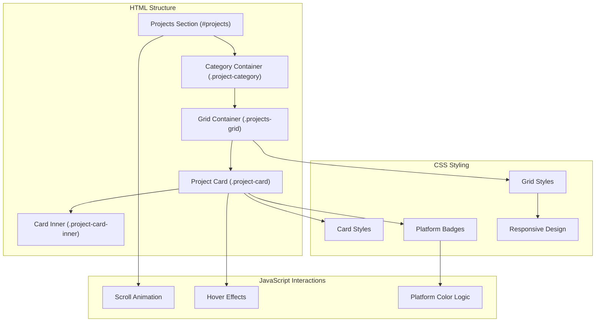
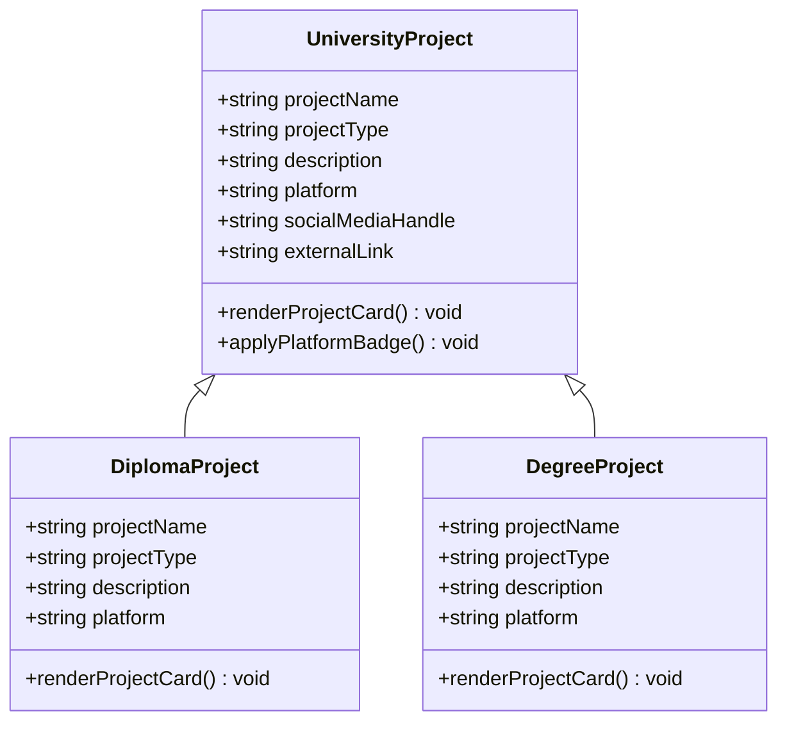
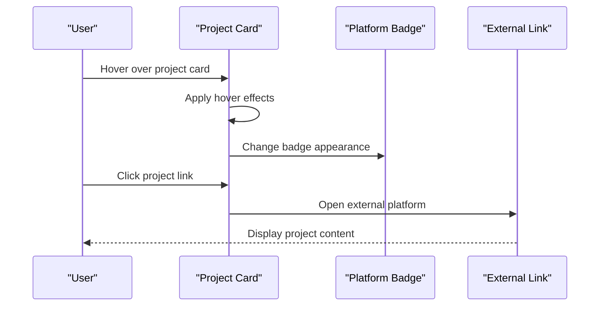
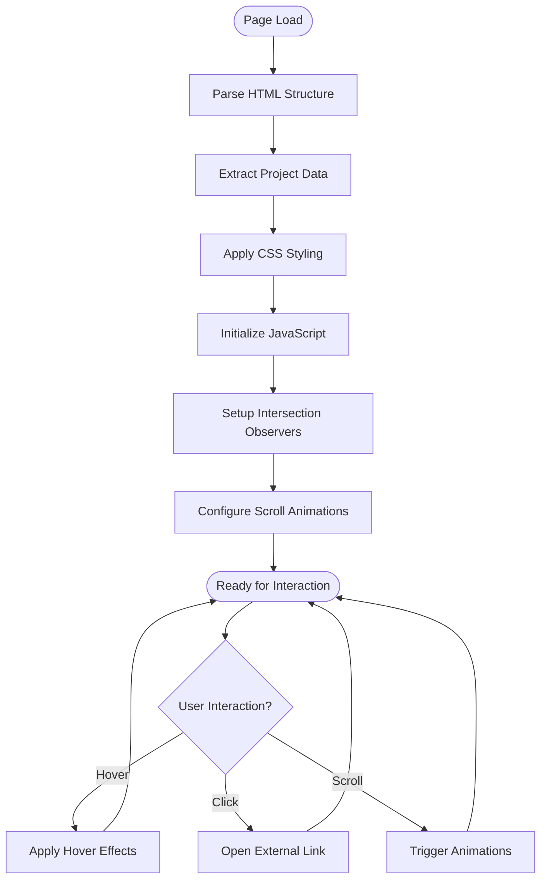
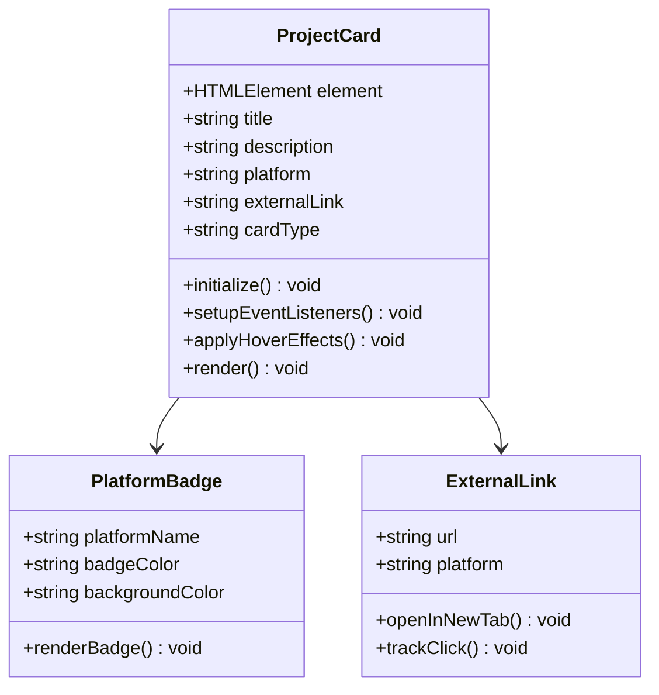
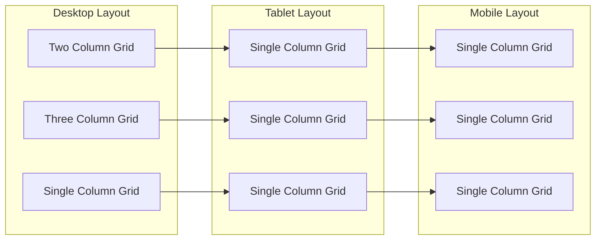
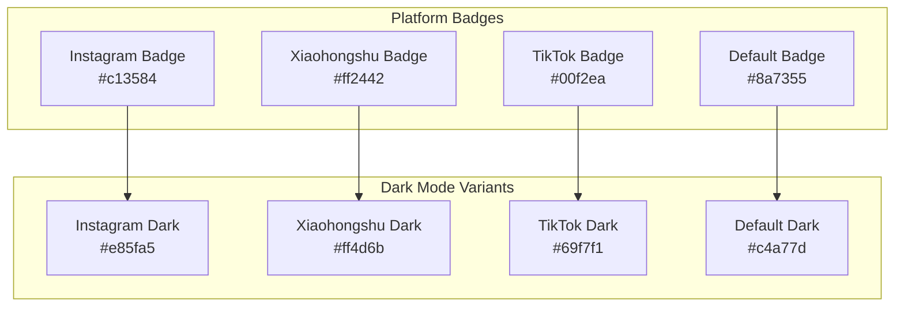

# Projects Showcase Section

<cite>
**Referenced Files in This Document**
- [index.html](file://index.html)
- [script.js](file://script.js)
- [styles.css](file://styles.css)
</cite>

## Table of Contents
1. [Introduction](#introduction)
2. [Project Structure](#project-structure)
3. [Core Components](#core-components)
4. [Architecture Overview](#architecture-overview)
5. [Detailed Component Analysis](#detailed-component-analysis)
6. [Dependency Analysis](#dependency-analysis)
7. [Performance Considerations](#performance-considerations)
8. [Troubleshooting Guide](#troubleshooting-guide)
9. [Conclusion](#conclusion)

## Introduction

The Projects Showcase Section is a comprehensive portfolio presentation component within Yeoh Yee Peng's personal website. This section serves as a digital showcase of the individual's professional work in digital marketing, social media content creation, and influencer collaborations. The implementation demonstrates modern web development practices with responsive design, interactive elements, and accessibility features.

The section is strategically positioned within a larger portfolio website that combines professional experience, education background, skills, awards, and contact information. The Projects Showcase specifically focuses on presenting three categories of work: university projects, internship experiences, and part-time freelance work.

## Project Structure

The Projects Showcase Section is built using a clean, semantic HTML structure with modular CSS styling and JavaScript interactivity. The implementation follows modern web standards with responsive design principles and accessibility considerations.

**Diagram sources**
- [index.html:227-369](file://index.html#L227-L369)
- [styles.css:379-656](file://styles.css#L379-L656)
- [script.js:4-10](file://script.js#L4-L10)

**Section sources**
- [index.html:227-369](file://index.html#L227-L369)
- [styles.css:379-656](file://styles.css#L379-L656)

## Core Components

The Projects Showcase Section consists of three primary categories, each containing multiple project presentations with consistent design patterns and interactive elements.

### University Projects Category

The University Projects category showcases academic work completed during the individual's educational journey. This category presents two distinct projects with different approaches and platforms.

**Diagram sources**
- [index.html:242-266](file://index.html#L242-L266)

### Internship Projects Category

The Internship Projects category highlights professional experience gained through internships and freelance collaborations. This category contains multiple projects with varying platforms and collaboration types.

**Diagram sources**
- [index.html:277-345](file://index.html#L277-L345)
- [styles.css:523-601](file://styles.css#L523-L601)

### Part-time Projects Category

The Part-time Projects category showcases freelance work and personal projects completed outside formal academic or internship contexts. This category features a single comprehensive project presentation.

**Section sources**
- [index.html:227-369](file://index.html#L227-L369)

## Architecture Overview

The Projects Showcase Section implements a modular architecture that separates concerns between structure, presentation, and behavior while maintaining consistency across all project presentations.

**Diagram sources**
- [script.js:4-10](file://script.js#L4-L10)
- [styles.css:326-328](file://styles.css#L326-L328)

The architecture follows these key principles:

- **Separation of Concerns**: HTML handles structure, CSS manages presentation, JavaScript controls behavior
- **Consistency**: All project cards follow identical patterns and styling
- **Accessibility**: Semantic HTML and ARIA attributes ensure screen reader compatibility
- **Responsive Design**: Flexible grid layouts adapt to different screen sizes
- **Performance**: Optimized animations and lazy loading techniques

## Detailed Component Analysis

### Project Card Implementation

Each project card follows a consistent structure with specific elements designed for optimal user experience and visual appeal.

**Diagram sources**
- [index.html:243-252](file://index.html#L243-L252)
- [styles.css:523-601](file://styles.css#L523-L601)

#### Card Structure Elements

The project card implementation includes several key structural elements:

1. **Sublabel**: Identifies project type (Diploma/Degree)
2. **Project Title**: Primary project identifier
3. **Description**: Brief project overview
4. **Platform Badge**: Visual indicator of social media platform
5. **External Link**: Call-to-action for project exploration

#### Hover and Interaction Effects

The project cards implement sophisticated hover effects that enhance user engagement while maintaining accessibility standards.

**Section sources**
- [index.html:243-365](file://index.html#L243-L365)
- [styles.css:464-601](file://styles.css#L464-L601)

### Grid Layout System

The Projects Showcase employs a flexible grid system that adapts to different screen sizes and content requirements.

**Diagram sources**
- [styles.css:421-438](file://styles.css#L421-L438)
- [styles.css:603-656](file://styles.css#L603-L656)

#### Grid Variants

The layout system provides three distinct grid configurations:

1. **Two-column Grid**: Used for university projects
2. **Multi-column Grid**: Used for internship projects
3. **Full-width Grid**: Used for part-time projects

**Section sources**
- [styles.css:421-438](file://styles.css#L421-L438)
- [styles.css:603-656](file://styles.css#L603-L656)

### Platform-Specific Styling

The implementation includes platform-specific styling for major social media platforms commonly used in digital marketing.

**Diagram sources**
- [styles.css:523-570](file://styles.css#L523-L570)

**Section sources**
- [styles.css:523-570](file://styles.css#L523-L570)

## Dependency Analysis

The Projects Showcase Section maintains loose coupling between its components while establishing clear relationships that support maintainability and extensibility.

```mermaid
graph TB
subgraph "HTML Dependencies"
ProjectsHTML["Projects HTML Structure"]
ProjectCards["Individual Project Cards"]
ExternalLinks["External Platform Links"]
end
subgraph "CSS Dependencies"
GridSystem["Grid Layout System"]
CardStyles["Card Presentation Styles"]
PlatformStyles["Platform-Specific Styles"]
ResponsiveStyles["Responsive Design Styles"]
end
subgraph "JavaScript Dependencies"
ScrollObserver["Intersection Observer"]
AnimationController["Animation Controller"]
EventHandlers["Event Handlers"]
end
ProjectsHTML --> ProjectCards
ProjectCards --> ExternalLinks
GridSystem --> CardStyles
CardStyles --> PlatformStyles
PlatformStyles --> ResponsiveStyles
ScrollObserver --> AnimationController
AnimationController --> EventHandlers
```

**Diagram sources**
- [index.html:227-369](file://index.html#L227-L369)
- [script.js:4-10](file://script.js#L4-L10)
- [styles.css:379-656](file://styles.css#L379-L656)

### Component Relationships

The dependency relationships demonstrate a well-structured architecture:

- **HTML provides structure**: Defines semantic markup and content hierarchy
- **CSS provides presentation**: Handles visual styling and responsive behavior
- **JavaScript provides behavior**: Manages interactions and animations
- **External links provide content**: Connect to live project demonstrations

**Section sources**
- [index.html:227-369](file://index.html#L227-L369)
- [script.js:4-10](file://script.js#L4-L10)
- [styles.css:379-656](file://styles.css#L379-L656)

## Performance Considerations

The Projects Showcase Section implements several performance optimization strategies to ensure smooth user experience across different devices and network conditions.

### Lazy Loading and Deferred Rendering

The implementation uses intersection observers to trigger animations only when elements become visible, reducing initial page load time and improving perceived performance.

### CSS Optimization

The styling system employs efficient CSS techniques including:

- **CSS custom properties** for consistent theming
- **Flexbox and Grid** for responsive layouts
- **Hardware-accelerated animations** for smooth transitions
- **Minimal repaint regions** to reduce layout thrashing

### Image and Asset Management

The section utilizes SVG-based device frames and external platform links, minimizing local asset dependencies while maximizing content reach.

## Troubleshooting Guide

Common issues and solutions for the Projects Showcase Section:

### Animation Issues

**Problem**: Project cards don't animate on scroll
**Solution**: Verify Intersection Observer API support and check console for errors

**Problem**: Hover effects not working
**Solution**: Ensure CSS hover selectors are properly defined and not overridden

### Responsive Design Issues

**Problem**: Grid layout breaks on mobile devices
**Solution**: Check media query breakpoints and ensure proper viewport meta tag

**Problem**: Platform badges appear incorrectly
**Solution**: Verify CSS specificity and ensure platform classes are properly applied

### Accessibility Concerns

**Problem**: Screen readers don't announce project information
**Solution**: Ensure proper ARIA attributes and semantic HTML structure

**Section sources**
- [script.js:4-10](file://script.js#L4-L10)
- [styles.css:326-328](file://styles.css#L326-L328)

## Conclusion

The Projects Showcase Section represents a comprehensive implementation of modern web development practices focused on presenting digital marketing work effectively. The section successfully balances aesthetic appeal with functional usability, providing an engaging platform for showcasing professional projects across multiple categories and platforms.

The implementation demonstrates strong architectural principles including separation of concerns, responsive design, accessibility compliance, and performance optimization. The modular approach ensures maintainability while the consistent design patterns create a cohesive user experience.

Key strengths of the implementation include:

- **Professional Presentation**: Clean, elegant design that reflects the individual's expertise
- **Technical Excellence**: Modern web standards and best practices
- **User Experience**: Intuitive interactions and smooth animations
- **Accessibility**: Comprehensive accessibility features and screen reader support
- **Performance**: Optimized for speed and efficiency across devices

The Projects Showcase Section serves as an exemplary model for portfolio presentations in digital marketing and social media content creation, effectively communicating professional capabilities through well-structured, visually appealing project presentations.