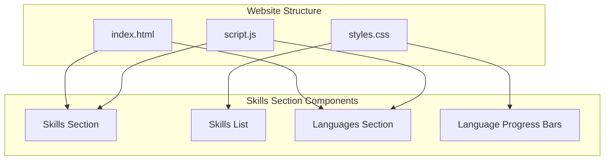
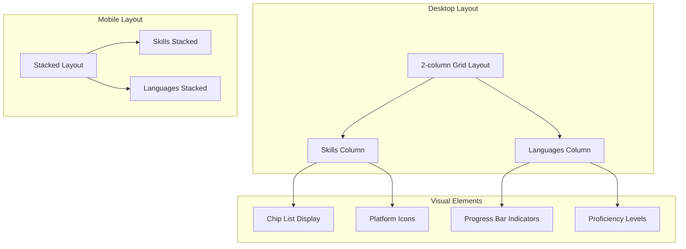
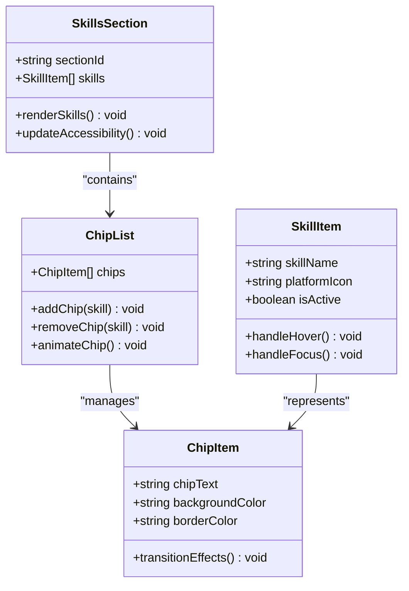
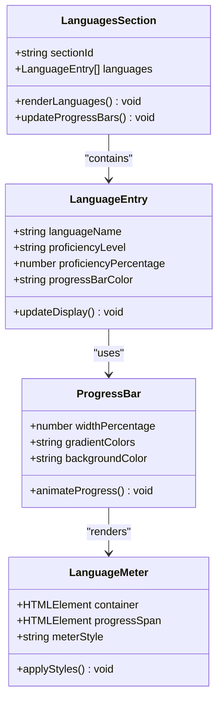
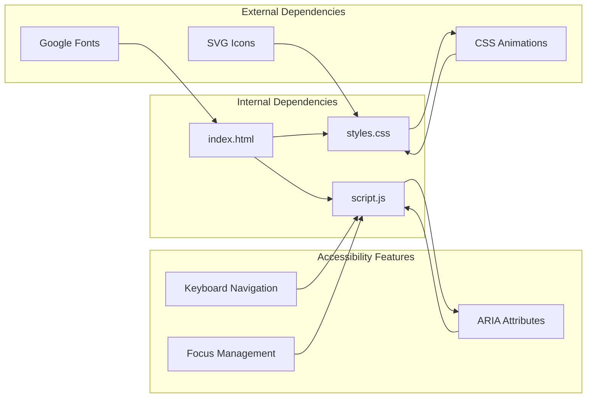

# Skills and Languages Section

<cite>
**Referenced Files in This Document**
- [index.html](file://index.html)
- [script.js](file://script.js)
- [styles.css](file://styles.css)
</cite>

## Table of Contents
1. [Introduction](#introduction)
2. [Project Structure](#project-structure)
3. [Core Components](#core-components)
4. [Architecture Overview](#architecture-overview)
5. [Detailed Component Analysis](#detailed-component-analysis)
6. [Dependency Analysis](#dependency-analysis)
7. [Performance Considerations](#performance-considerations)
8. [Troubleshooting Guide](#troubleshooting-guide)
9. [Conclusion](#conclusion)

## Introduction
This document provides comprehensive analysis of the Skills and Languages section within the Yeoh Yee Peng portfolio website. The Skills section showcases professional competencies and technical abilities, while the Languages section demonstrates multilingual proficiency with visual progress indicators. This section serves as a crucial component of the portfolio, presenting the candidate's capabilities to potential employers and clients.

## Project Structure
The Skills and Languages section is integrated into the main portfolio website as a dedicated section within the HTML structure. The implementation follows a modular approach with separate concerns for content presentation, styling, and interactive functionality.



**Diagram sources**
- [index.html:371-403](file://index.html#L371-L403)
- [styles.css:321-359](file://styles.css#L321-L359)

**Section sources**
- [index.html:371-403](file://index.html#L371-L403)
- [styles.css:321-359](file://styles.css#L321-L359)

## Core Components
The Skills and Languages section consists of two primary components: the Skills competency display and the Languages proficiency visualization.

### Skills Component
The Skills component presents professional competencies in a chip-based layout, showcasing expertise areas relevant to digital marketing and social media management.

### Languages Component  
The Languages component displays multilingual abilities with visual progress bars, indicating proficiency levels across different languages.

**Section sources**
- [index.html:375-401](file://index.html#L375-L401)
- [styles.css:321-359](file://styles.css#L321-L359)

## Architecture Overview
The Skills and Languages section follows a responsive design architecture that adapts to various screen sizes while maintaining visual consistency and accessibility standards.



**Diagram sources**
- [index.html:372-402](file://index.html#L372-L402)
- [styles.css:1166-1175](file://styles.css#L1166-L1175)

## Detailed Component Analysis

### Skills Section Implementation
The Skills section utilizes a modern chip-based design pattern to present professional competencies in an organized, visually appealing manner.



**Diagram sources**
- [index.html:376-385](file://index.html#L376-L385)
- [styles.css:322-338](file://styles.css#L322-L338)

#### Skills Content Structure
The Skills section presents 8 core competencies covering digital marketing, content creation, and platform-specific expertise:

- Social Media Strategy
- Meta Ads (Paid & Organic)
- Live Streaming & Engagement
- Customer Communication
- Content Creation
- Copywriting
- CapCut
- Canva

Each skill is displayed as an interactive chip element with hover effects and smooth transitions.

**Section sources**
- [index.html:376-385](file://index.html#L376-L385)
- [styles.css:322-338](file://styles.css#L322-L338)

### Languages Section Implementation
The Languages section employs a sophisticated progress bar visualization system to demonstrate multilingual proficiency levels.



**Diagram sources**
- [index.html:388-400](file://index.html#L388-L400)
- [styles.css:340-358](file://styles.css#L340-L358)

#### Language Proficiency Display
The Languages section showcases three languages with corresponding proficiency levels:

- **Mandarin**: Proficient (95%)
- **English**: Intermediate (60%)
- **Malay**: Beginner (30%)

Each language entry includes:
- Language name display
- Proficiency level indicator
- Visual progress bar with gradient coloring
- Responsive width calculations

**Section sources**
- [index.html:389-400](file://index.html#L389-L400)
- [styles.css:340-358](file://styles.css#L340-L358)

### Responsive Design Implementation
The Skills and Languages section implements a sophisticated responsive design system that adapts to different screen sizes and device capabilities.

```mermaid
flowchart TD
Start([Page Load]) --> CheckViewport{Viewport Width?}
CheckViewport --> |Desktop (>768px)| DesktopLayout[2-column Grid Layout]
CheckViewport --> |Tablet (768px)| TabletLayout[Stacked Layout]
CheckViewport --> |Mobile (<768px)| MobileLayout[Single Column]
DesktopLayout --> DesktopSkills[Skills: 2-column]
DesktopLayout --> DesktopLanguages[Languages: 2-column]
TabletLayout --> TabletSkills[Skills: Stacked]
TabletLayout --> TabletLanguages[Languages: Stacked]
MobileLayout --> MobileSkills[Skills: Full Width]
MobileLayout --> MobileLanguages[Languages: Full Width]
DesktopSkills --> ApplyDesktopStyles[Apply Desktop Styles]
DesktopLanguages --> ApplyDesktopStyles
TabletSkills --> ApplyTabletStyles[Apply Tablet Styles]
TabletLanguages --> ApplyTabletStyles
MobileSkills --> ApplyMobileStyles[Apply Mobile Styles]
MobileLanguages --> ApplyMobileStyles
ApplyDesktopStyles --> End([Complete])
ApplyTabletStyles --> End
ApplyMobileStyles --> End
```

**Diagram sources**
- [styles.css:1166-1175](file://styles.css#L1166-L1175)
- [styles.css:1194-1200](file://styles.css#L1194-L1200)

#### Breakpoint Behaviors
The section responds to multiple viewport breakpoints:

- **Desktop (768px+)**: Maintains 2-column grid layout
- **Tablet (768px)**: Switches to stacked layout with reduced spacing
- **Mobile (480px)**: Optimizes typography and spacing for small screens
- **Small Mobile (375px)**: Further reduces font sizes and padding

**Section sources**
- [styles.css:1166-1175](file://styles.css#L1166-L1175)
- [styles.css:1194-1200](file://styles.css#L1194-L1200)

## Dependency Analysis
The Skills and Languages section has minimal external dependencies and relies primarily on the core website infrastructure.



**Diagram sources**
- [index.html:10-17](file://index.html#L10-L17)
- [script.js:5-10](file://script.js#L5-L10)

### External Resource Dependencies
The section integrates with several external resources:

- **Google Fonts**: Cormorant Garamond and Lato font families
- **SVG Icons**: Sun/moon icons for theme toggle functionality
- **CSS Animations**: Gradient animations and transition effects

### Accessibility Dependencies
The implementation includes comprehensive accessibility features:

- ARIA attributes for screen reader compatibility
- Keyboard navigation support
- Focus management for interactive elements
- Color contrast compliance for both light and dark themes

**Section sources**
- [index.html:10-17](file://index.html#L10-L17)
- [script.js:5-10](file://script.js#L5-L10)

## Performance Considerations
The Skills and Languages section is optimized for performance through efficient CSS implementations and minimal JavaScript overhead.

### CSS Performance Optimizations
- **Hardware Acceleration**: Uses transform and opacity for smooth animations
- **Efficient Selectors**: Targets specific elements without complex selector chains
- **CSS Variables**: Centralized color management reduces repaint cycles
- **Flexbox Layout**: Modern layout system with optimal browser support

### JavaScript Performance Features
- **Intersection Observer**: Efficient scroll-triggered animations
- **Event Delegation**: Single event listeners for multiple interactive elements
- **Debounced Updates**: Optimized scroll and resize event handling
- **Memory Management**: Proper cleanup of event listeners and observers

**Section sources**
- [script.js:5-10](file://script.js#L5-L10)
- [styles.css:399-400](file://styles.css#L399-L400)

## Troubleshooting Guide

### Common Issues and Solutions

#### Skills Chips Not Displaying Correctly
**Problem**: Chip elements appear misaligned or overlap
**Solution**: Verify CSS grid properties and ensure proper spacing values

#### Language Progress Bars Not Visible
**Problem**: Progress bars appear as thin lines or are invisible
**Solution**: Check CSS background gradient properties and ensure proper width calculations

#### Responsive Layout Issues
**Problem**: Section layout breaks on specific screen sizes
**Solution**: Review media query breakpoints and adjust container widths

#### Accessibility Concerns
**Problem**: Screen readers cannot interpret skill or language information
**Solution**: Verify ARIA attributes and ensure proper semantic HTML structure

### Debugging Steps
1. **Inspect Element**: Use browser developer tools to examine element dimensions
2. **Console Logging**: Check for JavaScript errors in the console
3. **Network Tab**: Verify external resource loading (fonts, icons)
4. **Performance Tab**: Monitor animation performance and repaint frequency

**Section sources**
- [index.html:371-403](file://index.html#L371-L403)
- [styles.css:321-359](file://styles.css#L321-L359)

## Conclusion
The Skills and Languages section represents a well-crafted implementation that effectively communicates professional competencies and multilingual abilities. The section demonstrates excellent attention to responsive design, accessibility, and performance optimization while maintaining visual appeal and user experience quality.

The modular architecture allows for easy maintenance and updates, while the responsive design ensures consistent presentation across all device types. The combination of modern CSS techniques and efficient JavaScript implementation creates a smooth, accessible user experience that enhances the overall portfolio presentation.

Key strengths include the intuitive chip-based skill display, the visual progress bar system for language proficiency, and the comprehensive responsive design that adapts seamlessly to different screen sizes and orientations.