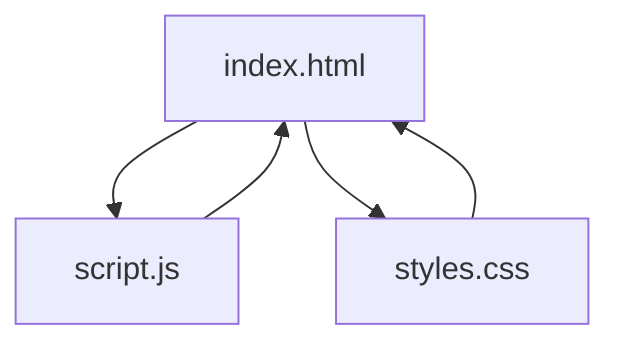
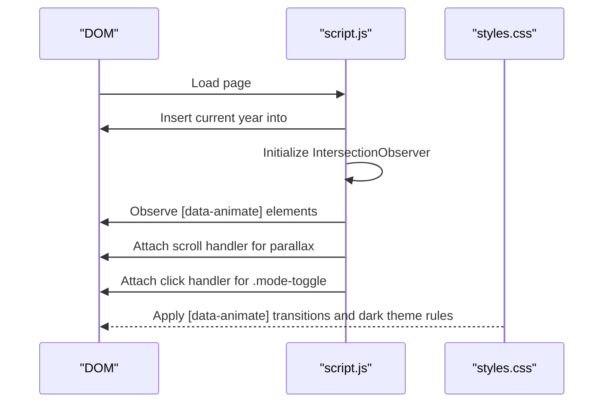
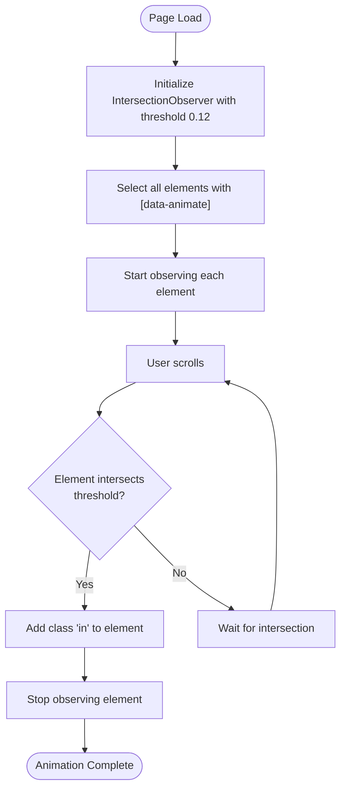
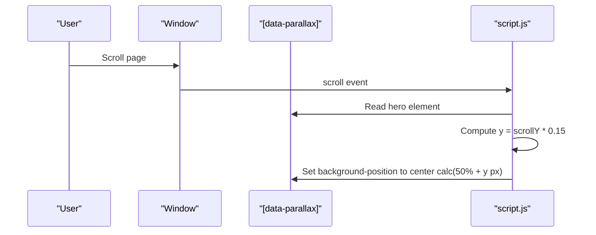
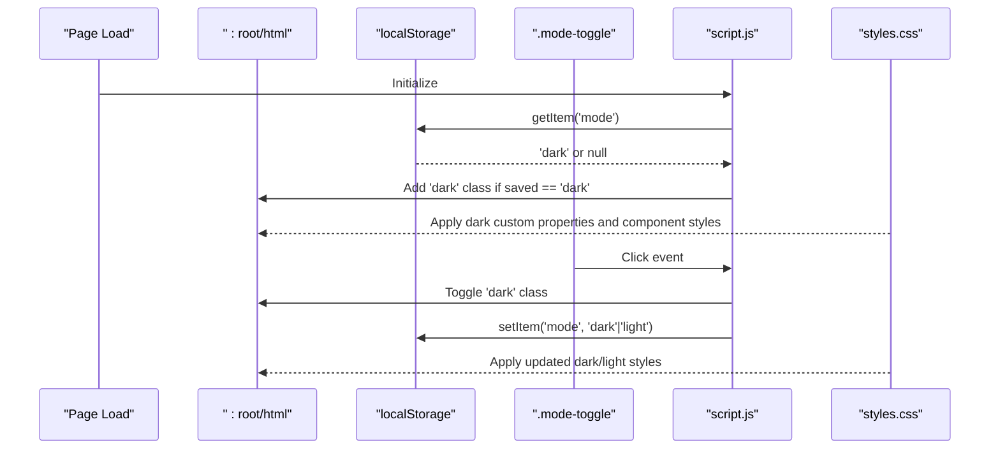
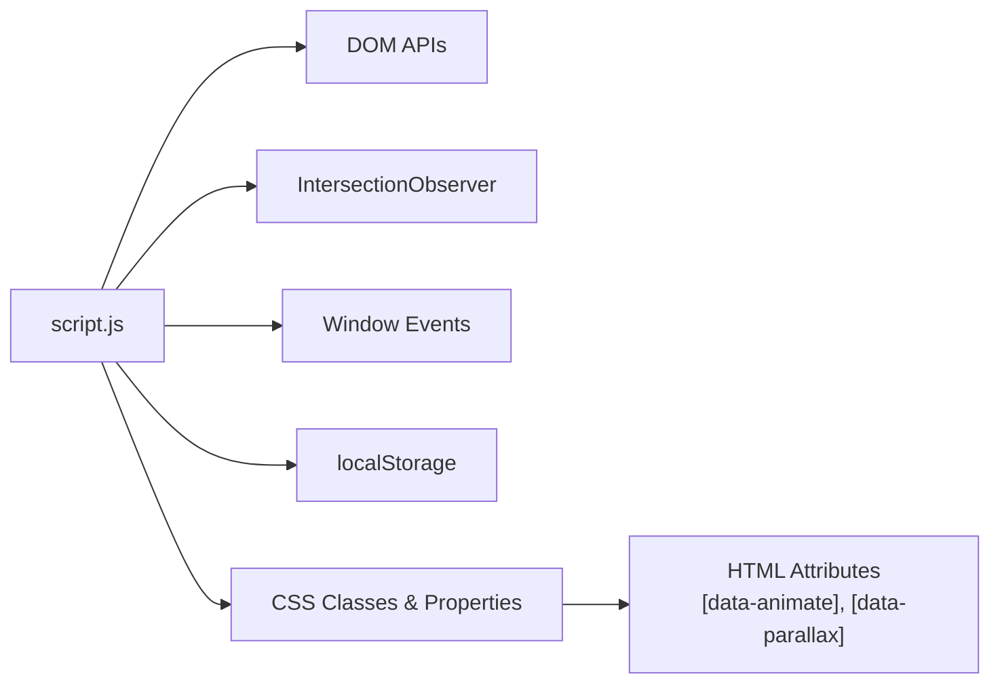

# JavaScript Functionality

<cite>
**Referenced Files in This Document**
- [index.html](file://index.html)
- [script.js](file://script.js)
- [styles.css](file://styles.css)
</cite>

## Table of Contents
1. [Introduction](#introduction)
2. [Project Structure](#project-structure)
3. [Core Components](#core-components)
4. [Architecture Overview](#architecture-overview)
5. [Detailed Component Analysis](#detailed-component-analysis)
6. [Dependency Analysis](#dependency-analysis)
7. [Performance Considerations](#performance-considerations)
8. [Troubleshooting Guide](#troubleshooting-guide)
9. [Conclusion](#conclusion)

## Introduction
This document explains the interactive features and client-side logic of Yeoh Yee Peng’s portfolio website. It focuses on:
- Dynamic year insertion in the footer
- Scroll-triggered element reveal animations using the Intersection Observer API
- Parallax background effects on the hero section
- Persistent theme switching with localStorage
- Event handlers for user interactions
- Smooth scrolling navigation behavior
- Performance-conscious implementation patterns

It also documents how the animation trigger system uses data-animate attributes, how the theme toggle integrates with CSS custom properties, and how responsive navigation behaves across devices.

## Project Structure
The site consists of a minimal HTML page, a small JavaScript module, and a stylesheet. The JavaScript file orchestrates DOM updates and runtime behaviors, while the CSS defines animations, themes, and responsive layouts.

**Diagram sources**
- [index.html](file://index.html)
- [script.js](file://script.js)
- [styles.css](file://styles.css)

**Section sources**
- [index.html](file://index.html)
- [script.js](file://script.js)
- [styles.css](file://styles.css)

## Core Components
- Dynamic year insertion: Sets the footer copyright year to the current year.
- Scroll-triggered reveals: Uses Intersection Observer to animate elements when they enter the viewport.
- Parallax background: Adjusts the hero background position based on scroll.
- Theme toggle: Switches between light and dark modes and persists the preference.
- Smooth scrolling: Enabled globally via CSS for anchor navigation.

Key implementation references:
- Year insertion: [index.html](file://index.html), [script.js](file://script.js)
- Scroll-reveal animation: [script.js](file://script.js), [styles.css](file://styles.css)
- Parallax effect: [script.js](file://script.js), [index.html](file://index.html)
- Theme toggle: [script.js](file://script.js), [styles.css](file://styles.css)
- Smooth scrolling: [styles.css](file://styles.css)

**Section sources**
- [index.html](file://index.html)
- [script.js](file://script.js)
- [styles.css](file://styles.css)

## Architecture Overview
The JavaScript module initializes three major systems:
- DOM mutation for the footer year
- Intersection Observer for scroll animations
- Window scroll listener for parallax
- LocalStorage-backed theme toggle

These systems interact with the HTML structure and CSS classes to deliver a cohesive user experience.

**Diagram sources**
- [script.js](file://script.js)
- [styles.css](file://styles.css)
- [index.html](file://index.html)

## Detailed Component Analysis

### Dynamic Year Insertion in Footer
- Purpose: Dynamically set the copyright year in the footer to the current calendar year.
- Implementation:
  - Retrieves the element with ID “year” and sets its text content to the current year.
- Behavior:
  - Runs immediately on load.
  - No repeated updates; one-time initialization.

References:
- Year insertion: [script.js](file://script.js)

**Section sources**
- [script.js](file://script.js)

### Scroll-Triggered Element Reveal Animations (Intersection Observer)
- Purpose: Animate elements into view when they intersect the viewport.
- Trigger mechanism:
  - Elements with the attribute data-animate are targeted.
  - The Intersection Observer is configured with a threshold that activates when 12% of the element is visible.
- Animation behavior:
  - On intersection, the class in is added to the element.
  - The observer stops observing that element to prevent re-triggering.
- CSS integration:
  - The [data-animate] selector defines initial hidden state (opacity and transform).
  - The .in class applies the transition to fully reveal the element.

Implementation references:
- Observer setup and element observation: [script.js](file://script.js)
- Animation trigger attribute usage: [index.html](file://index.html)
- Animation CSS rules: [styles.css](file://styles.css)

**Diagram sources**
- [script.js](file://script.js)
- [styles.css](file://styles.css)
- [index.html](file://index.html)

**Section sources**
- [script.js](file://script.js)
- [styles.css](file://styles.css)
- [index.html](file://index.html)

### Parallax Background Effects
- Purpose: Create a subtle depth effect by moving the hero background slightly with scroll.
- Implementation:
  - A scroll event listener computes a vertical offset proportional to scroll position.
  - Applies the computed offset to the hero section’s background-position property.
  - Uses passive event listener for performance.
- HTML/CSS relationship:
  - The hero section has the data-parallax attribute to target it.
  - The background is defined in CSS; the JavaScript adjusts its vertical position.

Implementation references:
- Scroll handler and background-position update: [script.js](file://script.js)
- Parallax target attribute: [index.html](file://index.html)

**Diagram sources**
- [script.js](file://script.js)
- [index.html](file://index.html)

**Section sources**
- [script.js](file://script.js)
- [index.html](file://index.html)

### Persistent Theme Switching with localStorage
- Purpose: Allow users to switch between light and dark themes and persist their choice.
- Implementation:
  - Reads the saved mode from localStorage on load.
  - Adds the dark class to the root element if the saved mode is dark.
  - Attaches a click handler to the theme toggle button to:
    - Toggle the dark class on the root element
    - Save the current mode to localStorage
- CSS integration:
  - The html.dark class switches CSS custom properties to dark variants.
  - Specific components (navigation, hero, device frame, meter) adjust visuals accordingly.

Implementation references:
- Mode persistence and toggle: [script.js](file://script.js)
- Root CSS custom properties and dark rules: [styles.css](file://styles.css)
- Theme toggle button markup: [index.html](file://index.html)

**Diagram sources**
- [script.js](file://script.js)
- [styles.css](file://styles.css)
- [index.html](file://index.html)

**Section sources**
- [script.js](file://script.js)
- [styles.css](file://styles.css)
- [index.html](file://index.html)

### Smooth Scrolling Navigation
- Purpose: Provide smooth scrolling when navigating between sections via anchor links.
- Implementation:
  - Global smooth scrolling behavior is enabled via CSS on the html element.
  - Anchor links in the navigation target section IDs (for example, #about, #experience, #contact).
- Behavior:
  - Clicking a navigation link smoothly scrolls to the corresponding section.

Implementation references:
- Smooth scrolling setting: [styles.css](file://styles.css)
- Navigation anchors: [index.html](file://index.html)

**Section sources**
- [styles.css](file://styles.css)
- [index.html](file://index.html)

### Responsive Navigation Behavior
- Purpose: Ensure navigation remains usable across screen sizes.
- Implementation:
  - Navigation items are arranged horizontally with flexible spacing.
  - On smaller screens, spacing and typography scale down for readability.
- Behavior:
  - Links remain clickable and accessible across breakpoints.

Implementation references:
- Navigation layout and hover/focus styles: [styles.css](file://styles.css)
- Navigation markup: [index.html](file://index.html)

**Section sources**
- [styles.css](file://styles.css)
- [index.html](file://index.html)

## Dependency Analysis
The JavaScript module depends on:
- DOM APIs for element selection and manipulation
- Browser APIs for scroll events and Intersection Observer
- CSS classes and custom properties for visual outcomes

**Diagram sources**
- [script.js](file://script.js)
- [styles.css](file://styles.css)
- [index.html](file://index.html)

**Section sources**
- [script.js](file://script.js)
- [styles.css](file://styles.css)
- [index.html](file://index.html)

## Performance Considerations
- Intersection Observer threshold tuned to activate at 12% visibility to balance responsiveness and performance.
- Passive scroll listener for parallax reduces layout thrashing.
- One-time DOM mutations (year insertion) avoid repeated work.
- CSS transitions handle animations efficiently, minimizing JavaScript-driven layout calculations.

Recommendations:
- Keep the observer threshold around the current value to avoid excessive triggers.
- Consider throttling or debouncing for heavy scroll handlers if additional effects are added.
- Prefer CSS custom properties for theming to minimize style recalculations.

[No sources needed since this section provides general guidance]

## Troubleshooting Guide
Common issues and resolutions:
- Elements do not animate on scroll
  - Ensure elements have the data-animate attribute.
  - Confirm the CSS rules for [data-animate] and .in are present.
  - Verify the Intersection Observer is initialized and observing elements.
  - References: [script.js](file://script.js), [styles.css](file://styles.css), [index.html](file://index.html)
- Parallax does not move
  - Confirm the hero section has the data-parallax attribute.
  - Check that the scroll listener executes and updates background-position.
  - References: [script.js](file://script.js), [index.html](file://index.html)
- Theme toggle does not persist
  - Verify localStorage is available and not blocked by browser settings.
  - Ensure the mode toggle click handler runs and writes to localStorage.
  - References: [script.js](file://script.js), [styles.css](file://styles.css)
- Smooth scrolling not working
  - Confirm html scroll-behavior is set to smooth.
  - Ensure anchor links point to existing section IDs.
  - References: [styles.css](file://styles.css), [index.html](file://index.html)

**Section sources**
- [script.js](file://script.js)
- [styles.css](file://styles.css)
- [index.html](file://index.html)

## Conclusion
The JavaScript functionality in this portfolio site is intentionally lightweight and performance-conscious. It delivers:
- A dynamic footer year
- Scroll-triggered animations powered by Intersection Observer
- A subtle parallax effect
- A persistent theme toggle integrated with CSS custom properties
- Smooth scrolling navigation

These features integrate cleanly with the HTML structure and CSS, enabling a polished, accessible, and efficient user experience. Extending the interactive features should continue leveraging CSS transitions, Intersection Observer, and localStorage to maintain performance and accessibility.