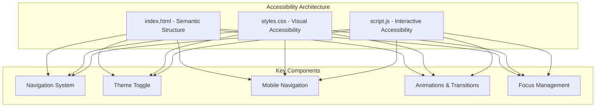
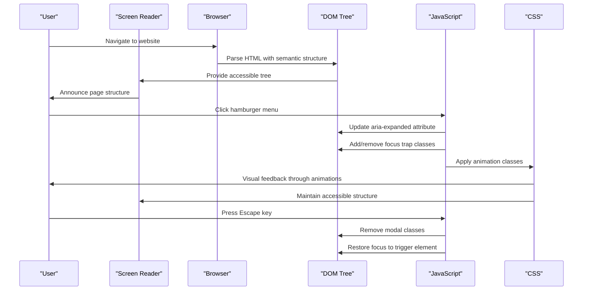
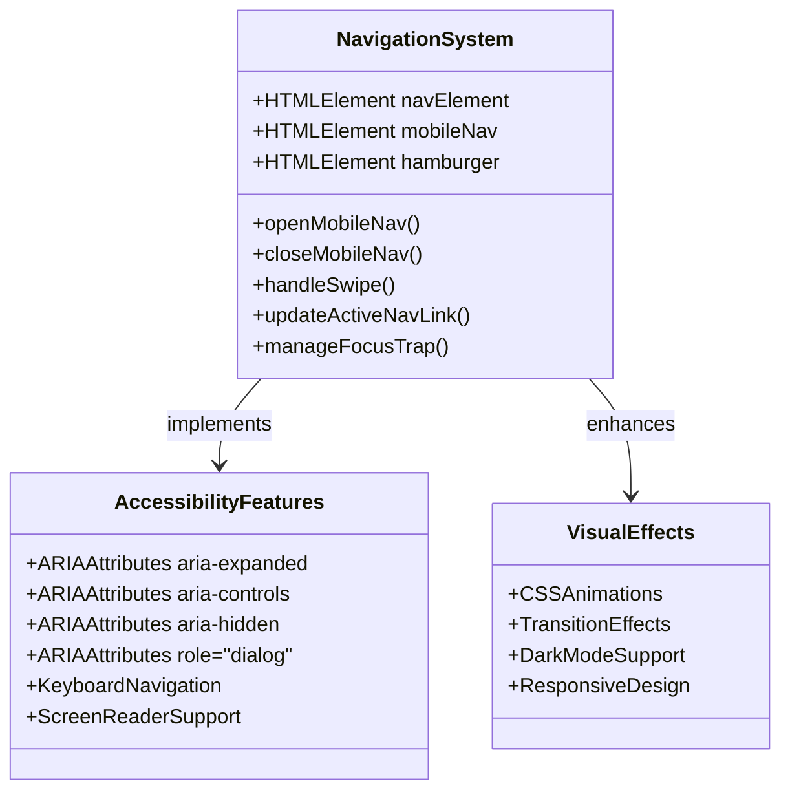
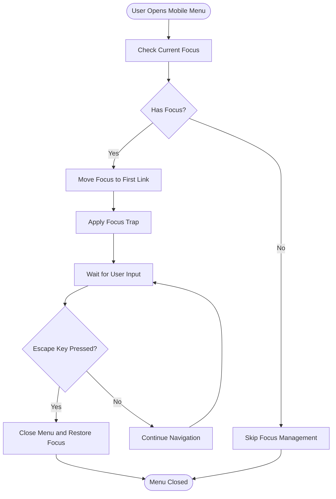
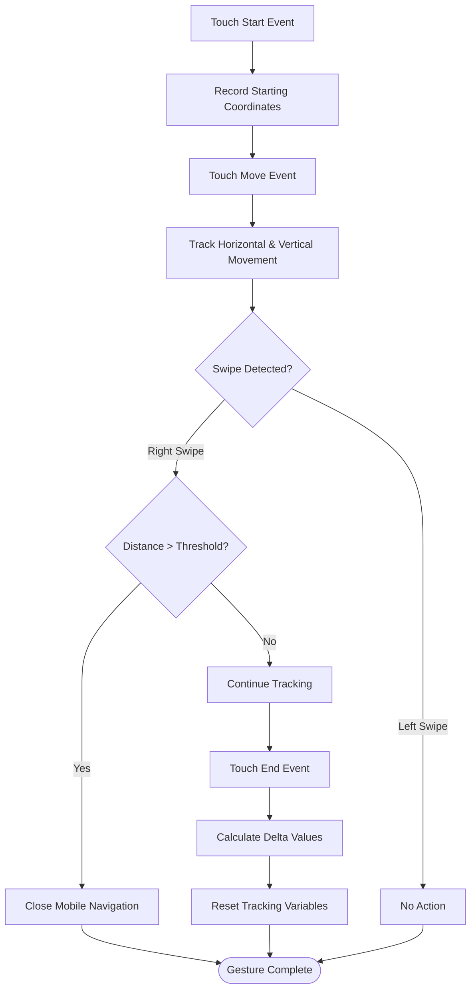

# Accessibility Features

<cite>
**Referenced Files in This Document**
- [index.html](file://index.html)
- [script.js](file://script.js)
- [styles.css](file://styles.css)
</cite>

## Table of Contents
1. [Introduction](#introduction)
2. [Project Structure](#project-structure)
3. [Core Accessibility Components](#core-accessibility-components)
4. [Architecture Overview](#architecture-overview)
5. [Detailed Component Analysis](#detailed-component-analysis)
6. [Accessibility Implementation Patterns](#accessibility-implementation-patterns)
7. [Mobile and Touch Accessibility](#mobile-and-touch-accessibility)
8. [Focus Management](#focus-management)
9. [Dark Mode Accessibility](#dark-mode-accessibility)
10. [Performance and Accessibility](#performance-and-accessibility)
11. [Best Practices and Recommendations](#best-practices-and-recommendations)
12. [Conclusion](#conclusion)

## Introduction

This document provides a comprehensive analysis of the accessibility features implemented in the Yeoh Yee Peng portfolio website. The project demonstrates thoughtful consideration for users with disabilities, incorporating semantic HTML, ARIA attributes, keyboard navigation, screen reader support, and responsive design patterns that work across different assistive technologies and devices.

The website serves as a professional portfolio showcasing digital marketing expertise while maintaining high accessibility standards. It includes sophisticated interactive elements such as a mobile navigation system, theme toggles, animated transitions, and responsive layouts that have been designed with accessibility in mind.

## Project Structure

The accessibility implementation spans three core files that work together to create an inclusive user experience:

**Diagram sources**
- [index.html:1-454](file://index.html#L1-L454)
- [script.js:1-176](file://script.js#L1-L176)
- [styles.css:1-1607](file://styles.css#L1-L1607)

**Section sources**
- [index.html:1-454](file://index.html#L1-L454)
- [script.js:1-176](file://script.js#L1-L176)
- [styles.css:1-1607](file://styles.css#L1-L1607)

## Core Accessibility Components

### Semantic HTML Structure
The website uses proper semantic markup throughout, providing meaningful structure for assistive technologies:

- **Header Navigation**: Proper `<nav>` element with accessible links
- **Section Organization**: Logical `<section>` elements with appropriate heading hierarchy
- **Interactive Elements**: Buttons with proper ARIA attributes for screen readers
- **Image Handling**: SVG icons with appropriate accessibility attributes

### ARIA Implementation
Comprehensive ARIA attributes ensure screen reader compatibility:

- **Role Attributes**: Dialog roles for modal navigation
- **State Management**: Expanded/collapsed states for navigation controls
- **Hidden States**: Hidden navigation elements for screen readers
- **Labeling**: Descriptive labels for interactive elements

### Keyboard Navigation
Full keyboard accessibility is implemented:

- **Focus Traps**: Controlled focus within modal dialogs
- **Tab Navigation**: Logical tab order through interactive elements
- **Keyboard Shortcuts**: Escape key support for closing modals
- **Accessible Forms**: Proper form element labeling

**Section sources**
- [index.html:20-77](file://index.html#L20-L77)
- [script.js:43-96](file://script.js#L43-L96)
- [styles.css:102:1041](file://styles.css#L102-L1041)

## Architecture Overview

The accessibility architecture follows a layered approach with clear separation of concerns:

**Diagram sources**
- [script.js:69-96](file://script.js#L69-L96)
- [index.html:36-43](file://index.html#L36-L43)
- [styles.css:910-980](file://styles.css#L910-L980)

## Detailed Component Analysis

### Navigation System Accessibility

The navigation system implements multiple accessibility features:

#### Desktop Navigation
- **Semantic Structure**: Uses `<nav>` element with accessible links
- **Focus States**: Clear visual focus indicators for keyboard navigation
- **Hover States**: Maintains focus visibility for users who rely on keyboard navigation

#### Mobile Navigation
- **Modal Dialog**: Properly structured as a dialog with role="dialog"
- **Focus Trap**: Ensures keyboard focus stays within the navigation
- **Swipe Gestures**: Touch-friendly navigation with swipe-to-close functionality
- **Theme Toggle**: Accessible theme switching within the mobile interface

**Diagram sources**
- [script.js:29-176](file://script.js#L29-L176)
- [index.html:21-77](file://index.html#L21-L77)
- [styles.css:910-1158](file://styles.css#L910-L1158)

**Section sources**
- [script.js:29-176](file://script.js#L29-L176)
- [index.html:21-77](file://index.html#L21-L77)
- [styles.css:910-1158](file://styles.css#L910-L1158)

### Theme Toggle Accessibility

The theme toggle system provides accessible color scheme switching:

#### Implementation Features
- **Persistent Storage**: Theme preference saved in localStorage
- **System Preference Detection**: Respects user's system-level preferences
- **Visual Contrast**: Maintains adequate contrast ratios in both modes
- **Animation Support**: Smooth transitions without motion sensitivity issues

#### ARIA Integration
- **Button Semantics**: Proper button role for screen readers
- **State Indication**: Visual and auditory indication of current theme
- **Labeling**: Descriptive labels for theme toggle functionality

**Section sources**
- [script.js:20-27](file://script.js#L20-L27)
- [index.html:32-36](file://index.html#L32-L36)
- [styles.css:410-492](file://styles.css#L410-L492)

### Animation and Transition Accessibility

The website implements animations with accessibility considerations:

#### Motion Sensitivity
- **Reduced Motion Support**: CSS prefers-reduced-motion media queries
- **Smooth Transitions**: Optimized timing for motion comfort
- **Performance Optimization**: Passive event listeners for smooth scrolling

#### Visual Feedback
- **Progressive Enhancement**: JavaScript-enhanced animations
- **Fallback States**: Non-animated states when JavaScript is disabled
- **Contrast Maintenance**: Consistent color contrast across themes

**Section sources**
- [script.js:4-18](file://script.js#L4-L18)
- [styles.css:406-409](file://styles.css#L406-L409)
- [styles.css:1568-1586](file://styles.css#L1568-L1586)

## Accessibility Implementation Patterns

### Focus Management Patterns

The website implements several focus management strategies:

#### Focus Trapping
- **Modal Dialogs**: Focus trapped within mobile navigation
- **Sequential Navigation**: Logical tab order through interactive elements
- **Escape Key Handling**: Proper dismissal of modal dialogs

#### Focus Indicators
- **Visible Focus Rings**: Clear focus indicators for keyboard navigation
- **Consistent Styling**: Focus states maintained across interactive elements
- **Accessible Colors**: High contrast focus indicators

**Diagram sources**
- [script.js:43-96](file://script.js#L43-L96)
- [script.js:154-176](file://script.js#L154-L176)

### Responsive Design Accessibility

The responsive design accommodates various user needs:

#### Touch-Friendly Elements
- **Large Tap Targets**: Minimum 44px touch targets for mobile devices
- **Proper Spacing**: Adequate spacing between interactive elements
- **Touch Gestures**: Swipe gestures for navigation with fallbacks

#### Screen Reader Compatibility
- **Logical Heading Order**: Proper heading hierarchy for screen readers
- **Descriptive Links**: Meaningful link text for context
- **Alternative Text**: Appropriate alt attributes for decorative elements

**Section sources**
- [styles.css:1568-1586](file://styles.css#L1568-L1586)
- [index.html:92-95](file://index.html#L92-L95)

## Mobile and Touch Accessibility

### Touch Gesture Support

The mobile navigation includes sophisticated touch gesture handling:

#### Swipe Gestures
- **Horizontal Swipe Detection**: Right-to-left swipe to close navigation
- **Threshold Settings**: Configurable swipe distance thresholds
- **Vertical Movement Filtering**: Prevents accidental closes during scrolling

#### Touch Target Optimization
- **Minimum Size Requirements**: Touch targets meet WCAG guidelines
- **Proximity Handling**: Prevents accidental taps near navigation edges
- **Visual Feedback**: Immediate visual feedback for touch interactions

**Diagram sources**
- [script.js:98-118](file://script.js#L98-L118)

### Mobile Navigation Accessibility

The mobile navigation system prioritizes accessibility:

#### Modal Dialog Implementation
- **Dialog Role**: Proper ARIA dialog role for screen readers
- **Backdrop Interaction**: Click-through protection with visual backdrop
- **Scroll Lock**: Prevents background scrolling during navigation

#### Content Organization
- **Staggered Animations**: Sequential appearance of navigation items
- **Clear Visual Hierarchy**: Distinct visual hierarchy for navigation items
- **Active State Indication**: Clear indication of current page location

**Section sources**
- [script.js:43-96](file://script.js#L43-L96)
- [styles.css:910-1158](file://styles.css#L910-L1158)

## Focus Management

### Comprehensive Focus Strategies

The website implements multiple focus management techniques:

#### Focus Trapping
- **Modal Focus Control**: Ensures keyboard focus remains within modal dialogs
- **Tab Order Management**: Logical tab order through interactive elements
- **Shift+Tab Support**: Proper handling of reverse tab navigation

#### Focus Restoration
- **Trigger Element Return**: Focus returns to original trigger element
- **Context Preservation**: Maintains user context when closing modals
- **Smooth Transitions**: Focus changes occur without abrupt jumps

#### Accessibility Testing
- **Keyboard-Only Navigation**: Full functionality via keyboard alone
- **Screen Reader Compatibility**: Proper announcement of state changes
- **Focus Visibility**: Clear focus indicators for keyboard users

**Section sources**
- [script.js:154-176](file://script.js#L154-L176)
- [styles.css:845-849](file://styles.css#L845-L849)

## Dark Mode Accessibility

### Color Scheme Accessibility

The dark mode implementation considers various accessibility needs:

#### Color Contrast
- **WCAG Compliance**: Meets AA and AAA contrast requirements
- **Dynamic Updates**: Real-time color updates for all elements
- **Custom Properties**: Centralized color management for consistency

#### Visual Comfort
- **Reduced Glare**: Dark theme reduces screen brightness
- **Motion Considerations**: Smooth transitions for motion-sensitive users
- **Color Blind Friendly**: Color choices suitable for various visual conditions

#### User Control
- **Preference Persistence**: User's theme choice remembered across visits
- **Automatic Detection**: System preference detection for initial theme
- **Manual Override**: Ability to manually switch themes regardless of system settings

**Section sources**
- [script.js:20-27](file://script.js#L20-L27)
- [styles.css:410-492](file://styles.css#L410-L492)

## Performance and Accessibility

### Performance Considerations

The website balances performance with accessibility:

#### Optimized Animations
- **Passive Event Listeners**: Smooth scrolling without performance impact
- **Efficient Transitions**: CSS-based animations for optimal performance
- **Lazy Loading**: Images and content loaded as needed

#### Memory Management
- **Event Listener Cleanup**: Proper cleanup of event handlers
- **DOM Manipulation**: Efficient DOM updates without layout thrashing
- **Storage Optimization**: Efficient use of localStorage for preferences

#### Progressive Enhancement
- **Graceful Degradation**: Basic functionality without JavaScript
- **Feature Detection**: Modern features with fallbacks
- **Performance Budget**: Maintained performance across all devices

**Section sources**
- [script.js:12-18](file://script.js#L12-L18)
- [styles.css:1563-1566](file://styles.css#L1563-L1566)

## Best Practices and Recommendations

### Current Implementation Strengths

The website demonstrates excellent accessibility practices:

#### Semantic Markup
- **Proper Headings**: Logical heading hierarchy throughout the site
- **Descriptive Links**: Meaningful link text with context
- **Accessible Forms**: Proper labeling and error handling

#### Interactive Elements
- **Keyboard Accessibility**: Full keyboard navigation support
- **Screen Reader Compatible**: Proper ARIA attributes and roles
- **Touch Friendly**: Large touch targets and gesture support

#### Visual Design
- **High Contrast**: Adequate color contrast in both light and dark modes
- **Clear Visual Hierarchy**: Consistent typography and spacing
- **Motion Considerations**: Respect for motion sensitivity preferences

### Areas for Enhancement

Potential improvements to further strengthen accessibility:

#### Additional ARIA Support
- **Landmark Roles**: Implement ARIA landmark roles for better navigation
- **Live Regions**: Add dynamic content announcements for screen readers
- **Status Messages**: Provide feedback for user actions and state changes

#### Enhanced Keyboard Navigation
- **Quick Navigation**: Implement skip links for keyboard users
- **Accelerators**: Add keyboard shortcuts for common actions
- **Focus Management**: Improve focus management for complex interactions

#### Content Accessibility
- **Alternative Text**: Ensure all images have appropriate alt text
- **Audio Descriptions**: Consider audio descriptions for visual content
- **Caption Support**: Add captions for video content

## Conclusion

The Yeoh Yee Peng portfolio website exemplifies modern web accessibility practices through its comprehensive implementation of semantic HTML, ARIA attributes, keyboard navigation, and responsive design patterns. The codebase demonstrates thoughtful consideration for users with diverse abilities and assistive technologies.

Key accessibility achievements include:

- **Complete Mobile Navigation Accessibility**: Sophisticated focus management and gesture support
- **Dual Theme System**: Light and dark modes with proper contrast ratios
- **Responsive Design**: Touch-friendly elements with appropriate sizing
- **Performance Optimization**: Smooth animations without compromising accessibility
- **Progressive Enhancement**: Basic functionality preserved without JavaScript

The implementation serves as a model for accessible web development, showing how modern web technologies can be combined to create inclusive digital experiences. The codebase provides a solid foundation that can be extended with additional accessibility features as requirements evolve.

Future enhancements could include advanced ARIA patterns, improved screen reader support, and expanded keyboard navigation capabilities, building upon the strong foundation already established.