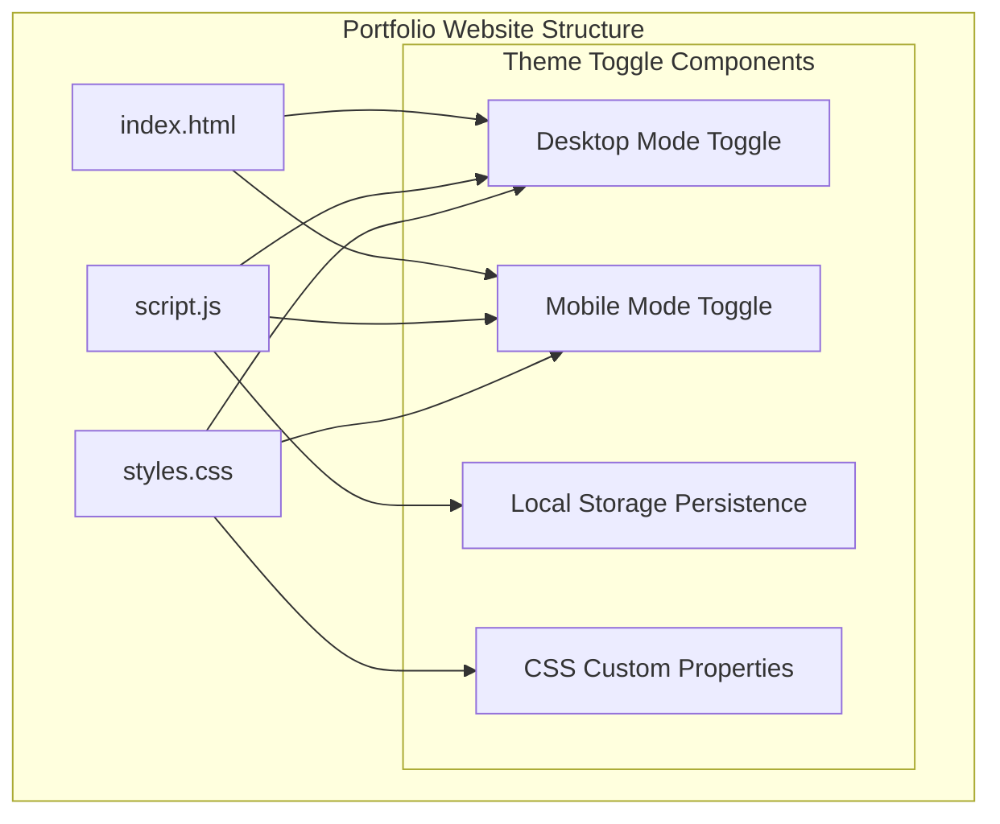
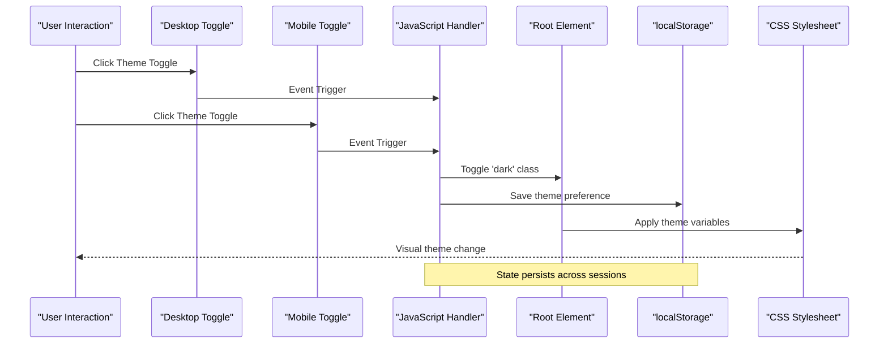
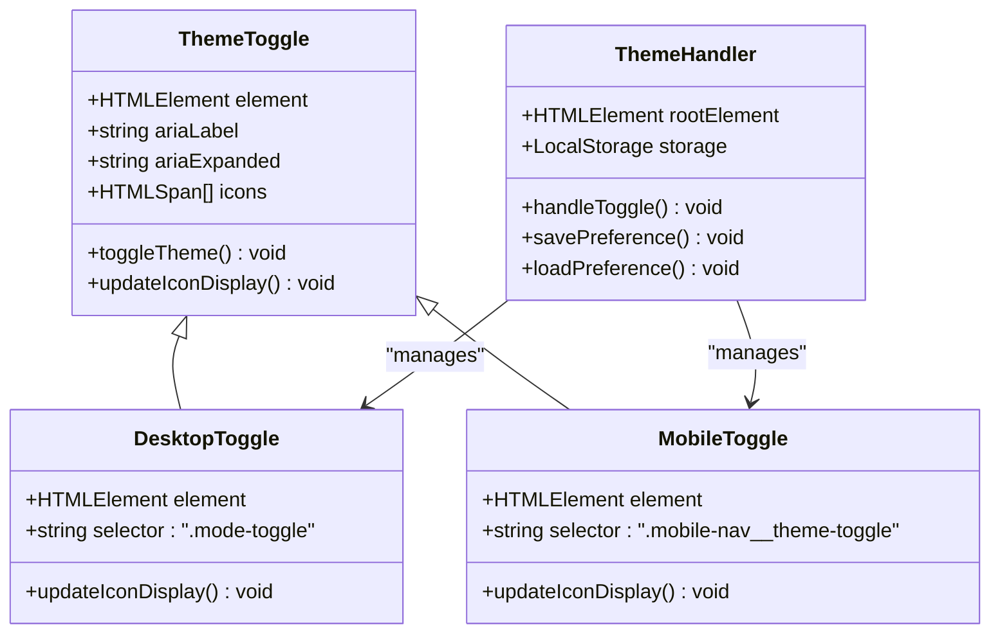
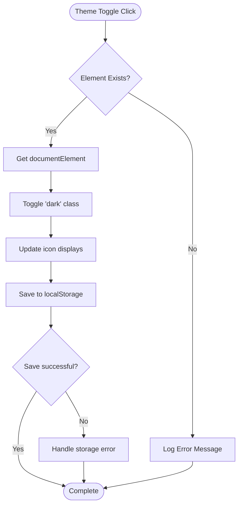
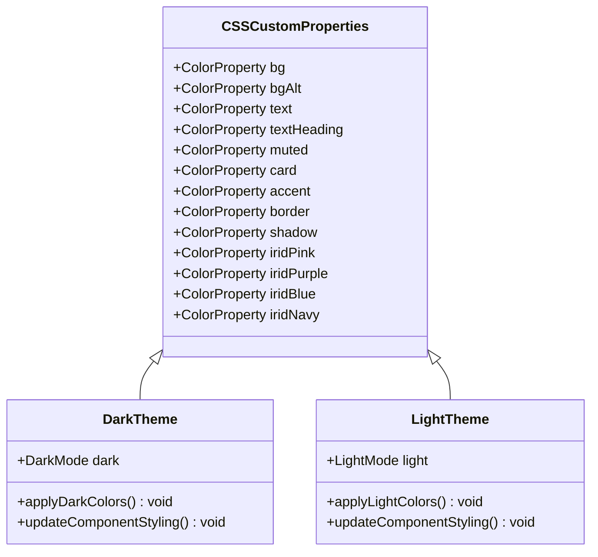
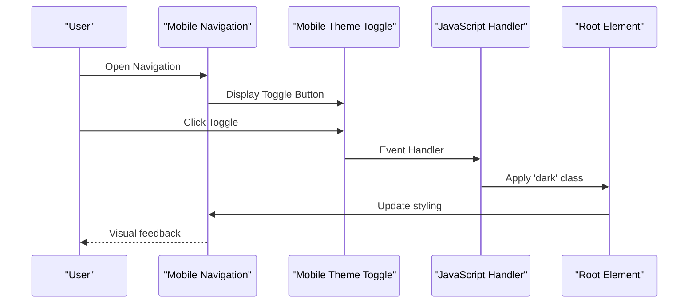
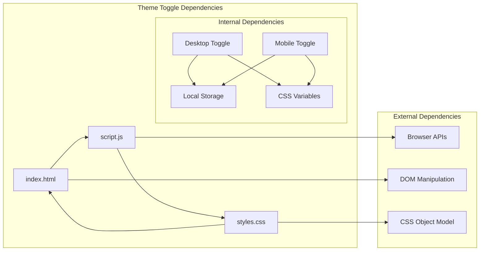

# Enhanced Theme Toggle

<cite>
**Referenced Files in This Document**
- [index.html](file://index.html)
- [script.js](file://script.js)
- [styles.css](file://styles.css)
</cite>

## Table of Contents
1. [Introduction](#introduction)
2. [Project Structure](#project-structure)
3. [Core Components](#core-components)
4. [Architecture Overview](#architecture-overview)
5. [Detailed Component Analysis](#detailed-component-analysis)
6. [Dependency Analysis](#dependency-analysis)
7. [Performance Considerations](#performance-considerations)
8. [Troubleshooting Guide](#troubleshooting-guide)
9. [Conclusion](#conclusion)

## Introduction

The Enhanced Theme Toggle is a sophisticated dark/light mode switching system implemented in a modern portfolio website. This feature provides users with seamless theme switching capabilities while maintaining accessibility standards and cross-platform compatibility. The implementation combines HTML semantic markup, CSS custom properties, JavaScript event handling, and localStorage persistence to deliver a robust user experience.

The theme toggle system features dual interface controls - one for desktop navigation and another for mobile navigation - with automatic state synchronization and smooth transitions. The system respects user preferences through persistent storage and adapts to different screen sizes and device capabilities.

## Project Structure

The portfolio website follows a clean, modular structure with three core files working together to provide the enhanced theme toggle functionality:

**Diagram sources**
- [index.html:33-36](file://index.html#L33-L36)
- [index.html:64-68](file://index.html#L64-L68)
- [script.js:20-27](file://script.js#L20-L27)
- [styles.css:387-410](file://styles.css#L387-L410)

**Section sources**
- [index.html:1-454](file://index.html#L1-L454)
- [script.js:1-176](file://script.js#L1-L176)
- [styles.css:1-1497](file://styles.css#L1-L1497)

## Core Components

The Enhanced Theme Toggle system consists of several interconnected components that work together to provide seamless theme switching:

### Desktop Theme Toggle
The primary theme toggle control located in the site navigation header provides immediate access to theme switching functionality. It features sun and moon icon indicators that change based on the current theme state.

### Mobile Theme Toggle
A dedicated theme toggle within the mobile navigation overlay ensures consistent functionality across all device sizes. This component maintains the same visual indicators and behavior as the desktop version.

### Local Storage Persistence
The system automatically saves user preferences using localStorage, ensuring that theme choices persist across browser sessions and page reloads.

### CSS Custom Property System
A comprehensive CSS custom property system manages all color values, allowing for seamless theme transitions without requiring JavaScript intervention for styling updates.

**Section sources**
- [index.html:33-36](file://index.html#L33-L36)
- [index.html:64-68](file://index.html#L64-L68)
- [script.js:20-27](file://script.js#L20-L27)
- [styles.css:387-410](file://styles.css#L387-L410)

## Architecture Overview

The Enhanced Theme Toggle implements a client-side architecture that separates concerns between presentation, logic, and persistence:

**Diagram sources**
- [script.js:24-27](file://script.js#L24-L27)
- [script.js:121-126](file://script.js#L121-L126)
- [styles.css:387-410](file://styles.css#L387-L410)

The architecture follows a unidirectional data flow where user interactions trigger JavaScript handlers that modify the DOM state, which in turn triggers CSS custom property updates without requiring additional JavaScript intervention.

**Section sources**
- [script.js:20-27](file://script.js#L20-L27)
- [script.js:120-127](file://script.js#L120-L127)
- [styles.css:387-410](file://styles.css#L387-L410)

## Detailed Component Analysis

### Theme Toggle Implementation

The theme toggle system utilizes a sophisticated approach combining semantic HTML, CSS custom properties, and JavaScript event handling:

#### HTML Structure
The theme toggle elements are implemented as semantic button elements with appropriate ARIA attributes for accessibility:

**Diagram sources**
- [index.html:33-36](file://index.html#L33-L36)
- [index.html:64-68](file://index.html#L64-L68)
- [script.js:24-27](file://script.js#L24-L27)
- [script.js:121-126](file://script.js#L121-L126)

#### JavaScript Event Handling
The JavaScript implementation provides robust event handling with multiple interaction methods:

**Diagram sources**
- [script.js:24-27](file://script.js#L24-L27)
- [script.js:121-126](file://script.js#L121-L126)

#### CSS Custom Property System
The stylesheet implements a comprehensive custom property system that manages all theme-dependent styling:

**Diagram sources**
- [styles.css:3-20](file://styles.css#L3-L20)
- [styles.css:387-410](file://styles.css#L387-L410)

**Section sources**
- [script.js:20-27](file://script.js#L20-L27)
- [script.js:120-127](file://script.js#L120-L127)
- [styles.css:3-20](file://styles.css#L3-L20)
- [styles.css:387-410](file://styles.css#L387-L410)

### Mobile Navigation Integration

The theme toggle seamlessly integrates with the mobile navigation system, providing consistent functionality across all device sizes:

#### Mobile Navigation Enhancement
The mobile navigation overlay includes a dedicated theme toggle button that mirrors the desktop functionality:

**Diagram sources**
- [index.html:64-68](file://index.html#L64-L68)
- [script.js:121-126](file://script.js#L121-L126)
- [styles.css:979-1014](file://styles.css#L979-L1014)

**Section sources**
- [index.html:64-68](file://index.html#L64-L68)
- [script.js:120-127](file://script.js#L120-L127)
- [styles.css:979-1014](file://styles.css#L979-L1014)

## Dependency Analysis

The Enhanced Theme Toggle system exhibits excellent modularity with clear separation of concerns:

**Diagram sources**
- [script.js:20-27](file://script.js#L20-L27)
- [script.js:121-126](file://script.js#L121-L126)
- [styles.css:387-410](file://styles.css#L387-L410)

The system demonstrates low coupling between components, with each module having a single responsibility and minimal dependencies on external systems.

**Section sources**
- [script.js:20-27](file://script.js#L20-L27)
- [script.js:120-127](file://script.js#L120-L127)
- [styles.css:387-410](file://styles.css#L387-L410)

## Performance Considerations

The Enhanced Theme Toggle system is optimized for performance through several key strategies:

### Efficient DOM Manipulation
The implementation minimizes DOM operations by toggling a single class on the root element rather than individually updating thousands of style properties. This approach leverages CSS custom properties for efficient theme switching.

### Memory Management
The system uses event delegation and efficient selectors to minimize memory footprint. JavaScript event listeners are attached only when elements exist, preventing unnecessary memory allocation.

### CSS Optimization
The stylesheet employs CSS custom properties and transforms for smooth animations, avoiding layout thrashing and ensuring optimal rendering performance across different devices.

### Storage Efficiency
Local storage usage is minimal and efficient, storing only a single preference value that determines the theme state.

## Troubleshooting Guide

Common issues and their solutions for the Enhanced Theme Toggle system:

### Theme Toggle Not Responding
**Symptoms**: Clicking the theme toggle has no effect
**Causes**: 
- Missing DOM elements with required selectors
- JavaScript errors preventing event handler execution
- CSS custom property conflicts

**Solutions**:
- Verify HTML structure matches expected selectors
- Check browser console for JavaScript errors
- Ensure CSS custom properties are properly defined

### Theme Preference Not Persisting
**Symptoms**: Theme resets after page refresh
**Causes**:
- Local storage disabled or blocked
- JavaScript execution errors
- Browser compatibility issues

**Solutions**:
- Test local storage availability in browser console
- Verify localStorage.setItem() permissions
- Check browser compatibility for required APIs

### Visual Inconsistencies
**Symptoms**: Partial theme application or inconsistent styling
**Causes**:
- CSS specificity conflicts
- Custom property value overrides
- Animation timing issues

**Solutions**:
- Review CSS specificity hierarchy
- Check for custom property overrides
- Adjust animation timing if necessary

**Section sources**
- [script.js:20-27](file://script.js#L20-L27)
- [script.js:120-127](file://script.js#L120-L127)
- [styles.css:387-410](file://styles.css#L387-L410)

## Conclusion

The Enhanced Theme Toggle system represents a sophisticated implementation of client-side theme switching that balances functionality, accessibility, and performance. The system successfully provides seamless dark/light mode functionality across multiple interface contexts while maintaining excellent user experience characteristics.

Key achievements of this implementation include:

- **Seamless Integration**: Dual theme toggle controls that work consistently across desktop and mobile contexts
- **Persistence**: Automatic saving of user preferences using localStorage
- **Accessibility**: Proper ARIA attributes and keyboard navigation support
- **Performance**: Efficient DOM manipulation and CSS custom property usage
- **Maintainability**: Clean separation of concerns with modular architecture

The system serves as an excellent example of modern web development practices, demonstrating how to create responsive, accessible, and performant user interface components that enhance the overall user experience.