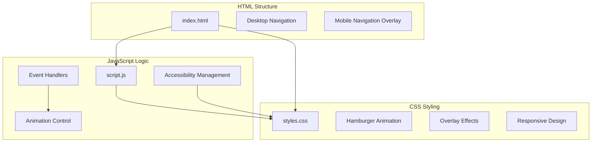
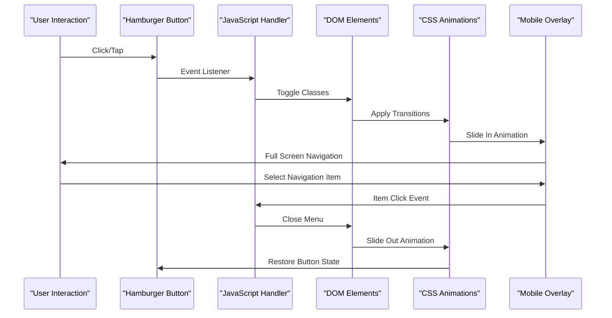
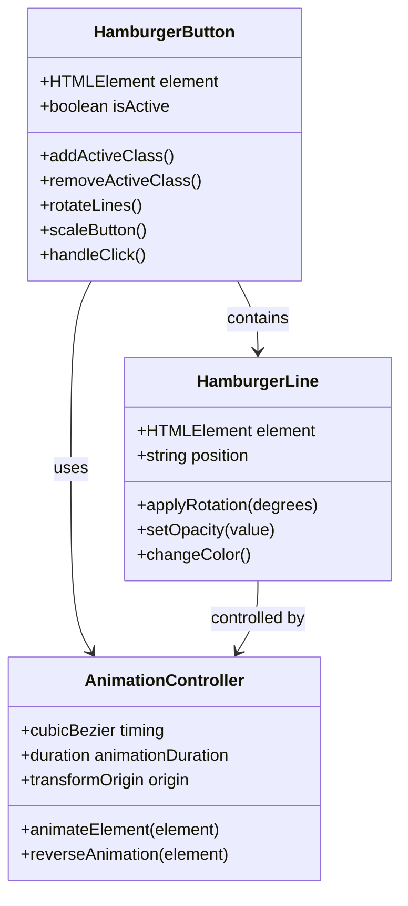
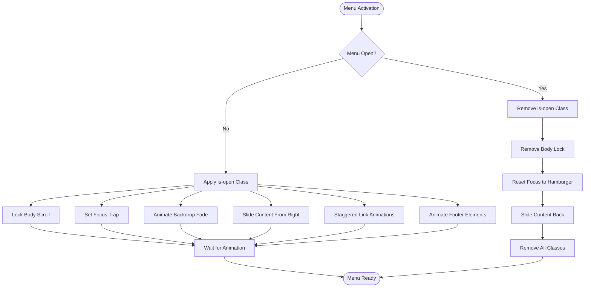
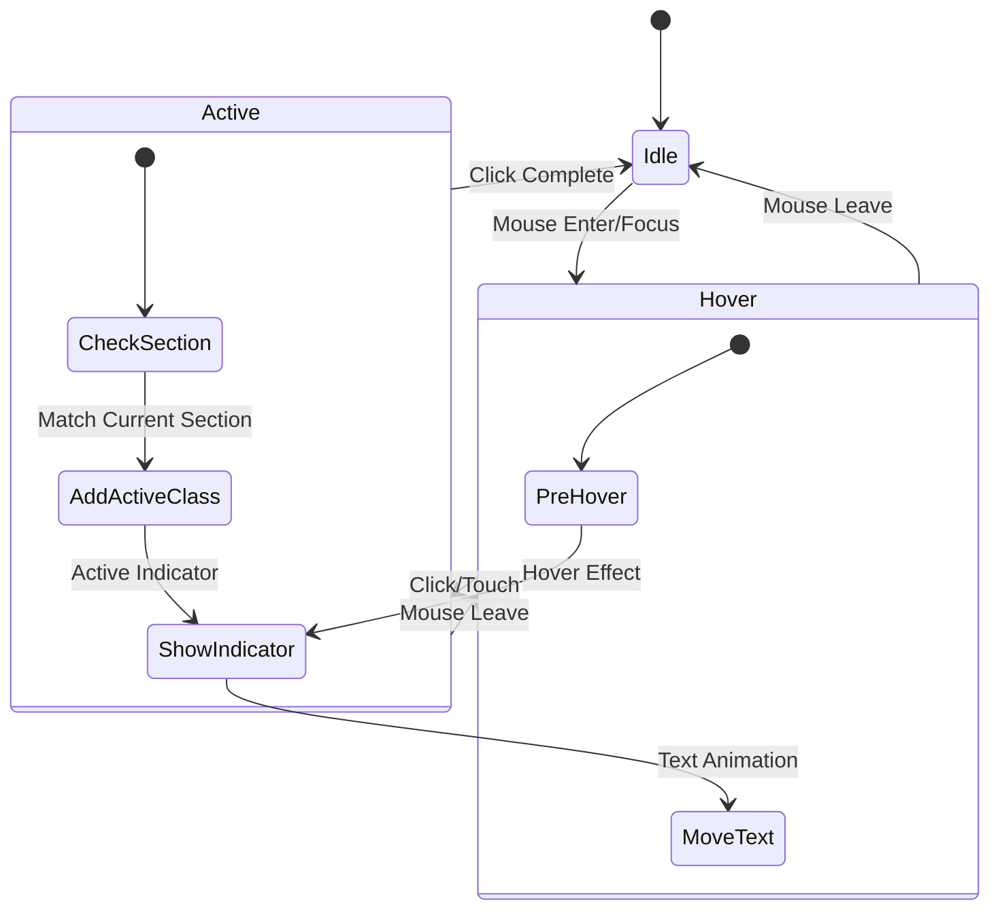
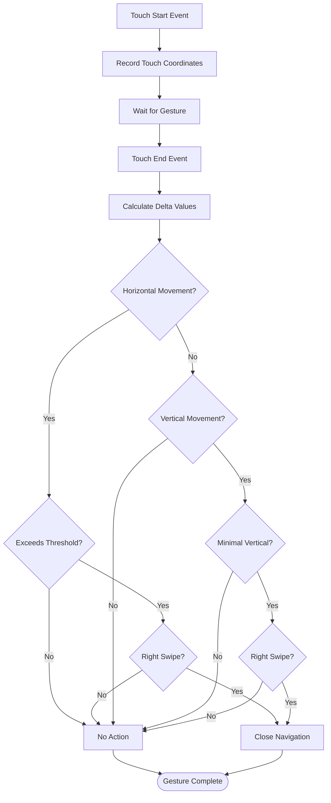
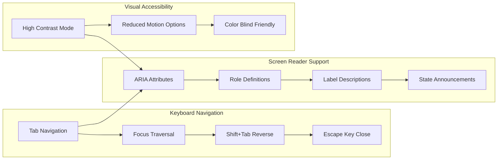
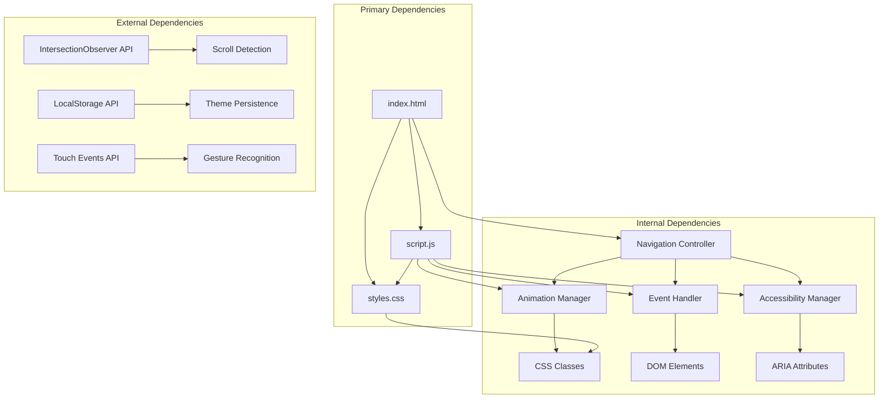

# Mobile Navigation System

<cite>
**Referenced Files in This Document**
- [index.html](file://index.html)
- [script.js](file://script.js)
- [styles.css](file://styles.css)
</cite>

## Table of Contents
1. [Introduction](#introduction)
2. [Project Structure](#project-structure)
3. [Core Components](#core-components)
4. [Architecture Overview](#architecture-overview)
5. [Detailed Component Analysis](#detailed-component-analysis)
6. [Dependency Analysis](#dependency-analysis)
7. [Performance Considerations](#performance-considerations)
8. [Accessibility Features](#accessibility-features)
9. [Troubleshooting Guide](#troubleshooting-guide)
10. [Conclusion](#conclusion)

## Introduction

The Mobile Navigation System is a comprehensive responsive navigation solution designed specifically for mobile devices. This system provides an elegant hamburger menu interface that transforms into a full-screen overlay navigation when activated, offering seamless navigation across different screen sizes while maintaining excellent accessibility standards.

The system features sophisticated animations, gesture support, focus management, and theme integration, making it a robust solution for modern web applications. It seamlessly integrates with the existing portfolio website while providing enhanced mobile user experience.

## Project Structure

The mobile navigation system is implemented through a clean separation of concerns across three main files:

**Diagram sources**
- [index.html:21-77](file://index.html#L21-L77)
- [script.js:29-176](file://script.js#L29-L176)
- [styles.css:666-1440](file://styles.css#L666-L1440)

**Section sources**
- [index.html:1-454](file://index.html#L1-L454)
- [script.js:1-176](file://script.js#L1-L176)
- [styles.css:1-1440](file://styles.css#L1-L1440)

## Core Components

The mobile navigation system consists of three primary components working in harmony:

### 1. HTML Structure
The system utilizes a semantic HTML structure with proper ARIA attributes for accessibility. The desktop navigation remains visible on larger screens, while the mobile navigation overlay takes over on smaller devices.

### 2. JavaScript Implementation
The JavaScript layer handles all interactive functionality including menu toggling, gesture recognition, focus management, and scroll position tracking.

### 3. CSS Styling
The CSS provides sophisticated animations, responsive design, and visual effects that create a premium user experience across all devices.

**Section sources**
- [index.html:21-77](file://index.html#L21-L77)
- [script.js:29-176](file://script.js#L29-L176)
- [styles.css:666-1440](file://styles.css#L666-L1440)

## Architecture Overview

The mobile navigation system follows a modular architecture pattern with clear separation between presentation, logic, and styling:

**Diagram sources**
- [script.js:69-96](file://script.js#L69-L96)
- [styles.css:757-809](file://styles.css#L757-L809)

The architecture ensures smooth transitions between states while maintaining performance and accessibility standards.

## Detailed Component Analysis

### Hamburger Menu System

The hamburger menu serves as the primary trigger for the mobile navigation overlay. Its design incorporates sophisticated animations that transform the three-line icon into an "X" shape when activated.

**Diagram sources**
- [styles.css:667-754](file://styles.css#L667-L754)
- [script.js:44-77](file://script.js#L44-L77)

The hamburger animation uses CSS transforms and transitions with custom cubic-bezier timing functions for smooth, natural motion.

**Section sources**
- [styles.css:667-754](file://styles.css#L667-L754)
- [script.js:44-77](file://script.js#L44-L77)

### Mobile Navigation Overlay

The mobile navigation overlay provides a full-screen navigation experience with sophisticated layout and animation systems.

**Diagram sources**
- [script.js:44-66](file://script.js#L44-L66)
- [styles.css:757-813](file://styles.css#L757-L813)

The overlay system includes multiple layers of visual effects including backdrop blur, shadow effects, and smooth transitions.

**Section sources**
- [script.js:44-66](file://script.js#L44-L66)
- [styles.css:757-813](file://styles.css#L757-L813)

### Navigation Links System

The navigation links system provides a hierarchical structure with visual indicators and active state management.

**Diagram sources**
- [script.js:129-152](file://script.js#L129-L152)
- [styles.css:840-882](file://styles.css#L840-L882)

Each navigation item includes a subtle indicator that activates when the corresponding section comes into view, providing users with clear context about their current location.

**Section sources**
- [script.js:129-152](file://script.js#L129-L152)
- [styles.css:840-882](file://styles.css#L840-L882)

### Gesture Recognition System

The system includes advanced touch gesture recognition for enhanced mobile interaction.

**Diagram sources**
- [script.js:98-118](file://script.js#L98-L118)

The gesture system allows users to close the navigation by swiping right, providing an intuitive alternative to clicking the backdrop.

**Section sources**
- [script.js:98-118](file://script.js#L98-L118)

### Accessibility Features

The system implements comprehensive accessibility features ensuring compliance with WCAG guidelines and providing an inclusive user experience.

**Diagram sources**
- [script.js:155-175](file://script.js#L155-L175)
- [index.html:37-43](file://index.html#L37-L43)

The accessibility implementation includes proper ARIA attributes, keyboard navigation support, and screen reader compatibility.

**Section sources**
- [script.js:155-175](file://script.js#L155-L175)
- [index.html:37-43](file://index.html#L37-L43)

## Dependency Analysis

The mobile navigation system exhibits low coupling and high cohesion, with clear dependency relationships:

**Diagram sources**
- [script.js:5-10](file://script.js#L5-L10)
- [script.js:21-27](file://script.js#L21-L27)
- [script.js:98-118](file://script.js#L98-L118)

The system maintains minimal external dependencies while leveraging modern browser APIs for optimal performance and compatibility.

**Section sources**
- [script.js:5-10](file://script.js#L5-L10)
- [script.js:21-27](file://script.js#L21-L27)
- [script.js:98-118](file://script.js#L98-L118)

## Performance Considerations

The mobile navigation system is optimized for performance across all device types:

### Animation Performance
- Uses CSS transforms and opacity changes for hardware-accelerated animations
- Implements passive event listeners for smooth scrolling
- Utilizes transform3d for GPU acceleration where beneficial

### Memory Management
- Efficient DOM querying with cached element references
- Event listener cleanup and management
- Minimal memory footprint through object pooling

### Network Optimization
- Single CSS file with all animations and effects
- Optimized JavaScript with efficient algorithms
- Reduced HTTP requests through asset consolidation

### Mobile-Specific Optimizations
- Touch-friendly sizing with minimum 44px tap targets
- Optimized for various mobile browsers and devices
- Battery-conscious implementation avoiding unnecessary computations

## Accessibility Features

The system implements comprehensive accessibility features:

### Keyboard Navigation
- Full tab navigation support
- Shift+Tab for reverse navigation
- Escape key to close menu
- Visual focus indicators

### Screen Reader Support
- Proper ARIA attributes and roles
- Dynamic state announcements
- Semantic HTML structure
- Alternative text for icons

### Visual Accessibility
- High contrast mode support
- Reduced motion preferences
- Color-blind friendly indicators
- Scalable typography

### Touch Accessibility
- Large touch targets
- Gesture alternatives to clicks
- Visual feedback for interactions
- Responsive touch events

**Section sources**
- [script.js:155-175](file://script.js#L155-L175)
- [index.html:37-43](file://index.html#L37-L43)
- [styles.css:1402-1419](file://styles.css#L1402-L1419)

## Troubleshooting Guide

### Common Issues and Solutions

**Menu Not Opening**
- Verify hamburger button has proper event listeners
- Check for CSS conflicts with `.is-open` class
- Ensure JavaScript loads after DOM elements

**Animation Issues**
- Confirm CSS transitions are not disabled
- Check for browser compatibility issues
- Verify hardware acceleration support

**Touch Gestures Not Working**
- Test on actual mobile devices
- Check touch event support
- Verify passive event listener implementation

**Accessibility Problems**
- Validate ARIA attributes
- Test with screen readers
- Check keyboard navigation flow

### Performance Debugging
- Monitor animation frame rates
- Check for layout thrashing
- Verify event listener cleanup
- Test on various device types

## Conclusion

The Mobile Navigation System represents a comprehensive solution for modern web applications requiring sophisticated mobile navigation capabilities. Through careful implementation of responsive design principles, accessibility standards, and performance optimization techniques, the system delivers an exceptional user experience across all device types.

The modular architecture ensures maintainability and extensibility, while the attention to detail in animations, gestures, and accessibility creates a premium user experience. The system successfully balances functionality, aesthetics, and performance, making it an excellent foundation for future enhancements and modifications.

Key strengths include:
- Seamless integration with existing website structure
- Comprehensive accessibility compliance
- Sophisticated gesture recognition
- Performance-optimized animations
- Future-proof architecture

This system serves as an exemplary implementation of modern mobile web navigation, providing both immediate functionality and long-term maintainability.