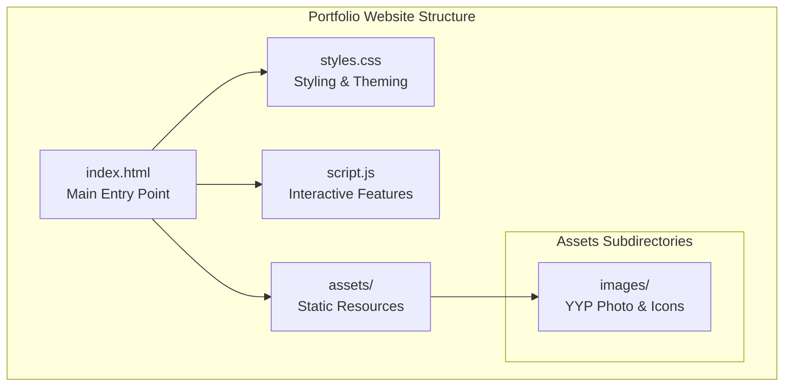
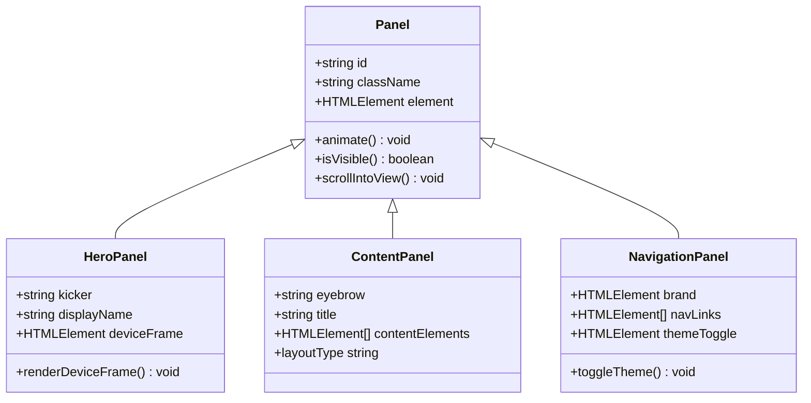
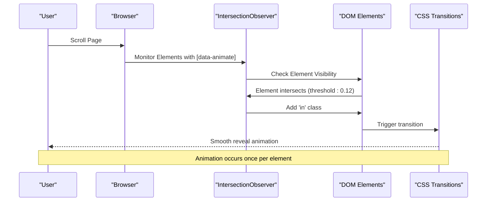
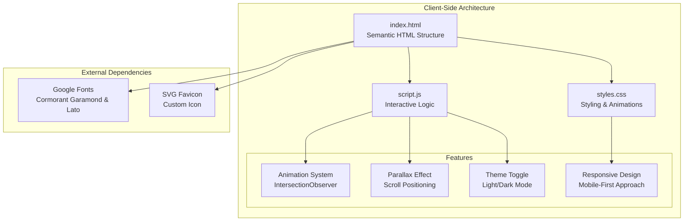
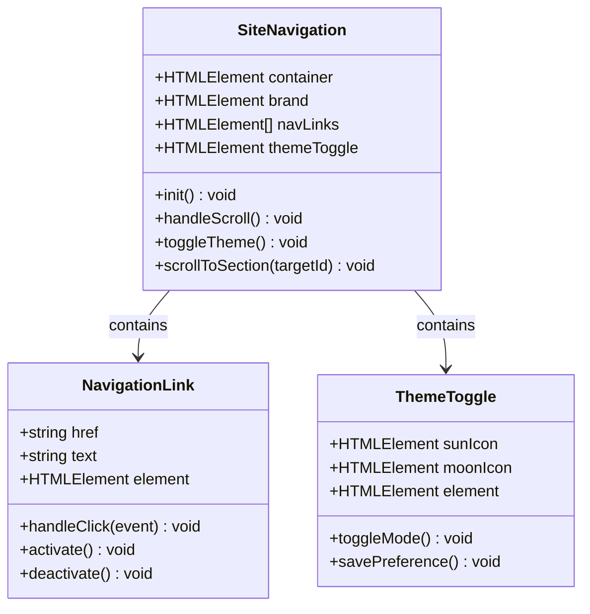
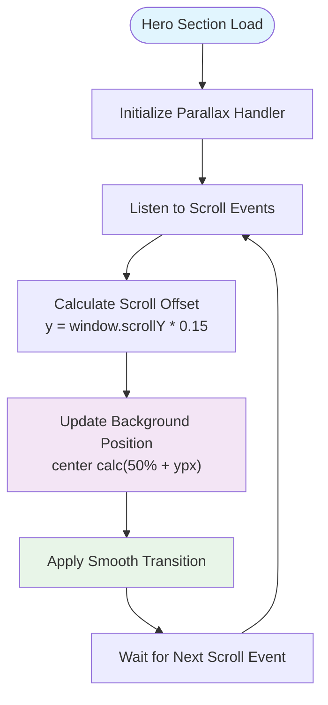
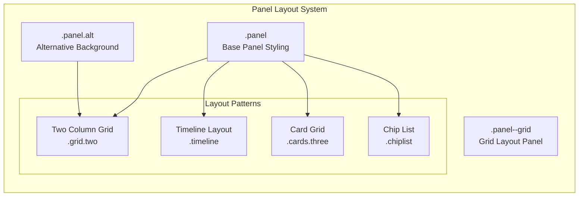
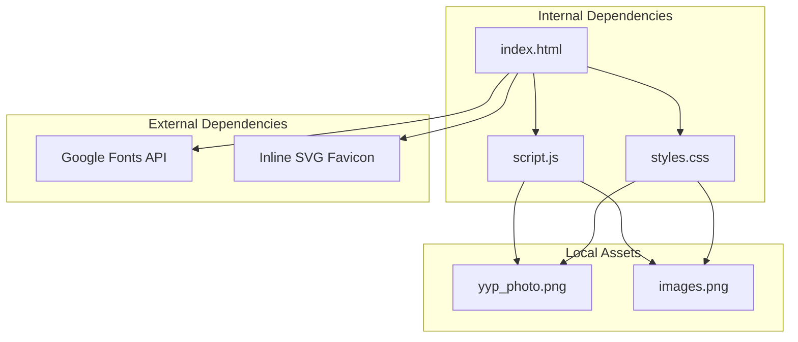

# Project Overview

<cite>
**Referenced Files in This Document**
- [index.html](file://index.html)
- [script.js](file://script.js)
- [styles.css](file://styles.css)
</cite>

## Table of Contents
1. [Introduction](#introduction)
2. [Project Structure](#project-structure)
3. [Core Components](#core-components)
4. [Architecture Overview](#architecture-overview)
5. [Detailed Component Analysis](#detailed-component-analysis)
6. [Dependency Analysis](#dependency-analysis)
7. [Performance Considerations](#performance-considerations)
8. [Troubleshooting Guide](#troubleshooting-guide)
9. [Conclusion](#conclusion)

## Introduction

Yeoh Yee Peng's personal portfolio website serves as a digital marketing professional's showcase, designed to present expertise in social media content creation, short-form video production, and trend adaptation. Built as a static single-page application using vanilla HTML5, CSS3, and JavaScript, this portfolio demonstrates modern web development practices while maintaining simplicity and performance.

The website's primary purpose is to establish a professional online presence for Yeoh Yee Peng, who identifies as a digital marketer with hands-on experience in platforms including CapCut, Canva, TikTok, and Instagram. The site functions as both a résumé and interactive showcase, presenting educational background, professional experience, skills, awards, and contact information in an aesthetically pleasing, responsive interface.

## Project Structure

The portfolio follows a minimalist yet sophisticated file structure optimized for static hosting and easy maintenance:

**Diagram sources**
- [index.html:1-271](file://index.html#L1-L271)
- [styles.css:1-157](file://styles.css#L1-L157)
- [script.js:1-27](file://script.js#L1-L27)

The architecture employs a mobile-first approach with responsive design principles, utilizing CSS Grid and Flexbox for layout management. The site consists of six distinct panels (sections) that create a cohesive storytelling experience from hero introduction to contact information.

**Section sources**
- [index.html:1-271](file://index.html#L1-L271)
- [styles.css:1-157](file://styles.css#L1-L157)

## Core Components

### Panel-Based Layout System

The website implements a panel-based architecture where each major content area is structured as a separate panel. Panels serve as distinct sections that can be individually animated and positioned within the viewport:

**Diagram sources**
- [index.html:37-260](file://index.html#L37-L260)
- [styles.css:51-128](file://styles.css#L51-L128)

Each panel utilizes the `data-animate` attribute to trigger reveal animations when scrolled into view, creating a progressive disclosure effect that enhances user engagement without overwhelming the interface.

### Animation Engine

The animation system employs IntersectionObserver for efficient scroll-triggered animations and CSS transitions for smooth state changes:

**Diagram sources**
- [script.js:4-10](file://script.js#L4-L10)
- [styles.css:132-135](file://styles.css#L132-L135)

**Section sources**
- [script.js:1-27](file://script.js#L1-L27)
- [styles.css:132-157](file://styles.css#L132-L157)

## Architecture Overview

The portfolio architecture follows modern web development principles with clear separation of concerns:

**Diagram sources**
- [index.html:4-16](file://index.html#L4-L16)
- [script.js:1-27](file://script.js#L1-L27)
- [styles.css:1-25](file://styles.css#L1-L25)

The architecture emphasizes performance through minimal external dependencies, efficient JavaScript execution, and optimized CSS rendering. The site achieves a balance between visual appeal and loading performance suitable for portfolio presentations.

## Detailed Component Analysis

### Navigation System

The navigation component implements a sticky header with smooth scrolling and theme switching capabilities:

**Diagram sources**
- [index.html:18-35](file://index.html#L18-L35)
- [script.js:20-27](file://script.js#L20-L27)

The navigation features persistent positioning at the top of the viewport, backdrop filtering for visual depth, and responsive spacing adjustments. The theme toggle persists user preferences using localStorage, ensuring consistent experience across page reloads.

### Hero Section Implementation

The hero section exemplifies modern web design principles with integrated parallax effects and device frame visualization:

**Diagram sources**
- [index.html:38-68](file://index.html#L38-L68)
- [script.js:12-18](file://script.js#L12-L18)
- [styles.css:51-78](file://styles.css#L51-L78)

The hero section incorporates a subtle parallax background effect where the background moves at 15% of the scroll speed, creating depth perception without performance overhead. The device frame visualization adds a modern touch by displaying a stylized phone screen containing the profile image.

### Content Panels Organization

Content panels utilize a consistent grid-based layout system with alternating background treatments:

**Diagram sources**
- [index.html:70-238](file://index.html#L70-L238)
- [styles.css:79-128](file://styles.css#L79-L128)

Each content panel maintains consistent spacing and typography scales, with specialized layouts for different content types including educational timelines, professional experiences, skill listings, and award displays.

**Section sources**
- [index.html:37-260](file://index.html#L37-L260)
- [script.js:1-27](file://script.js#L1-L27)
- [styles.css:1-157](file://styles.css#L1-L157)

## Dependency Analysis

The portfolio maintains minimal external dependencies to ensure reliability and performance:

**Diagram sources**
- [index.html:10-15](file://index.html#L10-L15)
- [index.html:51-66](file://index.html#L51-L66)

The dependency graph reveals a clean architecture with clear boundaries between internal logic and external resources. Google Fonts provides typography enhancement while maintaining offline fallback capabilities through system fonts. The inline SVG favicon eliminates additional HTTP requests while providing a scalable icon solution.

**Section sources**
- [index.html:10-16](file://index.html#L10-L16)
- [script.js:1-27](file://script.js#L1-L27)

## Performance Considerations

The portfolio implements several performance optimization strategies:

### Loading Performance
- Single HTML file with embedded CSS and JavaScript reduces HTTP requests
- Minimal external dependencies limit third-party loading overhead
- Efficient CSS selectors minimize reflow and repaint operations
- Optimized image assets with appropriate sizing for different contexts

### Runtime Performance
- IntersectionObserver for efficient scroll event handling
- Passive scroll listeners prevent layout thrashing
- CSS transforms for animations avoid expensive property recalculations
- LocalStorage persistence eliminates server round trips for theme preferences

### Mobile Performance
- Mobile-first CSS with progressive enhancement
- Responsive typography using clamp() for fluid scaling
- Touch-friendly navigation elements with adequate hit areas
- Optimized parallax effect with reduced computational overhead

## Troubleshooting Guide

### Common Issues and Solutions

**Animation Not Triggering**
- Verify elements have the `data-animate` attribute
- Check browser support for IntersectionObserver
- Ensure elements are visible in viewport during initial load
- Confirm CSS transition properties are not overridden

**Parallax Effect Not Working**
- Verify element has `data-parallax` attribute
- Check scroll event listener initialization
- Ensure background image is properly loaded
- Validate CSS background positioning properties

**Theme Toggle Not Persisting**
- Verify localStorage availability in browser
- Check for browser privacy settings blocking storage
- Ensure theme classes are properly applied to root element
- Validate CSS specificity for theme overrides

**Responsive Layout Issues**
- Check viewport meta tag configuration
- Verify CSS media queries and clamp() functions
- Ensure container max-width properties are respected
- Test on various device sizes and orientations

**Accessibility Concerns**
- Verify proper ARIA attributes for interactive elements
- Check color contrast ratios meet WCAG guidelines
- Ensure keyboard navigation support
- Validate semantic HTML structure

**Section sources**
- [script.js:4-27](file://script.js#L4-L27)
- [styles.css:132-157](file://styles.css#L132-L157)
- [index.html:18-35](file://index.html#L18-L35)

## Conclusion

Yeoh Yee Peng's personal portfolio website represents a masterful blend of modern web development practices and professional presentation. The static single-page application architecture provides optimal performance while delivering an engaging user experience through thoughtful animations, responsive design, and accessible navigation.

The implementation demonstrates proficiency in vanilla JavaScript for interactive features, CSS Grid and Flexbox for layout management, and strategic use of modern web APIs like IntersectionObserver. The portfolio successfully showcases digital marketing expertise while maintaining technical excellence in code organization and performance optimization.

The mobile-first approach ensures accessibility across devices, while the light/dark theme toggle provides user preference flexibility. The panel-based architecture creates a coherent narrative flow that guides visitors through educational background, professional experience, skills, and contact information in an aesthetically pleasing manner.

This portfolio serves as an exemplary model for personal websites, demonstrating how contemporary web technologies can be employed to create compelling digital presentations without unnecessary complexity or performance overhead.