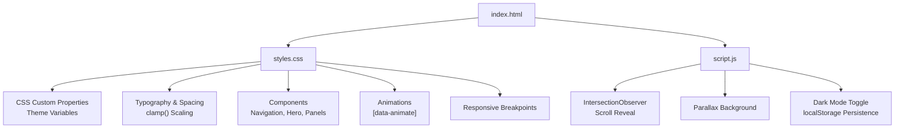
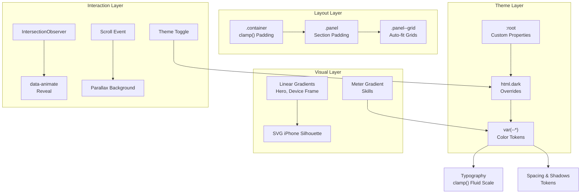
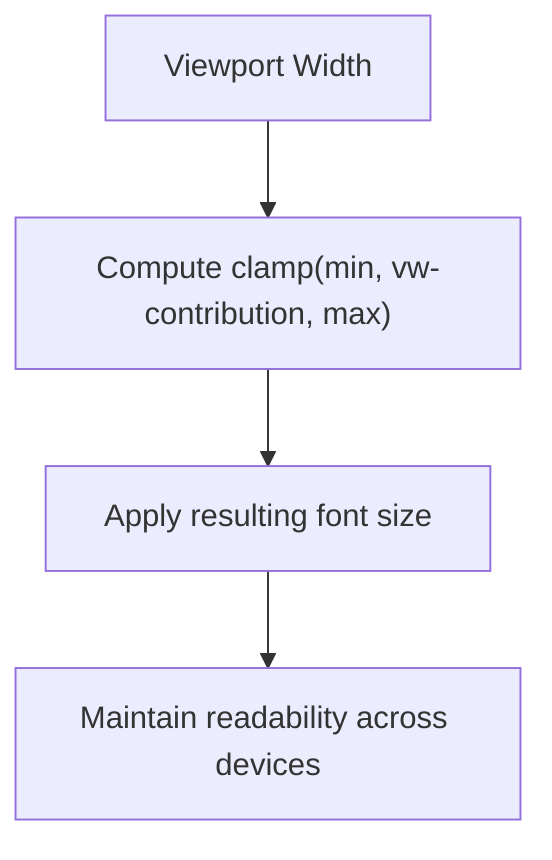
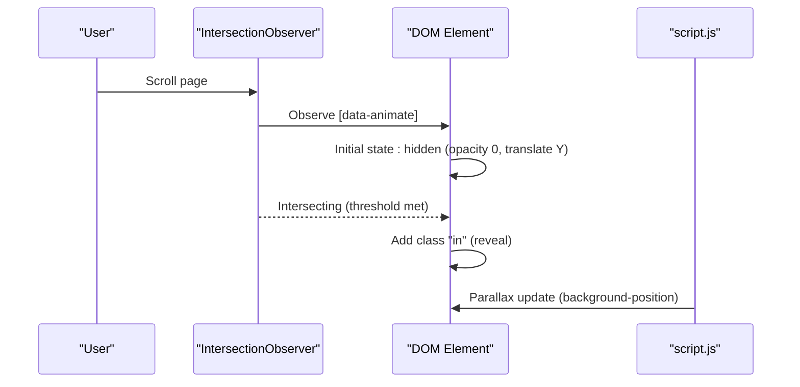
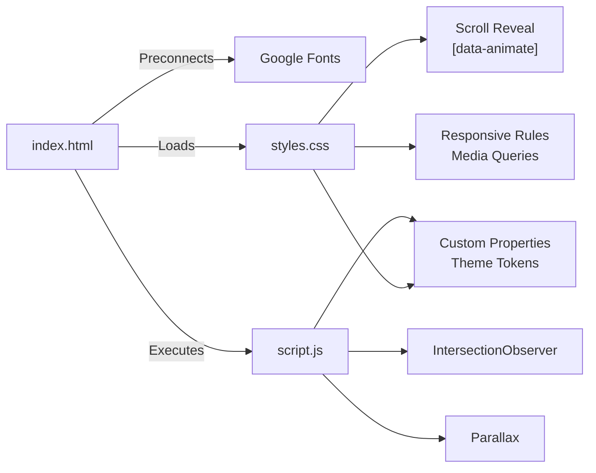

# Styling Architecture

<cite>
**Referenced Files in This Document**
- [styles.css](file://styles.css)
- [index.html](file://index.html)
- [script.js](file://script.js)
</cite>

## Table of Contents
1. [Introduction](#introduction)
2. [Project Structure](#project-structure)
3. [Core Components](#core-components)
4. [Architecture Overview](#architecture-overview)
5. [Detailed Component Analysis](#detailed-component-analysis)
6. [Dependency Analysis](#dependency-analysis)
7. [Performance Considerations](#performance-considerations)
8. [Troubleshooting Guide](#troubleshooting-guide)
9. [Conclusion](#conclusion)
10. [Appendices](#appendices)

## Introduction
This document explains the styling architecture of Yeoh Yee Peng’s portfolio website with a focus on the CSS custom properties system for theme management, advanced gradient backgrounds and visual effects, responsive typography scaling using clamp(), scroll-triggered animations, mobile-first responsive design, and modular CSS organization. It also provides practical customization guidance for colors, fonts, animations, and layouts while preserving existing responsive behavior and theme functionality.

## Project Structure
The styling system is implemented in a single stylesheet and a minimal JavaScript runtime that powers scroll-triggered animations and theme persistence. The HTML integrates Google Fonts via preconnect and loads the stylesheet and script.

**Diagram sources**
- [index.html:10-16](file://index.html#L10-L16)
- [styles.css:1-357](file://styles.css#L1-L357)
- [script.js:1-27](file://script.js#L1-L27)

**Section sources**
- [index.html:10-16](file://index.html#L10-L16)
- [styles.css:1-357](file://styles.css#L1-L357)
- [script.js:1-27](file://script.js#L1-L27)

## Core Components
- CSS custom properties system for theme management
- Advanced gradient backgrounds and SVG-based device frame
- Responsive typography using clamp() for fluid scaling
- Scroll-triggered reveal animations via IntersectionObserver
- Mobile-first responsive design with targeted media queries
- Modular section-based styling with container and panel patterns

**Section sources**
- [styles.css:3-14](file://styles.css#L3-L14)
- [styles.css:95-160](file://styles.css#L95-L160)
- [styles.css:112](file://styles.css#L112)
- [styles.css:320-323](file://styles.css#L320-L323)
- [styles.css:348-356](file://styles.css#L348-L356)
- [styles.css:162-184](file://styles.css#L162-L184)

## Architecture Overview
The styling architecture centers on a CSS custom properties foundation that enables dynamic theming. The JavaScript runtime adds scroll-driven interactions and persists user preferences. The design follows a modular, section-based approach with consistent spacing and typography scales.

**Diagram sources**
- [styles.css:3-14](file://styles.css#L3-L14)
- [styles.css:324-346](file://styles.css#L324-L346)
- [styles.css:95-160](file://styles.css#L95-L160)
- [styles.css:28](file://styles.css#L28)
- [styles.css:163-165](file://styles.css#L163-L165)
- [styles.css:320-323](file://styles.css#L320-L323)
- [script.js:4-18](file://script.js#L4-L18)
- [script.js:20-27](file://script.js#L20-L27)

## Detailed Component Analysis

### CSS Custom Properties System and Dark/Light Theming
- Purpose: Centralized color tokens enable consistent theming across components and allow seamless light/dark mode transitions.
- Implementation:
  - Root-level variables define base palette and semantic roles (background, text, muted, card, borders, shadows, accents).
  - The dark mode selector overrides all variables to provide a cohesive dark aesthetic.
  - Specific component selectors adjust colors for visual fidelity (e.g., navigation, hero, SVG elements, skill meter).
- Practical examples:
  - Switch themes by toggling the html.dark class on the root element.
  - Persist user preference using localStorage and apply the class on page load.

**Diagram sources**
- [script.js:20-27](file://script.js#L20-L27)

**Section sources**
- [styles.css:3-14](file://styles.css#L3-L14)
- [styles.css:324-346](file://styles.css#L324-L346)
- [script.js:20-27](file://script.js#L20-L27)

### Advanced Gradient Backgrounds and Visual Effects
- Hero background uses a vertical linear gradient for depth.
- Skill meter uses a horizontal linear gradient blending accent colors.
- SVG iPhone silhouette uses gradients and fills to simulate a screen and frame.
- Additional visual enhancements include backdrop-filter for the navigation bar and drop-shadow for the device frame.

Practical examples:
- Modify the hero gradient by updating the linear gradient definition in the hero selector.
- Adjust the skill meter gradient by changing the gradient colors in the meter span selector.
- Customize the iPhone frame colors by editing the SVG fill/stroke values.

**Section sources**
- [styles.css:95-160](file://styles.css#L95-L160)
- [styles.css:273-283](file://styles.css#L273-L283)

### Responsive Typography Scaling with clamp()
- Purpose: Provide smooth, readable typography across viewport sizes without brittle breakpoints.
- Implementation:
  - Container padding uses clamp() to scale between fixed min/max values with viewport-relative growth.
  - Headings and subheadings use clamp() to set fluid font sizes with lower and upper bounds.
  - Navigation links and eyebrow text scale proportionally with viewport width.
- Practical examples:
  - Adjust the hero kicker, display, and subtitle font sizes by tuning the clamp() arguments.
  - Change the container padding range by editing the clamp() values in the container selector.

**Diagram sources**
- [styles.css:28](file://styles.css#L28)
- [styles.css:112](file://styles.css#L112)
- [styles.css:119](file://styles.css#L119)
- [styles.css:176](file://styles.css#L176)
- [styles.css:55](file://styles.css#L55)

**Section sources**
- [styles.css:28](file://styles.css#L28)
- [styles.css:112](file://styles.css#L112)
- [styles.css:119](file://styles.css#L119)
- [styles.css:176](file://styles.css#L176)
- [styles.css:55](file://styles.css#L55)

### Animation Framework for Scroll-Triggered Effects
- Purpose: Animate section elements into view as the user scrolls.
- Implementation:
  - Elements with the data-animate attribute are initially hidden and translated down.
  - IntersectionObserver observes these elements with a low threshold; when intersecting, the in class is added to reveal them.
  - A parallax effect is applied to the hero section by adjusting background position on scroll.
- Practical examples:
  - Trigger animations by adding data-animate to any element.
  - Fine-tune reveal timing by adjusting the IntersectionObserver threshold.
  - Control parallax intensity by modifying the scroll multiplier.

**Diagram sources**
- [script.js:4-18](file://script.js#L4-L18)
- [styles.css:320-323](file://styles.css#L320-L323)

**Section sources**
- [script.js:4-18](file://script.js#L4-L18)
- [styles.css:320-323](file://styles.css#L320-L323)
- [script.js:12-18](file://script.js#L12-L18)

### Mobile-First Responsive Design Principles
- Approach: Establish baseline styles for small screens, then progressively enhance for larger viewports.
- Key patterns:
  - Grids stack vertically on small screens; two-column layout activates at wider widths.
  - Typography and spacing scale using clamp() to remain usable across devices.
  - Navigation items and spacing compress for compact screens.
- Practical examples:
  - Override grid behavior by adjusting media query conditions.
  - Tighten or relax spacing by modifying clamp() parameters in relevant selectors.

**Section sources**
- [styles.css:348-356](file://styles.css#L348-L356)
- [styles.css:165](file://styles.css#L165)
- [styles.css:55](file://styles.css#L55)

### Modular CSS Organization and Section-Based Styling
- Organization:
  - Base resets and root variables at the top.
  - Typography and global styles grouped by section.
  - Component-specific styles under logical headings (Nav, Hero, Sections, Skills, Contact, Footer).
  - Animations and responsive rules consolidated at the bottom.
- Patterns:
  - Container-based content width and padding.
  - Panel-based sections with alternating backgrounds.
  - Card-based content blocks with hover effects.
  - Auto-fit grids for responsive cards and contact items.
- Practical examples:
  - Add a new section by creating a new panel with container and content inside.
  - Extend the grid system by adding new grid classes or adjusting existing ones.

**Section sources**
- [styles.css:1-357](file://styles.css#L1-L357)
- [styles.css:28](file://styles.css#L28)
- [styles.css:163-165](file://styles.css#L163-L165)
- [styles.css:185-207](file://styles.css#L185-L207)
- [styles.css:286-287](file://styles.css#L286-L287)
- [styles.css:289-309](file://styles.css#L289-L309)

### Color Schemes, Typography Hierarchy, and Spacing Systems
- Color scheme:
  - Light palette: neutral backgrounds, muted text, warm accent tones, subtle borders and soft shadows.
  - Dark palette: deep backgrounds, light text, enhanced contrast accents, stronger borders and shadows.
  - Accent gradients for interactive elements and progress indicators.
- Typography hierarchy:
  - Headings use a serif font family with consistent letter-spacing and strong headings.
  - Body copy uses a sans-serif font family for readability.
  - Eyebrows and captions use uppercase and tight letter-spacing for emphasis.
- Spacing system:
  - Consistent padding and margins across panels and cards.
  - Container padding scales with clamp() for comfortable reading margins.
  - Grid gaps and component paddings use fixed units for predictable rhythm.

**Section sources**
- [styles.css:3-14](file://styles.css#L3-L14)
- [styles.css:31-36](file://styles.css#L31-L36)
- [styles.css:20](file://styles.css#L20)
- [styles.css:166-179](file://styles.css#L166-L179)
- [styles.css:28](file://styles.css#L28)
- [styles.css:165](file://styles.css#L165)

### Component Styling Patterns
- Navigation:
  - Sticky header with backdrop-filter blur.
  - Hover states for links and CTA buttons using color and background transitions.
  - Theme-aware toggle icons.
- Hero:
  - Full-bleed hero with gradient background and centered content.
  - Device frame overlay using SVG with gradients and drop-shadow.
- Panels and Cards:
  - Alternating background for visual rhythm.
  - Card hover effects with elevation and subtle translation.
- Buttons and Badges:
  - Minimal border and transition for interactive elements.
  - Badge chips with hover highlighting using accent colors.
- Timeline and Lists:
  - Two-column layout for year and content.
  - Dot lists for bullet points with muted color.

**Section sources**
- [styles.css:39-92](file://styles.css#L39-L92)
- [styles.css:95-160](file://styles.css#L95-L160)
- [styles.css:162-184](file://styles.css#L162-L184)
- [styles.css:185-207](file://styles.css#L185-L207)
- [styles.css:208-237](file://styles.css#L208-L237)
- [styles.css:250-284](file://styles.css#L250-L284)

## Dependency Analysis
The styling architecture depends on:
- HTML for loading Google Fonts via preconnect and for applying data-animate attributes.
- CSS for defining theme tokens, component styles, animations, and responsive rules.
- JavaScript for scroll-triggered animations, parallax, and theme persistence.

**Diagram sources**
- [index.html:10-16](file://index.html#L10-L16)
- [styles.css:320-323](file://styles.css#L320-L323)
- [styles.css:348-356](file://styles.css#L348-L356)
- [script.js:4-18](file://script.js#L4-L18)
- [script.js:12-18](file://script.js#L12-L18)

**Section sources**
- [index.html:10-16](file://index.html#L10-L16)
- [styles.css:320-323](file://styles.css#L320-L323)
- [styles.css:348-356](file://styles.css#L348-L356)
- [script.js:4-18](file://script.js#L4-L18)
- [script.js:12-18](file://script.js#L12-L18)

## Performance Considerations
- CSS optimization:
  - Consolidate repeated color values into custom properties for maintainability and fewer repaints.
  - Prefer transform and opacity for animations to leverage GPU acceleration.
  - Minimize heavy filters (e.g., backdrop-filter) on older devices; consider fallbacks if needed.
- Preconnect strategy:
  - Google Fonts preconnect reduces DNS and TLS overhead for font loading.
- Browser compatibility:
  - clamp() is widely supported; ensure fallbacks for older browsers if necessary.
  - IntersectionObserver and passive event listeners are modern APIs; provide polyfills if targeting legacy environments.

[No sources needed since this section provides general guidance]

## Troubleshooting Guide
- Theme toggle not persisting:
  - Verify localStorage keys and that the html.dark class is toggled on click.
- Animations not triggering:
  - Confirm elements have the data-animate attribute and IntersectionObserver is observing them.
- Parallax not moving:
  - Ensure the hero element has the data-parallax attribute and the scroll listener is attached.
- Typography not scaling:
  - Check clamp() usage and viewport width; confirm media queries are not overriding desired values.

**Section sources**
- [script.js:20-27](file://script.js#L20-L27)
- [script.js:4-18](file://script.js#L4-L18)
- [script.js:12-18](file://script.js#L12-L18)

## Conclusion
The styling architecture employs a robust CSS custom properties system, fluid typography with clamp(), scroll-triggered animations, and a mobile-first responsive design. The modular organization and theme tokens enable easy customization while maintaining visual coherence. By following the patterns and guidance here, developers can extend the design system without breaking existing behavior.

[No sources needed since this section summarizes without analyzing specific files]

## Appendices

### Practical Customization Playbook
- Colors:
  - Update root-level variables to change the entire palette.
  - Override component-specific variables for targeted adjustments.
- Fonts:
  - Replace font families in typography selectors; ensure Google Fonts are loaded.
  - Adjust letter-spacing and line-height for readability.
- Animations:
  - Add data-animate to new elements to enable scroll-reveal.
  - Tune the IntersectionObserver threshold for earlier/later reveals.
- Layout:
  - Use the container and panel classes for consistent spacing.
  - Extend grid classes or create new ones for additional layouts.

**Section sources**
- [styles.css:3-14](file://styles.css#L3-L14)
- [styles.css:31-36](file://styles.css#L31-L36)
- [styles.css:28](file://styles.css#L28)
- [styles.css:320-323](file://styles.css#L320-L323)
- [styles.css:163-165](file://styles.css#L163-L165)