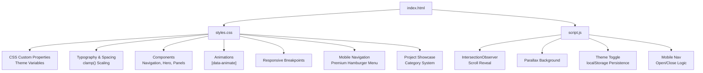
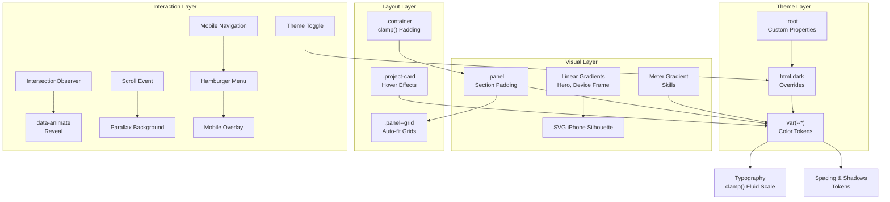
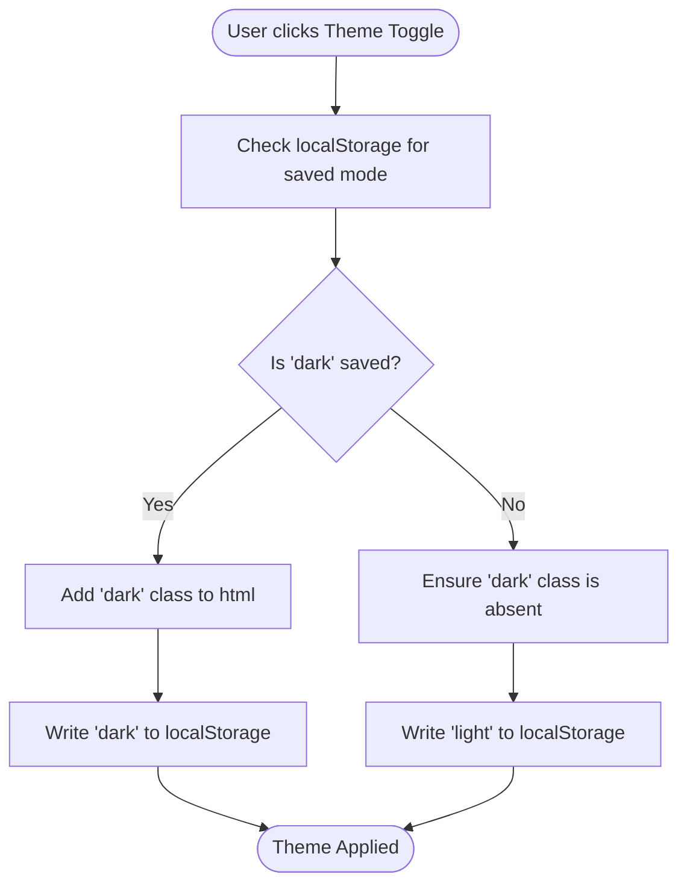
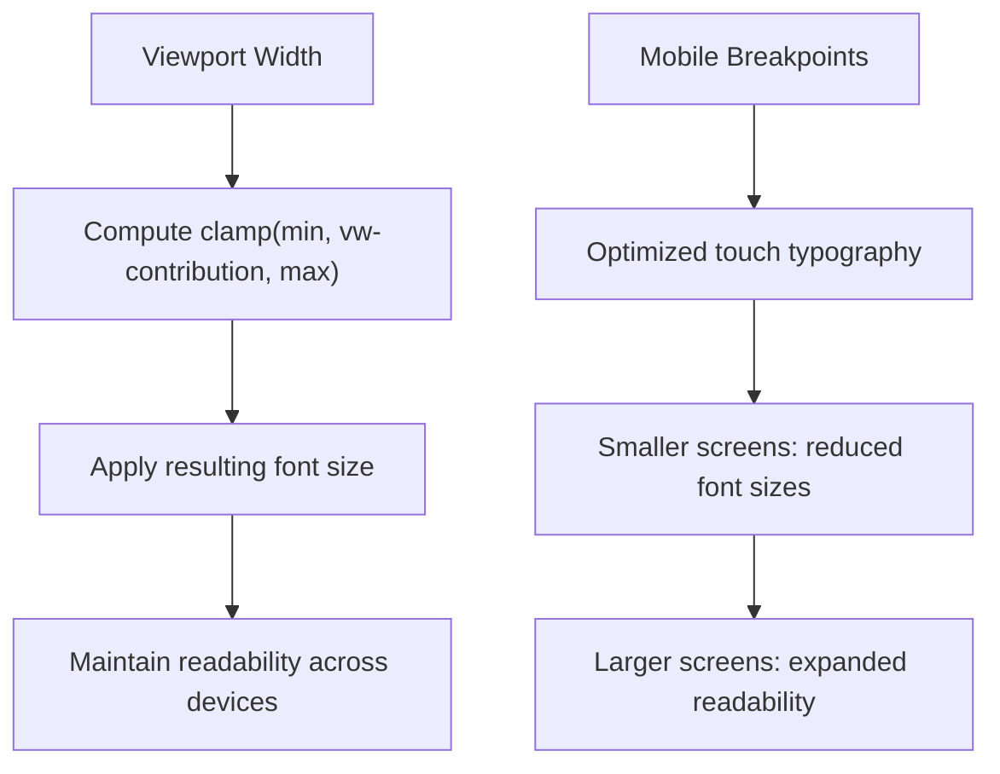
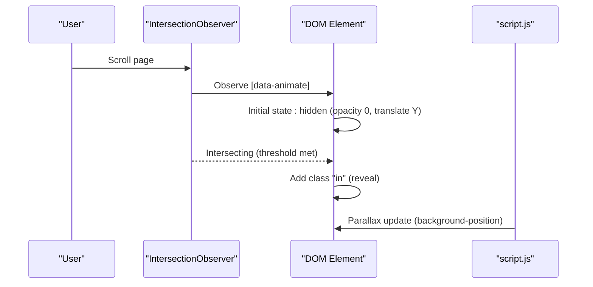
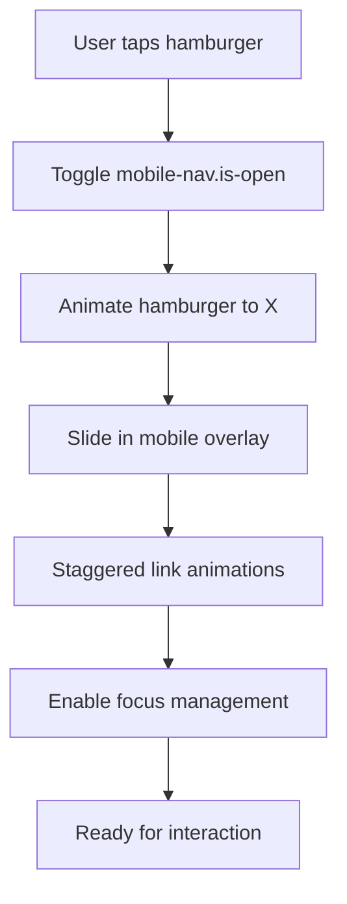
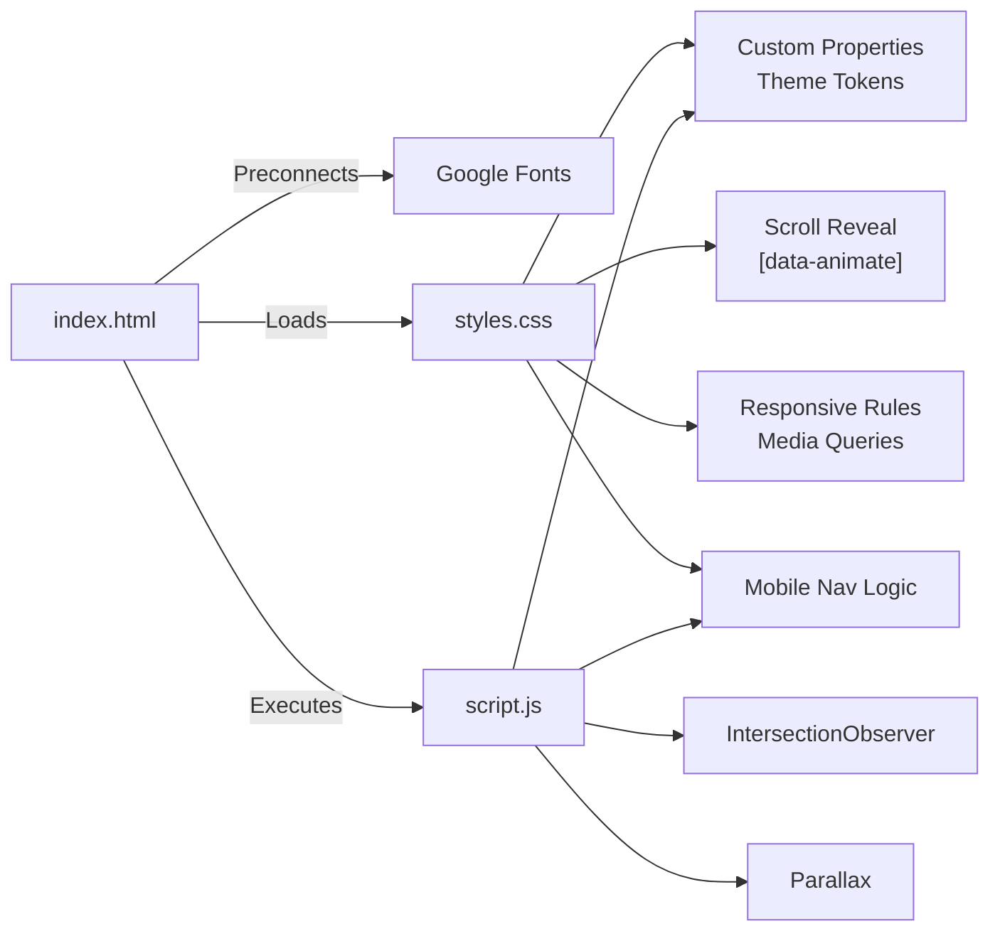

# Styling Architecture

<cite>
**Referenced Files in This Document**
- [styles.css](file://styles.css)
- [index.html](file://index.html)
- [script.js](file://script.js)
</cite>

## Update Summary
**Changes Made**
- Added comprehensive mobile-first responsive design system with premium hamburger menu
- Enhanced project showcase section with category-based organization and platform badges
- Implemented sophisticated mobile navigation overlay with smooth animations
- Expanded typography system with improved clamp() scaling for all breakpoints
- Added platform-specific badge styling for Instagram, Xiaohongshu, and TikTok
- Enhanced dark mode support across all components including mobile navigation
- Improved accessibility features with focus management and keyboard navigation

## Table of Contents
1. [Introduction](#introduction)
2. [Project Structure](#project-structure)
3. [Core Components](#core-components)
4. [Architecture Overview](#architecture-overview)
5. [Detailed Component Analysis](#detailed-component-analysis)
6. [Dependency Analysis](#dependency-analysis)
7. [Performance Considerations](#performance-considerations)
8. [Troubleshooting Guide](#troubleshooting-guide)
9. [Conclusion](#conclusion)
10. [Appendices](#appendices)

## Introduction
This document explains the styling architecture of Yeoh Yee Peng's portfolio website with a focus on the CSS custom properties system for theme management, advanced gradient backgrounds and visual effects, responsive typography scaling using clamp(), scroll-triggered animations, mobile-first responsive design, and modular CSS organization. The system now includes sophisticated mobile navigation, project showcase categories, and platform-specific styling components.

## Project Structure
The styling system is implemented in a single comprehensive stylesheet and a minimal JavaScript runtime that powers scroll-triggered animations, theme persistence, and premium mobile navigation. The HTML integrates Google Fonts via preconnect and loads the stylesheet and script.

**Diagram sources**
- [index.html:10-16](file://index.html#L10-L16)
- [styles.css:1-1440](file://styles.css#L1-L1440)
- [script.js:1-176](file://script.js#L1-L176)

**Section sources**
- [index.html:10-16](file://index.html#L10-L16)
- [styles.css:1-1440](file://styles.css#L1-L1440)
- [script.js:1-176](file://script.js#L1-L176)

## Core Components
- CSS custom properties system for theme management
- Advanced gradient backgrounds and SVG-based device frame
- Responsive typography using clamp() for fluid scaling across all breakpoints
- Scroll-triggered reveal animations via IntersectionObserver
- Premium mobile navigation with hamburger menu and overlay
- Project showcase with category-based organization and platform badges
- Mobile-first responsive design with sophisticated breakpoint handling
- Modular section-based styling with container and panel patterns

**Section sources**
- [styles.css:3-14](file://styles.css#L3-L14)
- [styles.css:95-160](file://styles.css#L95-L160)
- [styles.css:112](file://styles.css#L112)
- [styles.css:320-323](file://styles.css#L320-L323)
- [styles.css:348-356](file://styles.css#L348-L356)
- [styles.css:162-184](file://styles.css#L162-L184)
- [styles.css:666-755](file://styles.css#L666-L755)
- [styles.css:225-241](file://styles.css#L225-L241)

## Architecture Overview
The styling architecture centers on a CSS custom properties foundation that enables dynamic theming across all components. The JavaScript runtime adds scroll-driven interactions, premium mobile navigation, and persists user preferences. The design follows a modular, section-based approach with consistent spacing, typography scales, and sophisticated responsive behavior.

**Diagram sources**
- [styles.css:3-14](file://styles.css#L3-L14)
- [styles.css:324-346](file://styles.css#L324-L346)
- [styles.css:95-160](file://styles.css#L95-L160)
- [styles.css:28](file://styles.css#L28)
- [styles.css:163-165](file://styles.css#L163-L165)
- [styles.css:320-323](file://styles.css#L320-L323)
- [styles.css:524-570](file://styles.css#L524-L570)
- [script.js:4-18](file://script.js#L4-L18)
- [script.js:20-27](file://script.js#L20-L27)
- [script.js:29-176](file://script.js#L29-L176)

## Detailed Component Analysis

### CSS Custom Properties System and Dark/Light Theming
- Purpose: Centralized color tokens enable consistent theming across components and allow seamless light/dark mode transitions.
- Implementation:
  - Root-level variables define base palette and semantic roles (background, text, muted, card, borders, shadows, accents).
  - The dark mode selector overrides all variables to provide a cohesive dark aesthetic.
  - Specific component selectors adjust colors for visual fidelity (e.g., navigation, hero, SVG elements, skill meter, mobile navigation).
- Practical examples:
  - Switch themes by toggling the html.dark class on the root element.
  - Persist user preference using localStorage and apply the class on page load.

**Diagram sources**
- [script.js:20-27](file://script.js#L20-L27)

**Section sources**
- [styles.css:3-14](file://styles.css#L3-L14)
- [styles.css:331-352](file://styles.css#L331-L352)
- [script.js:20-27](file://script.js#L20-L27)

### Advanced Gradient Backgrounds and Visual Effects
- Hero background uses a vertical linear gradient for depth.
- Skill meter uses a horizontal linear gradient blending accent colors.
- SVG iPhone silhouette uses gradients and fills to simulate a screen and frame.
- Platform badges use gradient backgrounds with platform-specific colors.
- Project cards feature animated accent borders on hover.
- Additional visual enhancements include backdrop-filter for navigation and mobile overlays, drop-shadow for device frames, and sophisticated hover effects.

Practical examples:
- Modify the hero gradient by updating the linear gradient definition in the hero selector.
- Adjust the skill meter gradient by changing the gradient colors in the meter span selector.
- Customize the iPhone frame colors by editing the SVG fill/stroke values.
- Create new platform badges by extending the platform-badge classes.

**Section sources**
- [styles.css:95-160](file://styles.css#L95-L160)
- [styles.css:273-283](file://styles.css#L273-L283)
- [styles.css:524-570](file://styles.css#L524-L570)
- [styles.css:475-495](file://styles.css#L475-L495)

### Responsive Typography Scaling with clamp()
- Purpose: Provide smooth, readable typography across viewport sizes without brittle breakpoints.
- Implementation:
  - Container padding uses clamp() to scale between fixed min/max values with viewport-relative growth.
  - Headings and subheadings use clamp() to set fluid font sizes with lower and upper bounds.
  - Navigation links and eyebrow text scale proportionally with viewport width.
  - Project titles and descriptions use clamp() for optimal readability across devices.
  - Mobile-specific typography scales are optimized for touch interaction.
- Practical examples:
  - Adjust the hero kicker, display, and subtitle font sizes by tuning the clamp() arguments.
  - Change the container padding range by editing the clamp() values in the container selector.
  - Modify project card typography by adjusting the clamp() values in project-title and project-description selectors.

**Diagram sources**
- [styles.css:28](file://styles.css#L28)
- [styles.css:112](file://styles.css#L112)
- [styles.css:119](file://styles.css#L119)
- [styles.css:176](file://styles.css#L176)
- [styles.css:506-521](file://styles.css#L506-L521)
- [styles.css:1060-1064](file://styles.css#L1060-L1064)

**Section sources**
- [styles.css:28](file://styles.css#L28)
- [styles.css:112](file://styles.css#L112)
- [styles.css:119](file://styles.css#L119)
- [styles.css:176](file://styles.css#L176)
- [styles.css:506-521](file://styles.css#L506-L521)
- [styles.css:1060-1064](file://styles.css#L1060-L1064)

### Animation Framework for Scroll-Triggered Effects
- Purpose: Animate section elements into view as the user scrolls.
- Implementation:
  - Elements with the data-animate attribute are initially hidden and translated down.
  - IntersectionObserver observes these elements with a low threshold; when intersecting, the in class is added to reveal them.
  - A parallax effect is applied to the hero section by adjusting background position on scroll.
- Practical examples:
  - Trigger animations by adding data-animate to any element.
  - Fine-tune reveal timing by adjusting the IntersectionObserver threshold.
  - Control parallax intensity by modifying the scroll multiplier.

**Diagram sources**
- [script.js:4-18](file://script.js#L4-L18)
- [styles.css:320-323](file://styles.css#L320-L323)

**Section sources**
- [script.js:4-18](file://script.js#L4-L18)
- [styles.css:320-323](file://styles.css#L320-L323)
- [script.js:12-18](file://script.js#L12-L18)

### Premium Mobile Navigation System
- Purpose: Provide elegant, accessible navigation for mobile devices with smooth animations.
- Implementation:
  - Hamburger menu with animated transformation from hamburger to X shape.
  - Full-screen mobile navigation overlay with backdrop blur effect.
  - Staggered animation for navigation links with delay-based entrance.
  - Focus management and keyboard navigation support.
  - Touch swipe gestures for closing the navigation.
  - Active link highlighting based on scroll position.
- Practical examples:
  - Customize hamburger animation by modifying the transform properties in active state.
  - Adjust mobile navigation timing by changing transition durations.
  - Add new navigation items by extending the mobile-nav__link classes.

**Diagram sources**
- [styles.css:666-755](file://styles.css#L666-L755)
- [styles.css:756-991](file://styles.css#L756-L991)
- [script.js:29-176](file://script.js#L29-L176)

**Section sources**
- [styles.css:666-755](file://styles.css#L666-L755)
- [styles.css:756-991](file://styles.css#L756-L991)
- [script.js:29-176](file://script.js#L29-L176)

### Project Showcase with Category System
- Purpose: Organize and present projects in a structured, visually appealing manner.
- Implementation:
  - Category-based organization with decorative category lines.
  - Multiple grid layouts (2-column, 3-column, full-width) for different project types.
  - Platform-specific badges with unique colors and styling.
  - Sublabels for academic vs. professional projects.
  - Hover effects with animated accent borders.
- Practical examples:
  - Add new project categories by creating new .project-category sections.
  - Create platform-specific badges using the platform-badge--{platform} classes.
  - Modify grid layouts by adjusting the projects-grid--{layout} classes.

**Section sources**
- [styles.css:379-457](file://styles.css#L379-L457)
- [styles.css:421-495](file://styles.css#L421-L495)
- [styles.css:524-601](file://styles.css#L524-L601)
- [styles.css:440-457](file://styles.css#L440-L457)

### Mobile-First Responsive Design Principles
- Approach: Establish baseline styles for small screens, then progressively enhance for larger viewports.
- Key patterns:
  - Sophisticated breakpoint system with 768px, 480px, and 375px thresholds.
  - Grids stack vertically on small screens; responsive layouts activate at wider widths.
  - Typography and spacing scale using clamp() to remain usable across devices.
  - Touch-friendly enhancements with larger tap targets for coarse pointers.
  - Comprehensive mobile navigation system replacing desktop navigation on small screens.
- Practical examples:
  - Override grid behavior by adjusting media query conditions.
  - Tighten or relax spacing by modifying clamp() parameters in relevant selectors.
  - Customize mobile navigation by adjusting the hamburger and overlay styles.

**Section sources**
- [styles.css:354-377](file://styles.css#L354-L377)
- [styles.css:993-1046](file://styles.css#L993-L1046)
- [styles.css:1048-1394](file://styles.css#L1048-L1394)
- [styles.css:1401-1419](file://styles.css#L1401-L1419)

### Modular CSS Organization and Section-Based Styling
- Organization:
  - Base resets and root variables at the top.
  - Typography and global styles grouped by section.
  - Component-specific styles under logical headings (Nav, Hero, Sections, Skills, Contact, Footer).
  - Premium mobile navigation system with separate hamburger and overlay components.
  - Project showcase with category-based organization.
  - Animations and responsive rules consolidated at the bottom.
- Patterns:
  - Container-based content width and padding.
  - Panel-based sections with alternating backgrounds.
  - Card-based content blocks with hover effects.
  - Auto-fit grids for responsive cards and contact items.
  - Platform-specific styling for social media integration.
- Practical examples:
  - Add a new section by creating a new panel with container and content inside.
  - Extend the grid system by adding new grid classes or adjusting existing ones.
  - Create new platform badges by extending the existing platform-badge classes.

**Section sources**
- [styles.css:1-1440](file://styles.css#L1-L1440)
- [styles.css:28](file://styles.css#L28)
- [styles.css:163-165](file://styles.css#L163-L165)
- [styles.css:185-207](file://styles.css#L185-L207)
- [styles.css:286-287](file://styles.css#L286-L287)
- [styles.css:289-309](file://styles.css#L289-L309)
- [styles.css:666-755](file://styles.css#L666-L755)
- [styles.css:421-495](file://styles.css#L421-L495)

### Color Schemes, Typography Hierarchy, and Spacing Systems
- Color scheme:
  - Light palette: neutral backgrounds, muted text, warm accent tones, subtle borders and soft shadows.
  - Dark palette: deep backgrounds, light text, enhanced contrast accents, stronger borders and shadows.
  - Accent gradients for interactive elements and progress indicators.
  - Platform-specific colors for Instagram (#c13584), Xiaohongshu (#ff2442), and TikTok (#00f2ea).
- Typography hierarchy:
  - Headings use a serif font family (Cormorant Garamond) with consistent letter-spacing and strong headings.
  - Body copy uses a sans-serif font family (Lato) for readability.
  - Eyebrows and captions use uppercase and tight letter-spacing for emphasis.
  - Project titles and descriptions use optimized font sizes for different screen sizes.
- Spacing system:
  - Consistent padding and margins across panels and cards.
  - Container padding scales with clamp() for comfortable reading margins.
  - Grid gaps and component paddings use fixed units for predictable rhythm.
  - Mobile-specific spacing optimizations for touch interaction.

**Section sources**
- [styles.css:3-14](file://styles.css#L3-L14)
- [styles.css:31-36](file://styles.css#L31-L36)
- [styles.css:20](file://styles.css#L20)
- [styles.css:166-179](file://styles.css#L166-L179)
- [styles.css:28](file://styles.css#L28)
- [styles.css:165](file://styles.css#L165)
- [styles.css:524-570](file://styles.css#L524-L570)

### Component Styling Patterns
- Navigation:
  - Sticky header with backdrop-filter blur.
  - Hover states for links and CTA buttons using color and background transitions.
  - Theme-aware toggle icons.
  - Premium mobile navigation with smooth animations and focus management.
- Hero:
  - Full-bleed hero with gradient background and centered content.
  - Device frame overlay using SVG with gradients and drop-shadow.
- Panels and Cards:
  - Alternating background for visual rhythm.
  - Card hover effects with elevation and subtle translation.
  - Project cards with animated accent borders and hover effects.
- Buttons and Badges:
  - Minimal border and transition for interactive elements.
  - Badge chips with hover highlighting using accent colors.
  - Platform-specific badges with unique styling and colors.
- Timeline and Lists:
  - Two-column layout for year and content.
  - Dot lists for bullet points with muted color.
- Mobile Navigation:
  - Hamburger menu with elegant transformation animation.
  - Full-screen overlay with backdrop blur effect.
  - Staggered link animations with delay-based entrance.
  - Focus management and keyboard navigation support.

**Section sources**
- [styles.css:39-92](file://styles.css#L39-L92)
- [styles.css:95-160](file://styles.css#L95-L160)
- [styles.css:162-184](file://styles.css#L162-L184)
- [styles.css:185-207](file://styles.css#L185-L207)
- [styles.css:208-237](file://styles.css#L208-L237)
- [styles.css:250-284](file://styles.css#L250-L284)
- [styles.css:666-755](file://styles.css#L666-L755)
- [styles.css:756-991](file://styles.css#L756-L991)
- [styles.css:421-495](file://styles.css#L421-L495)
- [styles.css:524-601](file://styles.css#L524-L601)

## Dependency Analysis
The styling architecture depends on:
- HTML for loading Google Fonts via preconnect and for applying data-animate attributes.
- CSS for defining theme tokens, component styles, animations, and responsive rules.
- JavaScript for scroll-triggered animations, parallax, theme persistence, and premium mobile navigation.

**Diagram sources**
- [index.html:10-16](file://index.html#L10-L16)
- [styles.css:320-323](file://styles.css#L320-L323)
- [styles.css:348-356](file://styles.css#L348-L356)
- [styles.css:666-755](file://styles.css#L666-L755)
- [script.js:4-18](file://script.js#L4-L18)
- [script.js:12-18](file://script.js#L12-L18)
- [script.js:29-176](file://script.js#L29-L176)

**Section sources**
- [index.html:10-16](file://index.html#L10-L16)
- [styles.css:320-323](file://styles.css#L320-L323)
- [styles.css:348-356](file://styles.css#L348-L356)
- [styles.css:666-755](file://styles.css#L666-L755)
- [script.js:4-18](file://script.js#L4-L18)
- [script.js:12-18](file://script.js#L12-L18)
- [script.js:29-176](file://script.js#L29-L176)

## Performance Considerations
- CSS optimization:
  - Consolidate repeated color values into custom properties for maintainability and fewer repaints.
  - Prefer transform and opacity for animations to leverage GPU acceleration.
  - Minimize heavy filters (e.g., backdrop-filter) on older devices; consider fallbacks if needed.
  - Use hardware-accelerated transforms for mobile navigation animations.
- Preconnect strategy:
  - Google Fonts preconnect reduces DNS and TLS overhead for font loading.
- Browser compatibility:
  - clamp() is widely supported; ensure fallbacks for older browsers if necessary.
  - IntersectionObserver and passive event listeners are modern APIs; provide polyfills if targeting legacy environments.
  - Mobile navigation relies on modern CSS features; test fallbacks for older mobile browsers.
- Mobile optimization:
  - Touch-friendly tap targets improve usability on mobile devices.
  - Hardware-accelerated animations ensure smooth performance on mobile.

## Troubleshooting Guide
- Theme toggle not persisting:
  - Verify localStorage keys and that the html.dark class is toggled on click.
- Animations not triggering:
  - Confirm elements have the data-animate attribute and IntersectionObserver is observing them.
- Parallax not moving:
  - Ensure the hero element has the data-parallax attribute and the scroll listener is attached.
- Typography not scaling:
  - Check clamp() usage and viewport width; confirm media queries are not overriding desired values.
- Mobile navigation not working:
  - Verify hamburger button has proper event listeners and mobile-nav element exists.
  - Check that CSS transitions are not disabled and JavaScript is loaded correctly.
- Platform badges not displaying:
  - Ensure platform-badge classes match the expected naming convention.
  - Verify that platform-specific color overrides are properly defined.

**Section sources**
- [script.js:20-27](file://script.js#L20-L27)
- [script.js:4-18](file://script.js#L4-L18)
- [script.js:12-18](file://script.js#L12-L18)
- [script.js:29-176](file://script.js#L29-L176)

## Conclusion
The styling architecture employs a robust CSS custom properties system, fluid typography with clamp(), scroll-triggered animations, and sophisticated mobile-first responsive design. The premium mobile navigation system, project showcase categories, and platform-specific styling components provide a comprehensive solution for modern web development. The modular organization and theme tokens enable easy customization while maintaining visual coherence. By following the patterns and guidance here, developers can extend the design system without breaking existing behavior.

## Appendices

### Practical Customization Playbook
- Colors:
  - Update root-level variables to change the entire palette.
  - Override component-specific variables for targeted adjustments.
  - Add new platform colors by extending the platform-badge color classes.
- Fonts:
  - Replace font families in typography selectors; ensure Google Fonts are loaded.
  - Adjust letter-spacing and line-height for readability.
  - Modify font sizes for different breakpoints in the responsive sections.
- Animations:
  - Add data-animate to new elements to enable scroll-reveal.
  - Tune the IntersectionObserver threshold for earlier/later reveals.
  - Customize mobile navigation animation timing by adjusting transition durations.
- Layout:
  - Use the container and panel classes for consistent spacing.
  - Extend grid classes or create new ones for additional layouts.
  - Add new project categories by creating new .project-category sections.
  - Implement new platform badges by extending the platform-badge classes.

**Section sources**
- [styles.css:3-14](file://styles.css#L3-L14)
- [styles.css:31-36](file://styles.css#L31-L36)
- [styles.css:28](file://styles.css#L28)
- [styles.css:320-323](file://styles.css#L320-L323)
- [styles.css:163-165](file://styles.css#L163-L165)
- [styles.css:666-755](file://styles.css#L666-L755)
- [styles.css:421-495](file://styles.css#L421-L495)
- [styles.css:524-601](file://styles.css#L524-L601)